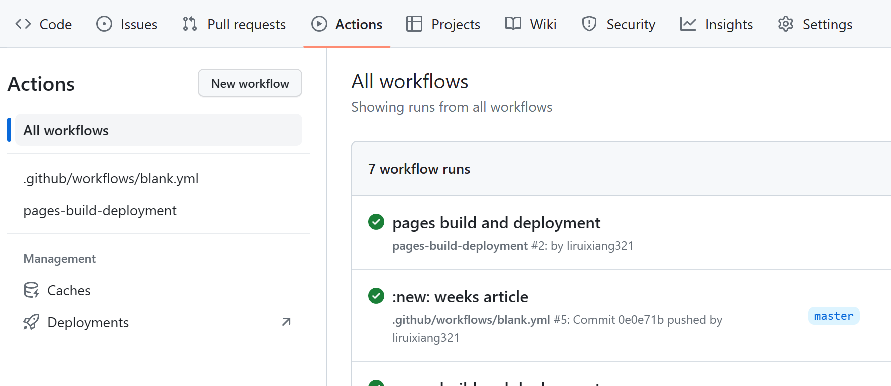
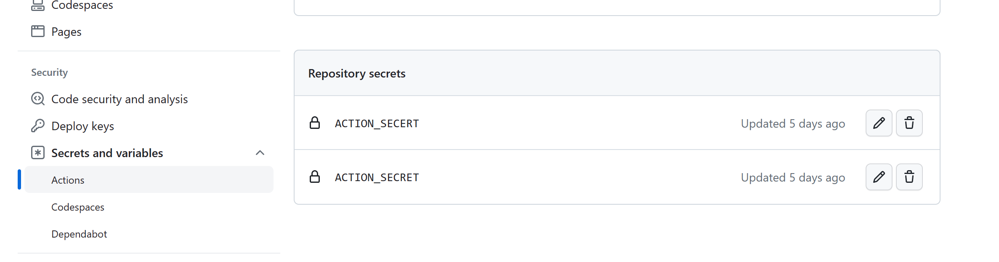

# vitepress建站过程

作为一个github小白😅，在这里记录一下本站的建站过程，主要是使用vitepress+github pages+自动化部署

## 为什么使用vitepress

> 我们喜爱`VuePress`，但是它是基于 Webpack 构建。为了一个只有几个简单页面的简单文档站点启动开发服务器所需的时间正变得让人难以忍受。即使是`HMR`热更新也需要几秒钟的时间才能在浏览器中显示出来。
>
> 作为参考，[Composition API RFC repo](https://github.com/vuejs/composition-api-rfc)仅只有两个页面，但是它花费了 4 秒来启动服务器，并且任何修改都需要将近 2 秒钟的时间才能在浏览器中显示出来。
>
> 从根本上说，这是因为 VuePress 是 webpack 的一个应用程序。即使只有两页，这也是一个完整的 webpack 项目(包括所有的主题源文件)正在编译。当项目有很多页面时，情况会变得更糟：每个页面都必须先完全编译，然后服务器才能显示内容！
>
> 顺便说一句，Vite 很好地解决了这些问题：几乎立即启动服务器，只按需编译正在服务的页面，以及闪电般的快速 hmr。另外，随着时间的推移，我在 VuePress 中注意到了一些额外的设计问题，但是由于重构的数量，我从来没有时间去修复它。
>
> 现在，使用 Vite 和 Vue 3，是时候重新考虑“Vue 驱动的静态站点生成器”到底能是什么了。

> [!WARNING] 
> VuePress 需要 [Node.js (opens new window)](https://nodejs.org/en/)>= 8.6

## vitepress本地搭建

这里直接参考vitepress官网中的[快速入门](https://vitejs.cn/vitepress/guide/getting-started.html)，将整个项目的基本框架先搭建起来。搭建起来的项目docs目录是这样的

```markdown
.
├─ docs
│  ├─ .vitepress
│  │  └─ config.js
│  └─ index.md
└─ package.json

```

## 配置文件

这一部分参考vitepress官网给出的[文档](https://vitejs.cn/vitepress/config/homepage.html)和[vuepress文档](https://www.vuepress.cn/theme/default-theme-config.html#%E9%A6%96%E9%A1%B5)共同食用，项目搭建起来之后，需要对config文件进行配置，这是我当前的配置

config文件

```javascript
module.exports = {
  title: "lrx's Blog",
  base: '/myblog/',
  description: 'Just playing around.',
  themeConfig: {
      logo:'/1.png',
      nav: [
          {
              text: '作品集',
              link:'/artworks/'
          },
          {
              text:'基础知识',
              items:[
               { text:'html',link:'/base/html/'},
               { text:'css',link:'/base/css/'},
               { text:'js',link:'/base/js/'},
               { text:'ts',link:'/base/ts/'}
              ]
          },
          {
              text:'vue3',
              link:'/vue3/'
          },
          {
              text:'需求杂症',
              link:'/xuqiuzazhen/'
          },
          {
            text:'每周总结',
            link:'/weeks/'
          },
          {
            text:'Leetcode',
            link:'/leetcode/'
          }
      ],
      // sideber以对象的形式配置的话每个sidebar都是独立的 如果以数组的形式配置那么侧边栏是公共的 进入其他子页面都可以看到
      sidebar: {
          collapsable: true,
            //是否折叠
          '/artworks/': [
              {
                  text: '我的博客',
                  items: [
                      { text: '建站记录', link: '/artworks/vitepressblog' }
                  ]
              },
              {
                text:'我的开源项目',
                items:[
                  {text:'...1', link:'/work/opensource'},
                ]
              }
          ]
      }
  }
}
```

主页配置index.md

```markdown
---
layout: home

hero:
  name: Lrx's的前端旅途
  text:
  tagline: 努力努力再努力💪！
  image: /1.png
  actions:
    - theme: brand
      text: 让我康康
      link: /guide/what-is-vitepress
    - theme: alt
      text: View on GitHub
      link: https://github.com/vuejs/vitepress

features:
  - icon: 🙋‍
    title: 前端基础知识
    details: Typescript 前端工程化...
  - icon: 📚
    title: 前端工作日常
    details: 开发工具使用 踩坑记录...
  - icon: 🛠️
    title: 学习总结
    details: Vue3 leetcode...
---

<style>
    :root {
  --vp-home-hero-name-color: transparent;
  --vp-home-hero-name-background: -webkit-linear-gradient(120deg, #f55a3e, #7c9eb7);
  --vp-home-hero-image-background-image: linear-gradient( -45deg, #f55a3e 50%, #7c9eb7 50% );
  --vp-home-hero-image-filter: blur(40px);
}
</style>

```

## 创建工作流

在根目录中创建/workflows/blank.yml文件或者通过github中的action进行创建如下图



具体文件内容如下：

```markdown

on: # 触发条件
  # 每当 push 到 master 分支时触发部署
  push:
    branches: [master]
  # 是否手动触发部署
  workflow_dispatch:
jobs:
  docs:
    runs-on: ubuntu-latest # 指定运行所需要的虚拟机环境（必填）

    steps:
      - uses: actions/checkout@v2
        with:
          # “最近更新时间” 等 git 日志相关信息，需要拉取全部提交记录
          fetch-depth: 0

      - name: Setup Node.js
        uses: actions/setup-node@v1
        with:
          # 选择要使用的 node 版本
          node-version: "14"

      # 缓存 node_modules
      - name: Cache dependencies
        uses: actions/cache@v2
        id: yarn-cache
        with:
          path: |
            **/node_modules
          key: ${{ runner.os }}-yarn-${{ hashFiles('**/yarn.lock') }}
          restore-keys: |
            ${{ runner.os }}-yarn-

      # 如果缓存没有命中，安装依赖
      - name: Install dependencies
        if: steps.yarn-cache.outputs.cache-hit != 'true'
        run: yarn --frozen-lockfile

      # 运行构建脚本
      - name: Build VuePress site
        run: yarn docs:build

      # 查看 workflow 的文档来获取更多信息
      # @see https://github.com/crazy-max/ghaction-github-pages
      - name: Deploy to GitHub Pages
        uses: crazy-max/ghaction-github-pages@v2
        # 环境变量
        env:
          GITHUB_TOKEN: ${{ secrets.ACTION_SECRET }}
        with:
          # 部署到 gh-pages 分支
          target_branch: gh-pages
          # 部署目录为 VuePress 的默认输出目录
          build_dir: docs/.vitepress/dist

```

之后将本地仓库推送到远程仓库，推送成功后，会自动执行这个工作流进行部署。需要注意的是这里需要创建Repository secrets



需要注意的是secret的值是personal access token

而这个pat我也是第一次设置，创建pat后密钥只会显示一次，所以只能复制这一次，之后就看不到他的值了。

复制到ACTION_SECRET.

再重新执行项目的action就好了。

2023/10/25

后续我再进行push并执行action时，会报密码和用户名错误，remote: Invalid username or password. fatal: Authentication failed for `https://github.com`...,后来发现原因时token过时了，所以解决方法是：

- 去`github -> setting -> developer settings -> personal access token`.
- 生成一个新的token 生成新的token,可以自定义他的有效期。
- 复制token，在需要输入密码的位置，粘贴token即可。
