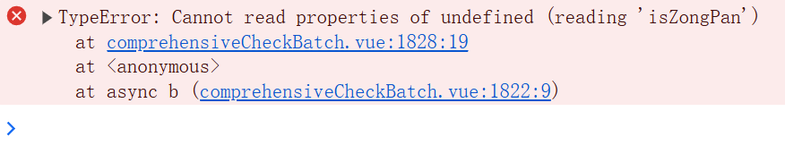
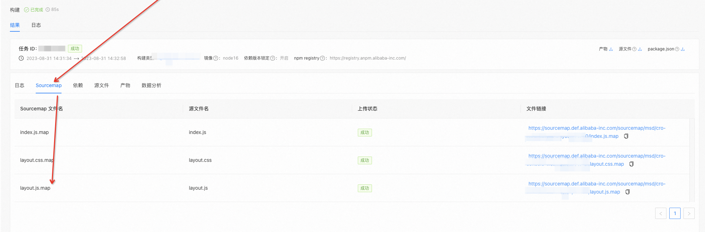
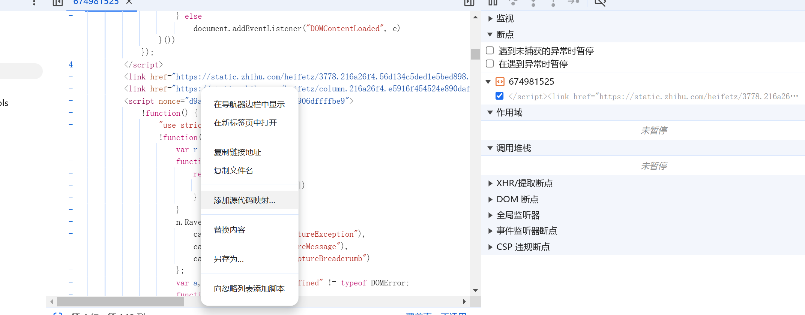
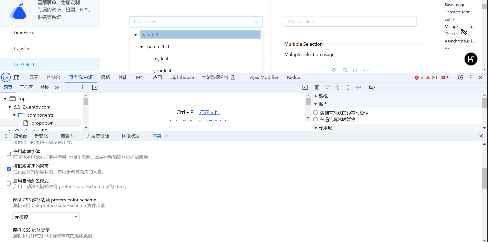
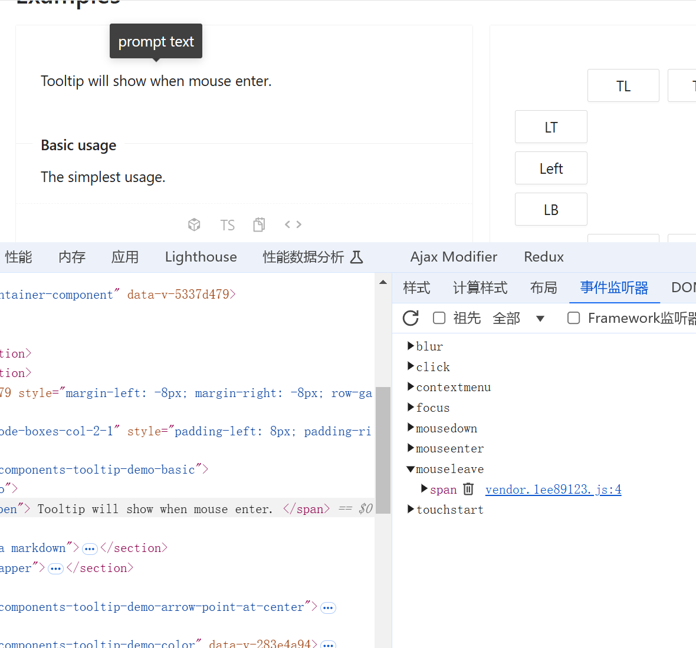
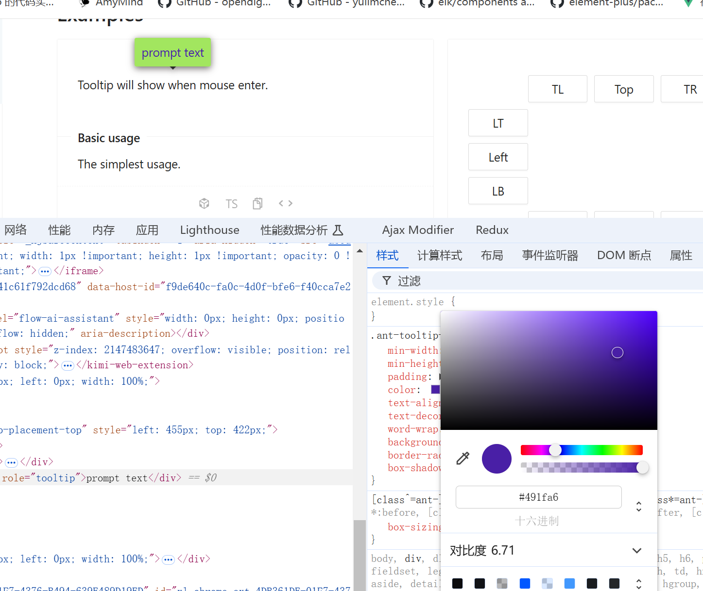

# chrome 开发者工具的使用

## 在生产环境下查看源代码

在生产环境下我们进行调试时，我们无法直接在浏览器中查看源代码，那我们该如何进行查看呢？。chrome devtools 提供了 sourcemap 映射功能，使得我们可以在生产环境下查看源代码。
首先我们将编译生产环境的产物部署后点击按钮会发现控制台报如下错误：

由于在生产环境中不允许有 soucemap 文件，或者不允许用户进行访问这些文件，所以我们在可以在打包时将 sourcemap 文件放在服务器的另一个文件夹下，这样就去除了 sourcemap 文件与打包后 js 文件之间的关联，在需要的时候我们可以手动添加这个关联。例如：

layout.js 文件在服务器中有 sourcemap 文件，我们可以在控制台中添加这个关联：

这样就可以在生产环境下查看源代码了。

## 模拟所聚焦的网页

这个属性可以帮助我们将组件的点击后或者聚焦后的状态一直呈现在页面方便我们对组件进行调试。例如这个 select 组件:

## hover 样式调试

这个 tooltip 组件：

我们在事件监听中将这个组件的 mouseleave 事件移除后，再将鼠标悬浮就能保持这个状态了，现在就可以进行样式调试了。

