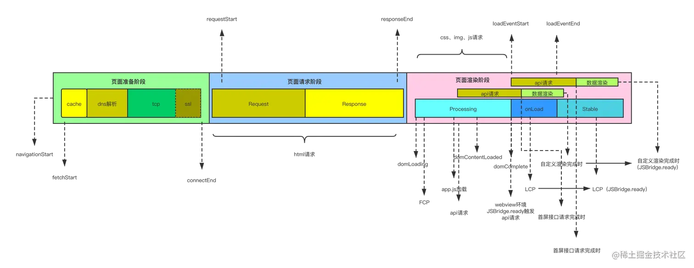
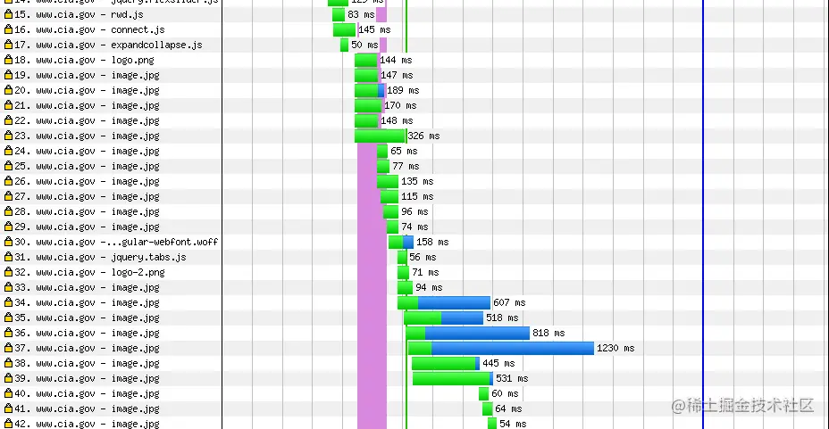

# 前端监控平台

## 埋点

使用第三方或自己开发相应的数据系统，进行用户行为数据或其它信息数据的收集。说白点，就是通过技术手段偷偷的监控用户在我们产品上的行为

### 埋点方式

#### 无埋点

在产品中植入 SDK,通过界面配置的方式对关键的行为进行定义，完成埋点采集，一般都是通过第三方统计工具，如：友盟、神策、百度统计、诸葛 IO 等。

#### 前端代码埋点

前端埋点与全埋点类似，也需要嵌入 SDK，不同的是对于每个事件行为都需要调用 SDK 代码，传入必要的事件名，属性参数等等，然后发到后台数据服务器。
前端埋点适用于：其他非关键业务量或不需要请求服务器的行为，能记录用户绝大多数的操作行为

### 埋点实现

实例：https://blog.csdn.net/luoluoxx0115/article/details/120714272

## 性能数据采集

SAP 页面加载模型

最初我们可以使用 window。performance.timing 来获取加载过程中模型的各个阶段的消耗时间。

```js
// window.performance.timing 各字段说明
{
  navigationStart, // 同一个浏览器上下文中，上一个文档结束时的时间戳。如果没有上一个文档，这个值会和 fetchStart 相同。
    unloadEventStart, // 上一个文档 unload 事件触发时的时间戳。如果没有上一个文档，为 0。
    unloadEventEnd, // 上一个文档 unload 事件结束时的时间戳。如果没有上一个文档，为 0。
    redirectStart, // 表示第一个 http 重定向开始时的时间戳。如果没有重定向或者有一个非同源的重定向，为 0。
    redirectEnd, // 表示最后一个 http 重定向结束时的时间戳。如果没有重定向或者有一个非同源的重定向，为 0。
    fetchStart, // 表示浏览器准备好使用 http 请求来获取文档的时间戳。这个时间点会在检查任何缓存之前。
    domainLookupStart, // 域名查询开始的时间戳。如果使用了持久连接或者本地有缓存，这个值会和 fetchStart 相同。
    domainLookupEnd, // 域名查询结束的时间戳。如果使用了持久连接或者本地有缓存，这个值会和 fetchStart 相同。
    connectStart, // http 请求向服务器发送连接请求时的时间戳。如果使用了持久连接，这个值会和 fetchStart 相同。
    connectEnd, // 浏览器和服务器之前建立连接的时间戳，所有握手和认证过程全部结束。如果使用了持久连接，这个值会和 fetchStart 相同。
    secureConnectionStart, // 浏览器与服务器开始安全链接的握手时的时间戳。如果当前网页不要求安全连接，返回 0。
    requestStart, // 浏览器向服务器发起 http 请求(或者读取本地缓存)时的时间戳，即获取 html 文档。
    responseStart, // 浏览器从服务器接收到第一个字节时的时间戳。
    responseEnd, // 浏览器从服务器接受到最后一个字节时的时间戳。
    domLoading, // dom 结构开始解析的时间戳，document.readyState 的值为 loading。
    domInteractive, // dom 结构解析结束，开始加载内嵌资源的时间戳，document.readyState 的状态为 interactive。
    domContentLoadedEventStart, // DOMContentLoaded 事件触发时的时间戳，所有需要执行的脚本执行完毕。
    domContentLoadedEventEnd, // DOMContentLoaded 事件结束时的时间戳
    domComplete, // dom 文档完成解析的时间戳， document.readyState 的值为 complete。
    loadEventStart, // load 事件触发的时间。
    loadEventEnd; // load 时间结束时的时间。
}
```

后来 window.performance.timing 被废除，通过 PerfomanceObserve 来获取。

## 用户行为数据采集

我们需要关注的事件有以下这几类：

1. 网络请求类

- XHR: XMLHttpRequest 请求
- FETCH: Fetch API 请求

2. 用户交互类

- CLICK: 点击事件
- DOM: DOM 操作事件

3. 路由类

- HISTORY: 历史记录变更
- HASHCHANGE: Hash 路由变更

4. 错误类

- ERROR: 一般错误
- UNHANDLEDREJECTION: Promise 未处理的 rejection
- RESOURCE: 资源加载错误

5. 框架类

- VUE: Vue 框架相关事件
- REACT: React 框架相关事件

6. 性能类

- PERFORMANCE: 性能监控
- WHITESCREEN: 白屏检测
- RECORDSCREEN: 录屏

7. 自定义类

- CUSTOM: 用户自定义事件

其中性能类不需要记录为用户行为数据

### 设计类

```js

// 创建用户行为类
class Breadcrumb {
  // maxBreadcrumbs控制上报用户行为的最大条数
  maxBreadcrumbs = 20;
  // stack 存储用户行为
  stack = [];
  constructor() {}
  // 添加用户行为栈
  push(data) {
    if (this.stack.length >= this.maxBreadcrumbs) {
      // 超出则删除第一条
      this.stack.shift();
    }
    this.stack.push(data);
    // 按照时间排序
    this.stack.sort((a, b) => a.time - b.time);
  }
}

let breadcrumb = new Breadcrumb();

// 添加一条页面跳转的行为，从home页面跳转到about页面
breadcrumb.push({
  type: "Route",
  form: '/home',
  to: '/about'
  url: "http://localhost:3000/index.html",
  time: "1668759320435"
});

// 添加一条用户点击行为
breadcrumb.push({
  type: "Click",
  dom: "<button id='btn'>按钮</button>",
  time: "1668759620485"
});

// 添加一条调用接口行为
breadcrumb.push({
  type: "Xhr",
  url: "http://10.105.10.12/monitor/open/pushData",
  time: "1668760485550"
});

// 上报用户行为
reportData({
  uuid: "a6481683-6d2e-4bd8-bba1-64819d8cce8c",
  stack: breadcrumb.getStack()
});
...
```

### 页面跳转

在 vue 中的两种路由模式 history 和 hash 模式，history 模式通过 pushState 和 replaceState 方法来改变路由还可以通过 popState 事件监听，hash 模式是通过 hashChange 事件来监听 url 变化。所以改写以上两个方法或者监听 hashChange 事件进行上报。

```js
// lastHref 前一个页面的路由
let lastHref = document.location.href;
function historyReplace() {
  function historyReplaceFn(originalHistoryFn) {
    return function (...args) {
      const url = args.length > 2 ? args[2] : undefined;
      if (url) {
        const from = lastHref;
        const to = String(url);
        lastHref = to;
        // 上报路由变化
        reportData("routeChange", {
          from,
          to,
        });
      }
      return originalHistoryFn.apply(this, args);
    };
  }
  // 重写pushState事件
  replaceAop(window.history, "pushState", historyReplaceFn);
  // 重写replaceState事件
  replaceAop(window.history, "replaceState", historyReplaceFn);
}

function replaceAop(source, name, fn) {
  if (source === undefined) return;
  if (name in source) {
    var original = source[name];
    var wrapped = fn(original);
    if (typeof wrapped === "function") {
      source[name] = wrapped;
    }
  }
}
```

### 资源加载


瀑布图展现了浏览器为渲染网页而加载的所有的资源，包括加载的顺序和每个资源的加载时间

分析这些资源是如何加载的, 可以帮助我们了解究竟是什么原因拖慢了网页，从而采取对应的措施来提升网页速度

```js
// PerformanceResourceTiming 各字段说明
{
  connectEnd, // 表示浏览器完成建立与服务器的连接以检索资源之后的时间
    connectStart, // 表示浏览器开始建立与服务器的连接以检索资源之前的时间
    decodedBodySize, // 表示在删除任何应用的内容编码之后，从*消息主体*的请求（HTTP 或缓存）中接收到的大小（以八位字节为单位）
    domainLookupEnd, // 表示浏览器完成资源的域名查找之后的时间
    domainLookupStart, // 表示在浏览器立即开始资源的域名查找之前的时间
    duration, // 返回一个timestamp，即 responseEnd 和 startTime 属性的差值
    encodedBodySize, // 表示在删除任何应用的内容编码之前，从*有效内容主体*的请求（HTTP 或缓存）中接收到的大小（以八位字节为单位）
    entryType, // 返回 "resource"
    fetchStart, // 表示浏览器即将开始获取资源之前的时间
    initiatorType, // 代表启动性能条目的资源的类型，如 PerformanceResourceTiming.initiatorType 中所指定
    name, // 返回资源 URL
    nextHopProtocol, // 代表用于获取资源的网络协议
    redirectEnd, // 表示收到上一次重定向响应的发送最后一个字节时的时间
    redirectStart, // 表示上一次重定向开始的时间
    requestStart, // 表示浏览器开始向服务器请求资源之前的时间
    responseEnd, // 表示在浏览器接收到资源的最后一个字节之后或在传输连接关闭之前（以先到者为准）的时间
    responseStart, // 表示浏览器从服务器接收到响应的第一个字节后的时间
    secureConnectionStart, // 表示浏览器即将开始握手过程以保护当前连接之前的时间
    serverTiming, // 一个 PerformanceServerTiming 数组，包含服务器计时指标的PerformanceServerTiming 条目
    startTime, // 表示资源获取开始的时间。该值等效于 PerformanceEntry.fetchStart
    transferSize, // 代表所获取资源的大小（以八位字节为单位）。该大小包括响应标头字段以及响应有效内容主体
    workerStart; // 如果服务 Worker 线程已经在运行，则返回在分派 FetchEvent 之前的时间戳，如果尚未运行，则返回在启动 Service Worker 线程之前的时间戳。如果服务 Worker 未拦截该资源，则该属性将始终返回 0。
}
```

如果我们只关注首页资源，我们可以在 window.onload 事件中去收集。
如果要收集所有的资源，需要通过定时器反复地去收集，并且在一轮收集结束后，通过调用 clearResourceTimings 将 performance entries 里的信息清空，避免在下一轮收集时取到重复的资源

## 个性化指标

### long task

### memory 内存

performance.memory 可以显示此刻内存占用情况，它是一个动态值，其中：

jsHeapSizeLimit 该属性代表的含义是：内存大小的限制。
totalJSHeapSize 表示总内存的大小。
usedJSHeapSize 表示可使用的内存的大小。

通常，usedJSHeapSize 不能大于 totalJSHeapSize，如果大于，有可能出现了内存泄漏

### 首屏加载时间

计算：

- 1.利用 MutationObserver 监听 document 对象，每当 dom.
- 2.判断监听的 dom 是否在首屏内，如果在首屏内，将该 dom 放到指定的数组中，记录下当前 dom 变化的时间点
- 3.在 MutationObserver 的 callback 函数中，通过防抖函数，监听 document.readyState 状态的变化
- 4.当 document.readyState === 'complete'，停止定时器和 取消对 document 的监听
- 5.遍历存放 dom 的数组，找出最后变化节点的时间，用该时间点减去 performance.timing.navigationStart 得出首屏的加载时间

### 白屏时间

### 用户可交互时间

### 总下载时间

### DNS 解析时间

### TCP 连接时间

### HTTP 请求时间

### HTTP 响应时间

### pv

### uv

### 用户行为统计

#### 用户行为类别

1. 页面跳转
2. 资源加载
3. 接口调用
4. 点击事件
5. 代码报错

### 异常及报错

#### 错误类别

1. js 语法错误和运行时错误
2. 异步错误
3. 静态资源加载错误
4. 接口请求报错

#### 错误捕获

1. try-catch
   try-catch 可以捕获常规的运行错误，不能捕获异步和语法错误

```js
try {
} catch (error) {
  // 处理错误
}
```

2. window.onerror
   window.onerror 可以捕获常见错误，异步错误，但不能捕获资源错误

```js
/**
 * @param { string } message 错误信息
 * @param { string } source 发生错误的脚本URL
 * @param { number } lineno 发生错误的行号
 * @param { number } colno 发生错误的列号
 * @param { object } error Error对象
 */
window.onerror = function (message, source, lineno, colno, error) {
  console.log("捕获到的错误信息是：", message, source, lineno, colno, error);
};
```

3.window.addEventListener('error')
可以捕获到资源加载的错误
4.window.addEventListener('unhandledrejection')
可以捕获到 promise 错误
5.vue 中捕获错误
控制台会报错，但是 window.onerror 和 error 不能捕获到,使用 vue 提供的 api: vue.config.errorHandler

```js
// vue项目在Vue.config.errorHandler中上报错误
Vue.config.errorHandler = function (err, vm, info) {
  console.log(err);
  HandleEvents.handleError(err);
  if (handler) handler.apply(null, [err, vm, info]);
};
```

6.react 中捕获错误
使用 react 提供的 api: ErrorBoundary 7.跨域问题
在 script 标签中加入 crossorigin,就可以通过 error 事件拿到具体的报错信息

7.接口错误

重写原型上的方法,在对应的关键方法上进行错误上报，实现接口拦截
xhr.open
xhr.send
fetch

### 用户设备信息: ip、浏览器、操作系统等

## 市面上成熟的方案
