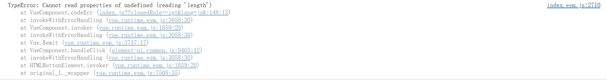
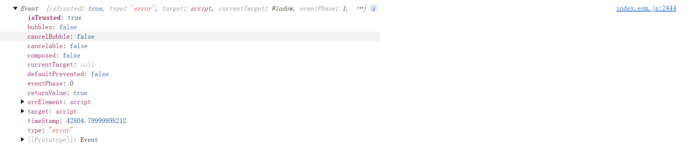

# 在监控到错误的时候，该如何进行处理呢

**首先我们需要明确，错误处理函数都需要处理哪些类别的错误:**

- 代码错误(包括 vue 和 react 以及 js)
- 资源加载错误

**如何区分这两种错误呢？**


这是 vue 中的 js 错误
!
[target](image-2.png)
这是资源加载错误时控制台抛出的 event,所以我们通过判断 target 来区分这两种错误

**获取到这些错误之后我们该做什么：**

- 上报错误
- 记录用户行为

::: codegroup

```ts
 handleError(ev: ErrorTarget): void {
    const target = ev.target;
    if (!target || (ev.target && !ev.target.localName)) {
      // vue和react捕获的报错使用ev解析，异步错误使用ev.error解析
      const stackFrame = ErrorStackParser.parse(!target ? ev : ev.error)[0];
      const { fileName, columnNumber, lineNumber } = stackFrame;
      const errorData = {
        type: EVENTTYPES.ERROR,
        status: STATUS_CODE.ERROR,
        time: getTimestamp(),
        message: ev.message,
        fileName,
        line: lineNumber,
        column: columnNumber,
      };


        //重复报错生成唯一hash防止重复上报
      const hash: string = getErrorUid(
        `${EVENTTYPES.ERROR}-${ev.message}-${fileName}-${columnNumber}`
      );
      // 开启repeatCodeError第一次报错才上报
      if (!options.repeatCodeError || (options.repeatCodeError && !hashMapExist(hash))) {
      //上报
      }
    }

    // 资源加载报错
    if (target?.localName) {
      // 提取资源加载的信息，进行格式化
      const data = resourceTransform(target);
      // 上报
    //   用户行为记录
    }
  },
```

:::
