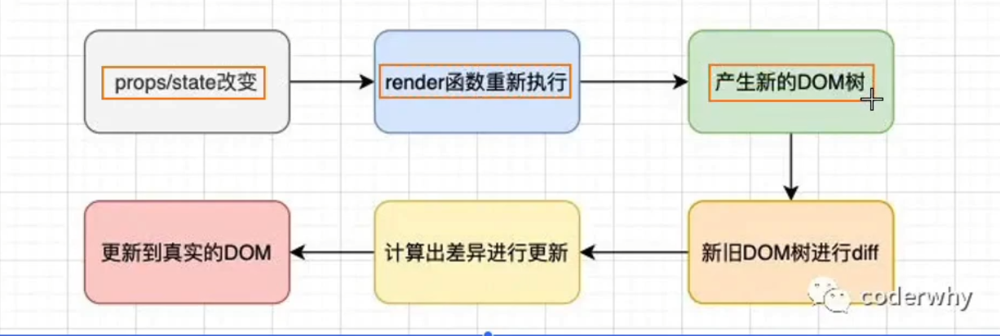

# react

## jsx 嵌入数据

一些需要注意的点:

```jsx

this.state = {

    // 1.在{}中可以正常显示的内容
    name:"why",
    age:19,
    names:["abc","cba","bac"]

    // 2.在{}中不能显示的内容(忽略)
    test1:null,
    test2:undefined,

    // 3.jsx不能显示子类

    friend:{
        name:"cobe",
        age:12
    }

    // 4.state中的数据只读不能修改
    arr.filter;//√
    arr.splice;//×
}

render(){
    return (
    <div>
        <h2>{this.state.name}</h2>
        <h2>{this.state.age}</h2>
        <h2>{this.state.names}</h2>

        <h2>{this.state.test1}</h2>
        <h2>{this.state.test2}</h2>

        <h2>{this.state.friend}</h2>   {/* 报错 */}
    </div>
    )
}

```

## 修改 dom 的 style

```jsx

render(){

    let {isLogin} = this.state;
    return (
        <div>
            <h2>你好啊，lrx</h2>
            <button style={{dispaly:isLogin && 'none'}}>登陆后不显示</button>
        </div>
    )

}

```

## jsx 的本质

本质上就是 React.createElement()函数的调用。

## react 脚手架

目前市面上流行的有三种脚手架：next.js、create React App、vite。我对 vite 比较熟悉一些，但还是想学习一下其他两种方式。

### create React App

#### 启动

```bash

npx create-react-app my-app
cd my-app
npm start

```

官方现在推荐使用 npx 来进行安装，npx 让 npm 包中的命令行工具和其他可执行文件在使用上变得更加简单。它极大地简化了我们之前使用纯粹的 npm 时所需要的大量步骤。

> 你是否遇到过这种情况：当你想尝试一些命令行工具，但却苦恼于不得不全局安装它们来运行仅仅一次？npx 也能很好地解决这种麻烦哦。当你执行 npx `<command>`而`<command>`并不在你的系统变量路径$PATH 中，npx 会自动为你从 npm 上下载安装叫这个名字的包，并且执行它。当做完这些事情后，已安装的包不会出现在你的全局安装中，所以不用担心长期使用所带来的全局污染。

这是 react 官方的建议

> 如果您之前通过 `npm install -g create-react-app` 全局安装了 create-react-app，我们建议您使用 `npm uninstall -g create-react-app` 或 `yarn global remove create-react-app` 卸载该软件包，以确保 npx 始终使用最新版本。

#### `npx run eject`

在 CRA 的官方文档中指出可以通过执行 npm run eject 来暴露出配置文件来进行修改，但是这种方式是不可逆的，同时会有一些隐藏的问题。

具体 eject 之后做了什么可以参考下面这篇文章：

<LinkCard link="https://juejin.cn/post/6844904034780839949" desc="还在run eject 修改create-react-app中的配置？"></LinkCard>

#### 模板

可以选择通过将 --template [template-name] 附加到创建命令来从模板启动新应用程序。

> 您可以通过在 npm 上搜索“cra-template-\*”来找到可用模板的列表。

也可以自己自定义模板进行发布

## react 中的插槽

1.通过 props 直接将 dom 传递到父组件中。

2.使用父组件中的 this.props.children 数组。

## 跨组件通信

1.使用 context。 2.使用 event。

## setState

### 为什么使用

### 异步更新

为什么要设计成异步更新？

redux 作者 gaearon Dan 在社区讨论下做出了[回应](https://github.com/facebook/react/issues/11527#issuecomment-360199710),大致意思就是：

- setState 设计为异步，可以显著的提升性能;口 如果每次调用 setState 都进行一次更新，那么意味着 render 函数会被频繁调用，界面重新渲染，这样效率是很低的口 最好的办法应该是获取到多个更新，之后进行批量更新;
- 如果同步更新了 state，但是还没有执行 render 函数，那么 state 和 props 不能保持同步口 state 和 props 不能保持一致性，会在开发中产生很多的问题;

但是一定就是异步吗？

其实分成两种情况：

- 在组件生命周期或 React 合成事件中，setState 是异步;
- 在 setTimeout 或者原生 dom 事件中，setState 是同步;

### 使用

setState 合并时自动会进行合并，取决于传递的是对象还是函数。

## react 更新流程


