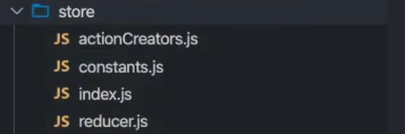

# react

## jsx 嵌入数据

一些需要注意的点:

```jsx

this.state = {

    // 1.在{}中可以正常显示的内容
    name:"why",
    age:19,
    names:["abc","cba","bac"]

    // 2.在{}中不能显示的内容(忽略)
    test1:null,
    test2:undefined,

    // 3.jsx不能显示子类

    friend:{
        name:"cobe",
        age:12
    }

    // 4.state中的数据只读不能修改
    arr.filter;//√
    arr.splice;//×
}

render(){
    return (
    <div>
        <h2>{this.state.name}</h2>
        <h2>{this.state.age}</h2>
        <h2>{this.state.names}</h2>

        <h2>{this.state.test1}</h2>
        <h2>{this.state.test2}</h2>

        <h2>{this.state.friend}</h2>   {/* 报错 */}
    </div>
    )
}

```

## 修改 dom 的 style

```jsx

render(){

    let {isLogin} = this.state;
    return (
        <div>
            <h2>你好啊，lrx</h2>
            <button style={{dispaly:isLogin && 'none'}}>登陆后不显示</button>
        </div>
    )

}

```

## jsx 的本质

本质上就是 React.createElement()函数的调用。

## react 脚手架

目前市面上流行的有三种脚手架：next.js、create React App、vite。我对 vite 比较熟悉一些，但还是想学习一下其他两种方式。

### create React App

#### 启动

```bash

npx create-react-app my-app
cd my-app
npm start

```

官方现在推荐使用 npx 来进行安装，npx 让 npm 包中的命令行工具和其他可执行文件在使用上变得更加简单。它极大地简化了我们之前使用纯粹的 npm 时所需要的大量步骤。

> 你是否遇到过这种情况：当你想尝试一些命令行工具，但却苦恼于不得不全局安装它们来运行仅仅一次？npx 也能很好地解决这种麻烦哦。当你执行 npx `<command>`而`<command>`并不在你的系统变量路径$PATH 中，npx 会自动为你从 npm 上下载安装叫这个名字的包，并且执行它。当做完这些事情后，已安装的包不会出现在你的全局安装中，所以不用担心长期使用所带来的全局污染。

这是 react 官方的建议

> 如果您之前通过 `npm install -g create-react-app` 全局安装了 create-react-app，我们建议您使用 `npm uninstall -g create-react-app` 或 `yarn global remove create-react-app` 卸载该软件包，以确保 npx 始终使用最新版本。

#### `npx run eject`

在 CRA 的官方文档中指出可以通过执行 npm run eject 来暴露出配置文件来进行修改，但是这种方式是不可逆的，同时会有一些隐藏的问题。

具体 eject 之后做了什么可以参考下面这篇文章：

<LinkCard link="https://juejin.cn/post/6844904034780839949" desc="还在run eject 修改create-react-app中的配置？"></LinkCard>

#### 模板

可以选择通过将 --template [template-name] 附加到创建命令来从模板启动新应用程序。

> 您可以通过在 npm 上搜索“cra-template-\*”来找到可用模板的列表。

也可以自己自定义模板进行发布

## react 中的插槽

1.通过 props 直接将 dom 传递到父组件中。

2.使用父组件中的 this.props.children 数组。

## 跨组件通信

1.使用 context。 2.使用 event。

## setState

### 为什么使用

### 异步更新

为什么要设计成异步更新？

redux 作者 gaearon Dan 在社区讨论下做出了[回应](https://github.com/facebook/react/issues/11527#issuecomment-360199710),大致意思就是：

- setState 设计为异步，可以显著的提升性能;口 如果每次调用 setState 都进行一次更新，那么意味着 render 函数会被频繁调用，界面重新渲染，这样效率是很低的口 最好的办法应该是获取到多个更新，之后进行批量更新;
- 如果同步更新了 state，但是还没有执行 render 函数，那么 state 和 props 不能保持同步口 state 和 props 不能保持一致性，会在开发中产生很多的问题;

但是一定就是异步吗？

其实分成两种情况：

- 在组件生命周期或 React 合成事件中，setState 是异步;
- 在 setTimeout 或者原生 dom 事件中，setState 是同步;

### 使用

setState 合并时自动会进行合并，取决于传递的是对象还是函数。

## react 更新流程


diffing 算法：感觉和 vue 的 diff 算法一样。

### PureComponent

当通过比较新旧 props 和 state 前后保持不变时，该组件不会因为父组件的重新渲染而跟着重新渲染。优化了渲染性能。

但是 react18 建议使用函数式组件来代替类式组件,也就意味着这种需要新的方式来代替,也就是 memeo 方式的声明组件。

> [!TIP]
> 与 PureComponent 不同，memo 不会比较新旧 state。在函数组件中，即使没有 memo，调用具有相同 state 的 set 函数，默认已经阻止了重新渲染。

### memo

### ref

ref 的值根据节点的类型而有所不同:

- 当 ref 属性用于 HTML 元素时,构造函数中使用 React.createRef() 创建的 ref 接收底层 DOM 元素作为其 current 属性口
- 当 ref 属性用于自定义 class 组件时，ref 对象接收组件的挂载实例作为其 current 属性;
- 你不能在函数组件上使用 ref 属性，因为他们没有实例;可以使用 React.forward 来代替；

### HOC

传入组件，返回组件,增强 props

> [!TIP]
> 只有在类组件中才可以使用生命周期函数

### 全局事件传递

eventBus

### Portals

类似于 vue 的 teleport 传送门

### strictMode

1.检查不安全的生命周期。

2.过时的 ref API。

3.检查意外的副作用：

- 这个组件的 constructor 会被调用两次。
- 这是严格模式下故意进行的操作，为了开发者查看逻辑代码多次调用时是否会产生副作用。
- 在生产环境下不会调用两次。

## redux

### 三大原则

- 单一数据源：
  - 整个应用程序的 `state` 被存储在一颗 `object tree` 中,并且这个 `object tree` 只存储在一个 store 中
  - `Redux` 并没有强制让我们不能创建多个 `Store`，但是那样做并不利于数据的维护;
  - 单一的数据源可以让整个应用程序的 state 变得方便维护、追踪、修改
- state 是只读的
  - 唯一修改 `State` 的方法一定是触发 `action`，不要试图在其他地方通过任何的方式来修改 `State`:
  - 这样就确保了 View 或网络请求都不能直接修改 `state`，它们只能通过 `action` 来描述自己想要如何修改 `state`
  - 这样可以保证所有的修改都被集中化处理，并且按照严格的顺序来执行，所以不需要担心 r`ace condition`(竟态)的问题:
- 使用纯函数来进行修改
  - 通过 `reducer` 将旧 `state` 和 `actions` 联系在一起，并且返回一个新的 `State`
  - 随着应用程序的复杂度增加，我们可以将 `reducer` 拆分成多个小的 `reducers`，分别操作不同 `state tree` 的一部分
  - 但是所有的 `reducer` 都应该是纯函数，不能产生任何的副作用

### 目录结构划分



将 redux 划分为 actionCreator(所有的 action 定义,包括 type 和传入的参数)、constans(包括 action 中的 type 等)、index.js(调用 reducer 创建 store 实例),reducer(初始化 state，定义每个 type 对应的逻辑代码即 reducer 的定义，传入 state 以及 action 并且返回新的 state，确保不产生任何副作用)。

修改状态时直接调用 store 的 dispatch 方法，并传入 action

### 如何优雅地在组件中使用 redux

将引入 store 的代码抽离出去，以 HOC 的方式添加到组件中。下面是封装的 connect.js 文件

```jsx
import React, { PureComponent } from "react";

export function connect(mapStateToProps, mapDispatchToProps) {
  return function enhance(wrapperComponent) {
    return class enhanceHOC extends PureComponent {
      constructor(props) {
        super(props);
        this.state = { storeState: mapStateToProps(store.getState()) };
      }

      componentDidMount() {
        this.discribe = store.subscribe(() => {
          this.setState({
            storeState: mapStateToProps(store.getState()),
          });
        });
      }
      componentWillUnmount() {
        this.discribe();
      }
      render() {
        return (
          <div>
            <wrapperComponent
              {...props}
              {...mapDispatchToProps(store.dispatch())}
              {...mapStateToProps(store.getState())}
            ></wrapperComponent>
          </div>
        );
      }
    };
  };
}
```

在要引入的组件 home 中这样写:

```jsx

import React, { PureComponent } from "react";

export default class home extends PureComponent {
  render() {
    return (
      <div>
        home
        <h2>当前计数{this.state.counter}</h2>
        <button onClick={(e) => this.increment()}>+1</button>
        <button onClick={(e) => this.decrement(5)}>-5</button>
      </div>
    );
  }
}

const mapStateToProps = (state) => ({
  counter: state.counter,
});

const mapDispatchToProps = (dispatch) => ({
  increment: function () {
    dispatch(incAction);
  },
  decrement: function (num) {
    dispatch(derAction(num));
  },
});

export default connect(mapStateToProps,mapDispatchToProps)(home)

```

这样我们仅仅为每个组件添加了 action 这个依赖,其他的部分全部在 connect 这个函数中。

### redux-thunk

使用中间件可以在 dispatch 发送网络请求

1.安装 redux-thunk `yarn add redux-thunk`  
2.在创建 store 时传入应用了 middleware 的 enhance 函数

- 通过 applyMiddleware 来结合多个 Middleware,返回一个 enhancer
- 将 enhancer 作为第二个参数传入到 createStore 中。

```jsx
import { createStore, applyMiddleware, compose } from "redux";
import thunkMiddleware from "redux-thunk";
import reducer from "./reducer.js";

//通过applyMiddleware来结合多个Middleware，返回一个enhancer
const enhancer = applyMiddleware(thunkMiddleware);
// 将enhancer作为第二个参数传入到createStore中
const store = createStore(reducer, enhancer);

export default store;
```

3.定义返回一个函数的 action:

- 注意:这里不是返回一个对象了，而是一个函数;
- 该函数在 dispatch 之后会被执行 q;

```js
// action.js
const getHomeMultidataAction = () => {
  return (dispatch) => {
    axios.get("http://123.207.32.32:8000/home/multidata").then((res) => {
      const data = res.data.data;
      dispatch(changeBannersAction(data.banner.list));
      dispatch(changeRecommendsAction(data.recommend.list));
    });
  };
};
```
