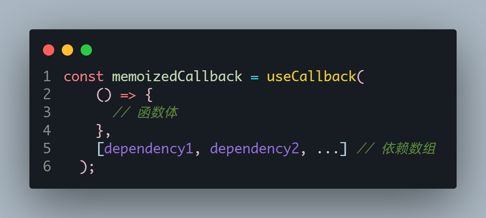
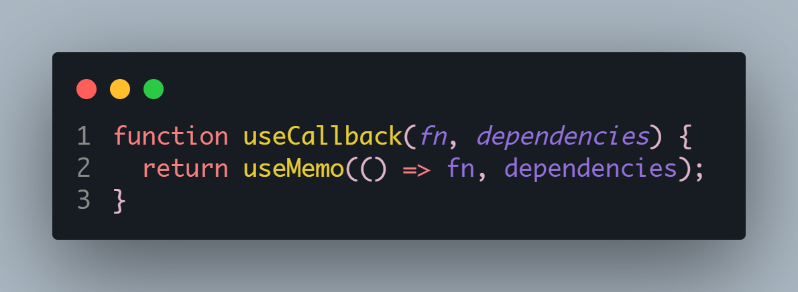
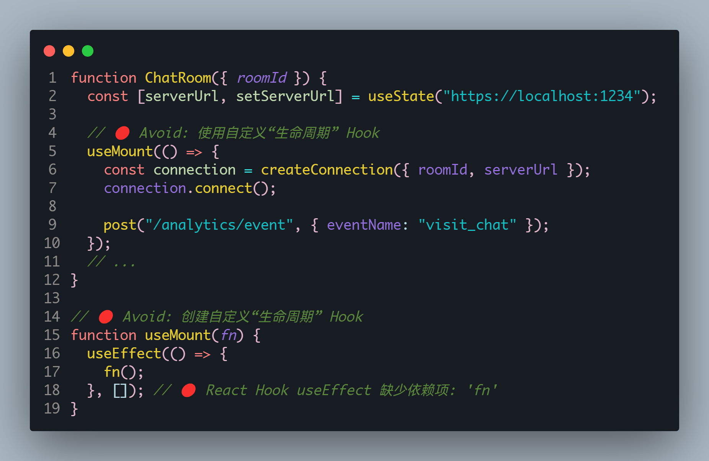
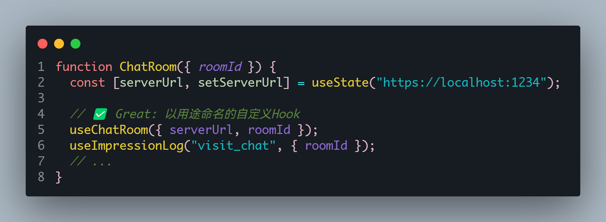

# reactHooks

Hook 就是 JavaScript 函数，这个函数可以帮助你 钩入(hook into)
React State 以及生命周期等特性;

优势:

- 它可以让我们在不编写 class 的情况下使用 state 以及其他的 React 特性;
- 但是我们可以由此延伸出非常多的用法，来让我们前可所提到的问题得到解决;

Hook 的使用场景

- Hook 的出现基本可以代替我们之前所有使用 class 组件的地方(除了一些非常不常用的场景);
- 但是如果是一个旧的项目，你并不需要直接将所有的代码重构为 Hooks，因为它完全向下兼容，你可以渐进式的来使用它
- Hook 只能在函数组件中使用，不能在类组件，或者函数组件之外的地方使用;

## useEffectHooks

依赖发生改变就会重新执行 🧐，类似于 Vue 的 watchEffect,后面还可以加一个参数用来进行优化防止内部代码再次执行，比如一些请求代码。

## useContext

## useReducer

useState 的替代方案

## useCallBack

~~类似于 Vue 的计算属性~~
想象这个场景：你有一个 React.memo 化的子组件，该子组件接受一个父组件传递的函数作为 prop。如果父组件重新渲染，而且这个函数是在父组件的函数体内定义的，那么每次父组件渲染时，都会为子组件传递一个新的函数实例。这可能会导致子组件不必要地重新渲染，即使该函数的实际内容没有任何变化。

useCallback 的主要目的是解决这样的问题。它确保，除非依赖项发生变化，否则函数实例保持不变。这可以防止因为父组件的非相关渲染而导致的子组件的不必要重新渲染。

当然，useCallback 真正的应用场景不仅于此，它还可以用于其他需要稳定引用的场景，例如事件处理器、setTimeout/setInterval 的回调、函数用于 useEffect、useMemo 或 useCallback 等的依赖项、或其他可能因为函数引用改变而导致意外行为的场合。

### 使用 ⚙️

只有当 dependency1、dependency2 等依赖发生改变时，函数才会重新创建。这对于 React.memo 化的组件、useEffect、useMemo 等钩子的输入特别有用，因为它们都依赖于输入的引用恒定性。

### useMemo 和 useCallback

<LinkCard link="https://zhuanlan.zhihu.com/p/678677928" desc="精读React hooks（八）：我们为什么需要useCallback"></LinkCard>

这个作者写的很好，解释了 useCallback，useCallback 其实就是 useMemo 的语法糖，他的底层也是这么实现的。

我们可以将一个 useCallback 转化为 useMemo 的写法

## useMemo

类似于 Vue 的计算属性

## useRef

## useImperativeHandle

## 自定义 hooks

> 组件内部的代码描述的是想要做什么（使用在线状态！），而不是怎么做（通过订阅浏览器事件完成）。

- [Hook 的名称必须永远以 use 开头](https://react.docschina.org/learn/reusing-logic-with-custom-hooks#hook-names-always-start-with-use)
- [自定义 Hook 共享的是状态逻辑，而不是状态本身](https://react.docschina.org/learn/reusing-logic-with-custom-hooks#custom-hooks-let-you-share-stateful-logic-not-state-itself)
- [在 Hook 之间传递响应值](https://react.docschina.org/learn/reusing-logic-with-custom-hooks#passing-reactive-values-between-hooks)

### 如何检验自己的 Hooks 标准且优雅 🧐

官方文档也进行了探讨并且给出了标准：

> 理想情况下，你的自定义 Hook 名称应该清晰到即使一个不经常写代码的人也能很好地猜中自定义 Hook 的功能，输入和返回：
>
> - ✅ useData(url)
> - ✅ useImpressionLog(eventName, extraData)
> - ✅ useChatRoom(options)
>
>   当你和外部系统同步的时候，你的自定义 Hook 名称可能会更加专业，并使用该系统特定的术语。只要对熟悉这个系统的人来说名称清晰就可以：
>
> - ✅ useMediaQuery(query)
> - ✅ useSocket(url)
> - ✅ useIntersectionObserver(ref, options)
>
> 保持自定义 Hook 专注于具体的高级用例,避免创建和使用作为 useEffect API 本身的替代品和 wrapper 的自定义“生命周期” Hook：

> 好的自定义 Hook 通过限制功能使代码调用更具声明性。例如 useChatRoom(options) 只能连接聊天室，而 useImpressionLog(eventName, extraData) 只能向分析系统发送展示日志。如果你的自定义 Hook API 没有约束用例且非常抽象，那么在长期的运行中，它引入的问题可能比解决的问题更多。

