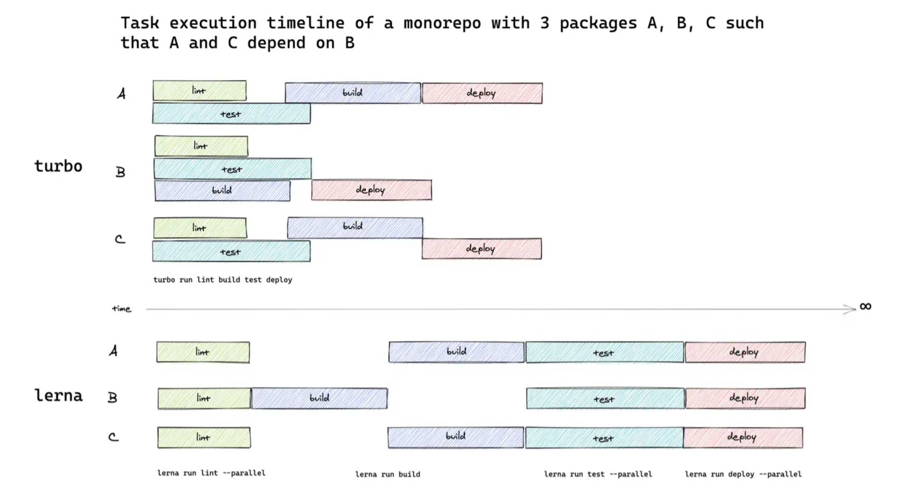

## Menorepo📚

**✨Menorepo 是什么**

Monorepo 是一种项目管理方式，在 Monorepo 之前，代码仓库管理方式是 MultiRepo，即每个项目都对应着一个单独的代码仓库每个项目进行分散管理。
这就会导致许多弊端，例如可能每个项目的基建以及工具库都是差不多的，基础代码的重复复用问题等等...
Monorepo 就是把多个项目放在一个仓库里面,现代的前端工程已经越来越离不开 Monorepo 了，无论是业务代码还是工具库，越来越多的项目已经采用 Monorepo 的方式来进行开发。Google 宁愿把所有的代码都放在一个 Monorepo 工程下面，Vue 3、Yarn、Npm7 等等知名开源项目的源码也是采用 Monorepo 的方式来进行管理的。
一般 Monorepo 的目录如下所示，在 packages 存放多个子项目，并且每个子项目都有自己的 package.json:

```md
.
├── package
│   ├── package1
│   │   └── package.json
│   └── package12
│      └── package.json
└── package.json
```

**🍰MultiRepo 的弊端**

**_代码复用_**

在维护多个项目的时候，有一些逻辑很有可能会被多次用到，比如一些基础的组件、工具函数，或者一些配置，你可能会想: 要不把代码直接 copy 过来，多省事儿！但有个问题是，如果这些代码出现 bug、或者需要做一些调整的时候，就得修改多份，维护成本越来越高。
那如何来解决这个问题呢？比较好的方式是将公共的逻辑代码抽取出来，作为一个 npm 包进行发布，一旦需要改动，只需要改动一份代码，然后 publish 就行了。

但这真的就完美解决了么？我举个例子，比如你引入了 1.1.0 版本的 A 包，某个工具函数出现问题了，你需要做这些事情：

去修改一个工具函数的代码
发布 1.1.1 版本的新包
项目中安装新版本的 A。
可能只是改了一行代码，需要走这么多流程。然而开发阶段是很难保证不出 bug 的，如果有个按钮需要改个样式，又需要把上面的流程重新走一遍......停下来想想，这些重复的步骤真的是必须的吗？我们只是想复用一下代码，为什么每次修改代码都这么复杂？

上述的问题其实是 MultiRepo 普遍存在的问题，因为不同的仓库工作区的割裂，导致复用代码的成本很高，开发调试的流程繁琐，甚至在基础库频繁改动的情况下让人感到很抓狂，体验很差。

**_版本管理_**
在 MultiRepo 的开发方式下，依赖包的版本管理有时候是一个特别玄学的问题。比如说刚开始一个工具包版本是 v1.0.0，有诸多项目都依赖于这个工具包，但在某个时刻，这个工具包发了一个 break change 版本，和原来版本的 API 完全不兼容。而事实上有些项目并没有升级这个依赖，导致一些莫名的报错。

当项目多了之后，很容易出现这种依赖更新不及时的情况。这又是一个痛点。
**_项目基建_**
由于在 MultiRepo 当中，各个项目的工作流是割裂的，因此每个项目需要单独配置开发环境、配置 CI 流程、配置部署发布流程等等，甚至每个项目都有自己单独的一套脚手架工具。

其实，很容易发现这些项目里的很多基建的逻辑都是重复的，如果是 10 个项目，就需要维护 10 份基建的流程，逻辑重复不说，各个项目间存在构建、部署和发布的规范不能统一的情况，这样维护起来就更加麻烦了。

**menorepo 落地**

关于 monorepo 的文章已经很多了，并且目前可以搭建 Monorepo 的工具也很多，例如
| 工具 | 简述 |
| --- | --- |
| [Bit](https://bit.dev/) | 用于组件驱动开发的工具链 |
|[Turborepo](https://turbo.build/repo/docs) | 用于 JavaScript 和 TypeScript 代码库的高性能构建系统|
| [Rush](https://rushjs.io/) | 一个可扩展的 web 单仓库管理器 |
| [Nx](https://nx.dev/) | 具有一流的 monorepo 支持和强大集成的下一代构建系统 |
|[Lerna](https://www.lernajs.cn/) | 用于管理包含多个软件包的项目 |

下面介绍一下 Turborepo,这个目前最流行的 menorepo 构建方案

## Turborepo📚

> Turborepo 是一个针对 JavaScript 和 TypeScript 代码库优化的智能构建系统。具有缓存、并行处理的特性。

### turbo 的特性

总的来说就是更快，更简单

#### 多任务并行处理

Turbo 支持多个任务的并行运行，我们在对多个子包，编译打包的过程中，turbo 会同时进行多个任务的处理
在传统的 monorepo 任务运行器中，就像 lerna 或者 yarn 自己的内置 workspaces run 命令一样，每个项目的 script 生命周期脚本都以拓扑方式运行（这是“依赖优先”顺序的数学术语）或单独并行运行。根据 monorepo 的依赖关系图，CPU 内核可能处于空闲状态——这样就会浪费宝贵的时间和资源。
为了可以了解 turbo 多么强大，下图比较了 turbovslerna 任务执行时间线：

Turbo 它能够有效地安排任务类似于瀑布可以同时异步执行多个任务，而 lerna 一次只能执行一项任务 所以 Turbo 的 性能不言而喻

#### 云缓存

Turbo 通过其远程缓存功能可以帮助多人远程构建云缓存实现了更快的构建。

#### 任务管道

用配置文件定义任务之间的关系，然后让 Turborepo 优化构建内容和时间。

#### 基于约定的配置

通过约定降低复杂性，只需几行 JSON 即可配置整个项目依赖，执行脚本的顺序结构。

#### 浏览器中的配置文件

生成构建配置文件并将其导入 Chrome 或 Edge 以了解哪些任务花费的时间最长。

## 参考链接 🔗

<LinkCard desc="前端工程Monorepo项目管理方式" link="https://www.jb51.net/article/254801.htm"></LinkCard>

<LinkCard desc="前端工程Monorepo项目管理方式" link="https://www.jb51.net/article/254801.htm"></LinkCard>
