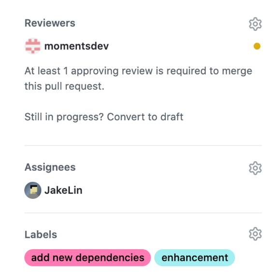
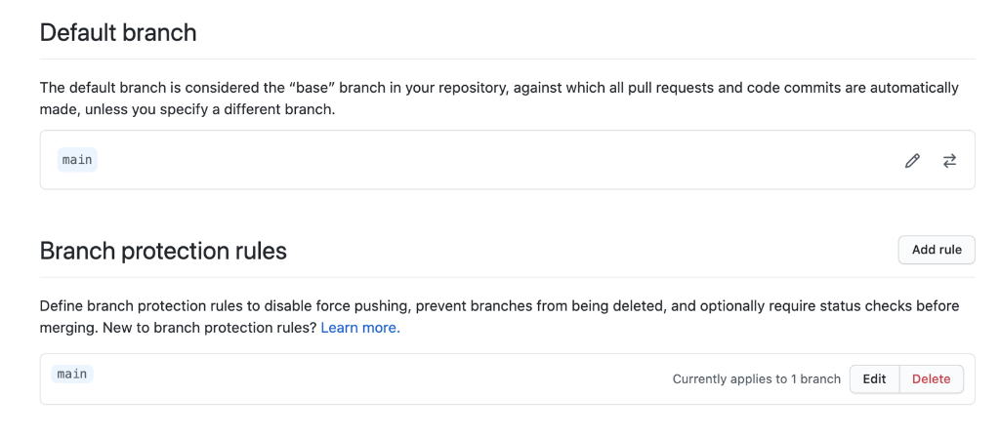

# 使用 Git 与 GitHub 统一代码管理流程

现代的软件开发活动通常需要多人参与。为了保证不同开发者可以同时贡献到同一个代码库，Git 提供了分支（Branch）来支持并行开发。不同团队有不同的 Git 分支管理方式，根据我们团队多年的经验，经过不断的完善，最终形成出一套简单并十分有效的 Git 分支管理规范，你可以参考下。这套规范是怎样的呢？

具体来说，我把所有的 Git 分支分成三类：主分支，功能分支和发布分支，让它们各自承担不同的功能。

其中主分支也称为 master 或者 main 分支， 是 Git 代码仓库的默认分支。在 Xcode 12 以后，新建项目时也会默认生成命名为 main 的主分支。

主分支在软件开发中非常重要，它是我们 App 的唯一的信息源（Single source of truth），不论是编译出不同版本的 App 还是排查问题，都需要用到主分支的代码。并且，团队同事的代码，最终也必须汇总到这个主分支中，且不能出错。所以，所谓的统一代码管理流程，就是制定其他分支的代码如何合并到主分支的流程。

功能分支是我们在开发过程中建立的临时分支，它可以用来保存一次开发活动的状态。根据不同的开发活动，我把功能分支分成几个小类。

feature 分支，当开发一个新功能的时候，我会为每一个功能建立一个叫作 feature 分支，当整个功能完成后就可以合并到主分支里面，并把该分支从 Git 代码仓库中删除掉。

bugfix 分支，当发现 Bug 的时候，会专门建立一个 bugfix 分支，修改 Bug 后把它合并到主分支里面去。

spike 分支，当我们探索或研究一些新技术（如 App Clips 功能）的时候，会建立一个叫作 spike 的分支。在得出结论以后，我才决定是否把该分支合并到主分支。如果探索失败，我就不会把相关的 spike 分支合并到主分支了。

在新建一个功能分支的时候，我们都遵循一定的命名规范，一般会把功能的描述作为分支的名称。例如当我们要开发一个点赞功能时，会把该分支可以命名为 feature/add-like-button-to-moments-screen。又例如当我们需要修改用户头像的一个 UI Bug 时，会把分支命名为 bugfix/fix-avatar-ui-bug。

举例来说，我有一个同事要开发点赞功能，他就从主分支最新的 MC1commit 签出（checkout）并新建 feature/add-like-button-to-moments-screen 来进行点赞功能的开发。与此同时，另外一个同事发现了一个用户头像的 UI Bug，她也从 MC1commit 签出并新建了 bugfix/fix-avatar-ui-bug 来修改 Bug。

当头像的 Bug 修改完成后，开发组长把 BC2commit 合并到主分支里面。在此之后点赞功能也开发完毕，开发组长又把该功能分支上的 FC4commit 合并到主分支里面。这两个分支彼此独立，而且互不影响。

除了主分支和功能分支以外，我们在发布 App 的时候还使用到发布分支。

发布分支一般命名为 release。每次当我们发布 App 之前都会把主分支的最新代码合并到发布分支去。因此发布分支会一直保存 App 发布版的源码记录。

有了发布分支以后，一旦发生严重的线上事故，例如出现引起高崩溃率的 Bug 时，我们可以马上在发布分支上进行修复。一般的做法是从发布分支上签出一个功能分支，例如当修复点赞按钮引起的崩溃时，我们可以建立一个叫作 bugfix/fix-like-button-crash 的功能分支，在修复该崩溃以后马上合并到发布分支，并提交到 App Store ，更新线上的 App。

由上图可见，当我们把主分支最新的 MC1commit 合并到 release 分支以后，提交了一个版本号为 V2.0 的 App 到 App Store。当我们通过查看崩溃报告，得知新上线的点缀功能引起很多崩溃时，可以采取如下措施：

马上从 release 分支的 V2.0commit 签出 bugfix/fix-like-button-crash 分支并修复该崩溃；

把 BC2commit 合并回 release 分支，并立刻提交版本号为 V2.1 的 App 到 App Store；

把包含了该修复的 V2.1commit 合并到 main 分支，保证主分支统一管理所有代码的更新状态。

有了上面讲的三大分支，以及它们签出和合并的流程，我们就定义了一部分的代码管理规范——知道什么时候要使用哪个分支进行开发或者发布。但是你可能已经察觉到，当我们把功能分支合并到主分支的时候并没有进行任何的审查，万一有人不小心把 Bug 合并到主分支怎么办？

解决方案就是 Pull Request。
Pull Request 是一个代码审查工具，它允许开发人员创建一个 Pull Request 请求，请求的目的是希望其他开发人员审查该请求，并决定是否合并到主分支。

## GitHub Pull Request 流程

这套流程分成六步。

第一步，当我们要开发一个新功能或者修改一个 Bug 时，从主分支的签出并建立一个功能分支。这里需要注意的是，为了减少合并时出现的冲突，我们需要从主分支最新的一个 commit 签出。

第二步，我们可以在功能分支上持续开发并多次提交 commit。因为我们是在独立的功能分支上进行开发，所有的变动都不会影响到主分支，所以可以放心修改所需的代码。

第三步，当我们完成一个功能的开发以后，就可以提交一个 PR 了。为了避免合并冲突，我建议在提交 PR 前先 rebase 主分支的 Git 历史。同时为了方便其他成员审查代码和参与讨论，我们在提交 PR 的时候需要清楚地描述所完成的功能，并把注意 事项，UI 前后变动的区别，测试步骤等等一同写到 PR 描述文档里面。

在我们项目中，为了方便开发者编写 PR 描述文档，需要建立了一个模板文件 pull_request_template.md。当我们提交 PR 的时候，GitHub 会自动读取并准备好描述文档的模板，我们只需要填写相关内容即可。这里是[地址](https://github.com/lagoueduCol/iOS-linyongjian/blob/main/.github/pull_request_template.md)

在提交 PR 的时候，我们还可以加上代码审查人（Reviewer）来通知他/她审查代码。同时也可以加上分类的标签（Label）来方便管理所有的 PR，例如使用 enhancement 表示功能开发，使用 bug 表示 Bug 修改。如果你的项目由多团队同时开发，我们还会为每个产品团队都建立一个标签，这样就能清楚地知道这个 PR 来自那个产品团队了。

第四步，一旦 PR 提交以后，其他成员就会收到通知消息，他们可以进行代码审查，并把反馈意见留言到 RP 里面。提交者可以根据留言来修改代码和提交新的 commit。当所有留言都修正和完善以后，可以再次通知审查人进行进一步的审查。

第五步，大家通过协商得到共识以后，审查人就可以批准（approve）该 PR。这表示该 PR 可以随时合并到主分支了。

第六步，当 PR 得到批准以后，提交人可以把 PR 合并到主分支里面去。我建议在合并之前先 rebase 主分支上的最新 commit，这样能保证合并过程没有冲突，并使得 Git 的历史更加简洁。

上面就是我们的统一的代码管理流程。为了进一步保证少犯错误，我们可以通过修改 GitHub 上的配置来为每一步操作做自动检查，以保证所有成员都必须严格遵循一致的代码管理流程。

## Github 配置

在 Github 上，我们可以通过配置来设置代码管理流程。
第一步，在项目的 Settings 页面，我们可以设置默认分支。默认分支是主分支，所有新的 PR 都会从主分支签出。

第二步，在项目的 Settings 页面，我们可以设置保护分支。保护分支是指只有被批准以后，才能合并到主分支的分支。这样就能保证所有 PR 都经过审查，并得到批准以后才能合并到主分支。我们还要设置代码审查人。代码审查人是指在 PR 合并到主分支之前，对 PR 进行审查的人。所有 PR 在合并之前都必须经过一个或以上的代码审查人批准。审查人的数量可以根据团队的情况进行调整。

当 Github 检查到有某些条件不完全符合时，就不允许我们合并该 PR。

比如，因为我们的项目配置了所有的 PR 都必须有一个或以上的代码审查人批准后才能合并。上图可以见 GitHub PR 页面上的 Merge pull request 按钮是失效的，并提示 “Merging can be performed automatically with 1 approving review” （需要一个代码审查通过后才能合并）。

第三步，在项目的 Settings 页面，我们可以设置标签。标签是用来对 PR 进行分类的，例如使用 enhancement 表示功能开发，使用 bug 表示 Bug 修改。如果你的项目由多团队同时开发，我们还会为每个产品团队都建立一个标签，这样就能清楚地知道这个 PR 来自那个产品团队了。

---

## 总结

在上述 PR 流程的第一步是从主分支签出一个功能分支，而不是使用 Fork，为什么这样做？
因为 Fork 分支是独立的，如果主分支上的代码有更新，Fork 分支上没有更新，那么 Fork 分支就无法与主分支合并。而功能分支是依赖于主分支的，所以功能分支可以与主分支合并。

## 参考

- [ios 架构与开发第二课 代码规范管理与自动化构建](https://blog.csdn.net/fegus/article/details/124624399)

- [GitHub 工作流](https://guides.github.com/introduction/flow/)
