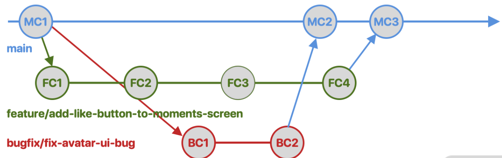
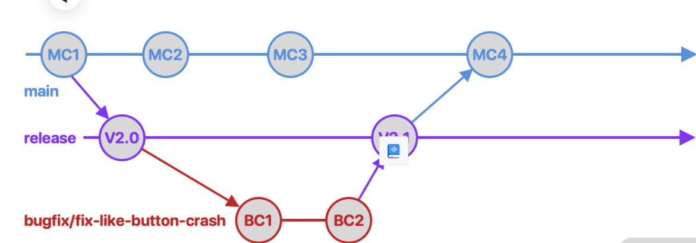
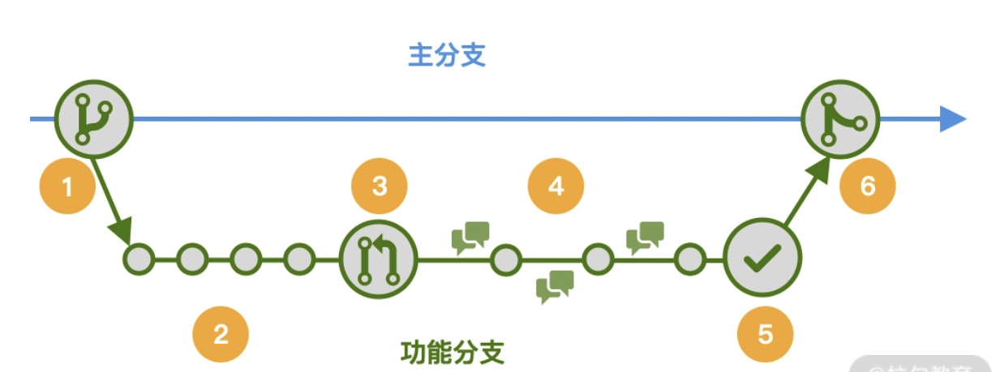
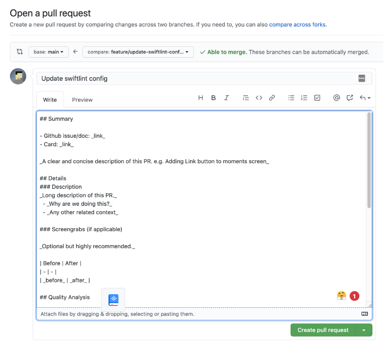
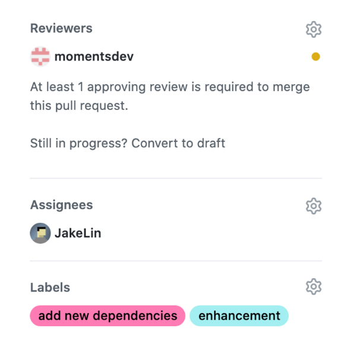
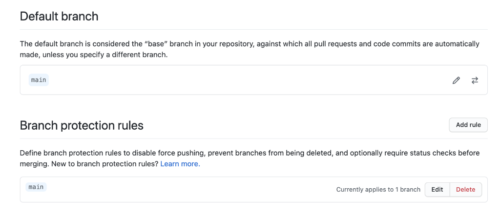
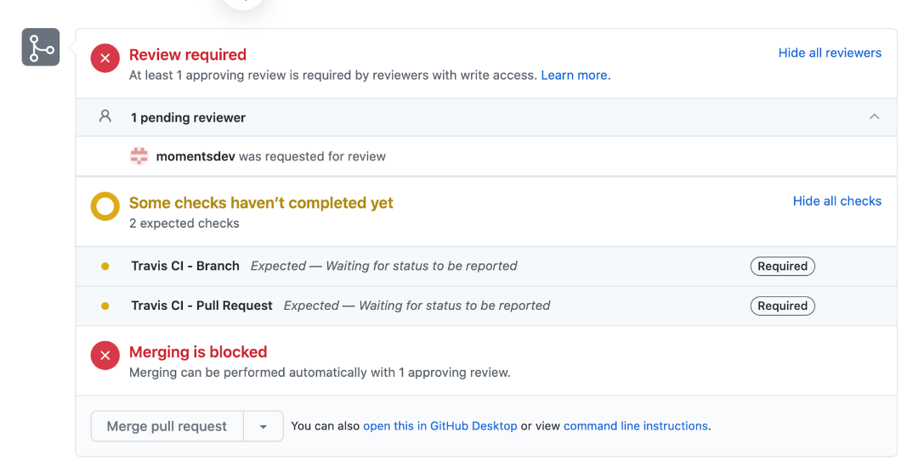
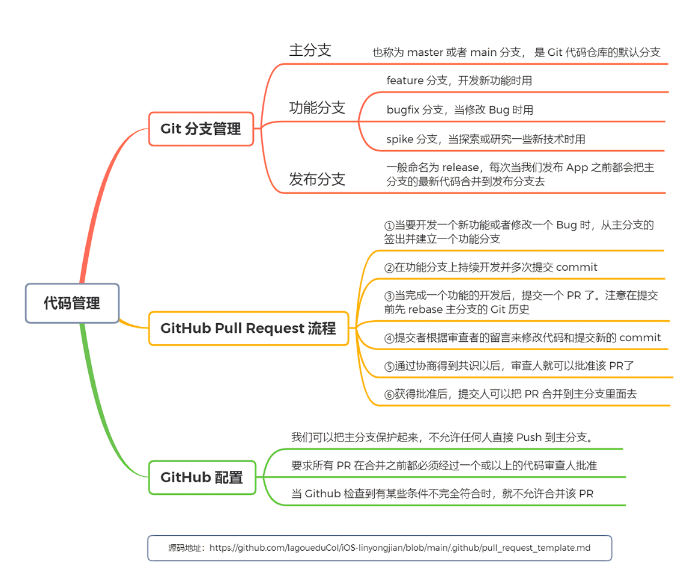

# 🖋每周总结

## 第一周

### 算法题：换炉


预定条件：在生产高炉数量固定，正在生产高炉数量为7，也可能是6 或者是5（原始总数是7），每座高炉对应的煤气值小于 标准值（比如1#是90000）且持续8分钟认为是正在换炉.

注：每座高炉每分钟采集数据得到对应的煤气值和是否停机信号，停机的不参与计算。
需要判断违规情况：

例如在运行高炉6炉情况下，有3炉 持续时间大于等于10分钟 则认为违规
有4炉 同时持续时间大于等于1分钟 则也认为违规。
在运行高炉为7炉情况下，另有上述类似的规则。

问题1：需要得到 不定数量高炉（参数不定即可配置）下 得到当前时间的高炉违规情况和信息

问题2：得到 一段时间内 高炉运行的 违规历史记录。

写一写 算法步骤（包括参数设定等情况）

```javascript
// 一共有m个高炉
// 假设当前正在运行的高炉数量为running，有replacing个正在置换，且到目前为止持续了n分钟，判断当前是否违规
// 问题1：需要得到 不定数量高炉（参数不定即可配置）下 得到当前时间的高炉违规情况和信息

function panduan(now) {
  let running = 0;
  let replacing = 0;
  let gaolu = []; //记录每个高炉的持续时间
  let public = infinity; //多炉同时运行的时间
  for (let i = 0; i < m; i++) {
    if (第i个高炉不停机) {
      let n = 0; //这个高炉的持续时间
      running++;
      // 从当前时间向前回溯
      while (回溯时间收集到的煤气小于标准值) {
        n++;
        now--;
      }
      gaolu.push(n);
    }
  }
  let res = true;
  for (let item of gaolu) {
    if (item > 0) {
      replacing++;
      if (public > item) {
        public = item;
      }
    }
  }
  if (replacing > Math.floor(running / 2)) {
      res = public>=1 ? false : true;
    }
  } else if (replacing === Math.floor(running / 2)) {
     res = public>=10 ? false : true;
  }
  return res;
}
// 得到 一段时间内 高炉运行的 违规历史记录。
function all(start, end) {
  let res = [];
  let s = new Date(start).getMinutes();
  let e = new Date(end).getMinutes();
  while (s <= e) {
    if (!panduan(s)) {
      res.push(s);
    }
    s++;
  }
  let result = [{'start':res[0],'end':res[0]}];
  for(let i=1;i<res.length;i++){
    if(res[i]-res[i-1]===1){  //如果相邻，进行合并
    result[result.length-1].end = res[i];
  } else {   //如果不相邻，则重新开启一个时间段
    result.push({'start':res[i],'end':res[i]})
}
}        
  return res;
}
```

## 第二周

### Iconify上手体验

今天学习了Iconify，一方面之后的项目会使用到，另一方面是Anthony Fu大佬在社区一直在推荐并推动着这个项目，我也是通过了他的两篇博客[Journey with Icons]([Journey with Icons (antfu.me)](https://antfu.me/posts/journey-with-icons)) 和[Journey with Icons Continues]([Journey with Icons Continues (antfu.me)](https://antfu.me/posts/journey-with-icons-continues))来进行的学习，并上手体验了一下，以此来记录一下😊。

[Iconify](https://iconify.design/)是一款收录各种图标供开发者使用的开源项目，提供了超过 150，000 个开源矢量图标，而且数目还在持续增长。

#### purge-icons插件

使用iconify服务器提供的在线图标会出现很多的不稳定因素，可能会出现在首次加载时闪烁的现象，解决方法就是将图标预加载和图标渲染进行同步，AnthonyFu创作的这款purgeicons插件为我们完美的解决了问题。

> 它静态分析您的代码并按需生成[图标包](https://docs.iconify.design/sources/bundles/)。


使用方法：

```js
import { createApp } from 'vue'
import App from './App.vue'

import '@purge-icons/generated' // <-- This

createApp(App).mount('#app')
```

由于我的项目都是基于Vben,而我也发现Vben也正是采用的这款方案，所以我直接在Vben项目上进行了实验。

在Vben/build/vite/plugin/index.ts中有对该插件的相关配置：

```js
import purgeIcons from 'vite-plugin-purge-icons';
export function createVitePlugins(viteEnv: ViteEnv, isBuild: boolean) {
    const vitePlugins: (Plugin | Plugin[])[] = [
    // have to
    vue(),
    // have to
    vueJsx(),
    // support name
    vueSetupExtend(),
  ];
    ...
    vitePlugins.push(purgeIcons());
    return vitePlugins;
}
```

下面是Vben封装的Icon.vue组件

```vue
<template>
  <SvgIcon
    :size="size"
    :name="getSvgIcon"
    v-if="isSvgIcon"
    :class="[$attrs.class, 'anticon']"
    :spin="spin"
  />
  <span
    v-else
    ref="elRef"
    :class="[$attrs.class, 'app-iconify anticon', spin && 'app-iconify-spin']"
    :style="getWrapStyle"
  ></span>
</template>
<script lang="ts">
  import type { PropType } from 'vue';
  import {
    defineComponent,
    ref,
    watch,
    onMounted,
    nextTick,
    unref,
    computed,
    CSSProperties,
  } from 'vue';
  import SvgIcon from './SvgIcon.vue';
  import Iconify from '@purge-icons/generated';
  import { isString } from '/@/utils/is';
  import { propTypes } from '/@/utils/propTypes';

  const SVG_END_WITH_FLAG = '|svg';
  export default defineComponent({
    name: 'Icon',
    components: { SvgIcon },
    props: {
      // icon name
      icon: propTypes.string,//组件接受icon的名字
      // icon color
      color: propTypes.string,//icon的颜色
      // icon size
      size: { //icon的大小
        type: [String, Number] as PropType<string | number>,
        default: 16,
      },
      spin: propTypes.bool.def(false),//是否有加载动画 
      prefix: propTypes.string.def(''),//icon的前缀
    },
    setup(props) {
      const elRef = ref<ElRef>(null); 
      const isSvgIcon = computed(() => props.icon?.endsWith(SVG_END_WITH_FLAG));
      const getSvgIcon = computed(() => props.icon.replace(SVG_END_WITH_FLAG, ''));
      const getIconRef = computed(() => `${props.prefix ? props.prefix + ':' : ''}${props.icon}`);

      const update = async () => {
        if (unref(isSvgIcon)) return;

        const el = unref(elRef);
        if (!el) return;

        await nextTick();
        const icon = unref(getIconRef);
        if (!icon) return;

        const svg = Iconify.renderSVG(icon, {});
          //对图标进行渲染
        if (svg) {
          el.textContent = '';
          el.appendChild(svg);
        } else {
          const span = document.createElement('span');
          span.className = 'iconify';
          span.dataset.icon = icon;
          el.textContent = '';
          el.appendChild(span);
        }
      };

      const getWrapStyle = computed((): CSSProperties => {
        const { size, color } = props;
        let fs = size;
        if (isString(size)) {
          fs = parseInt(size, 10);
        }

        return {
          fontSize: `${fs}px`,
          color: color,
          display: 'inline-flex',
        };
      });

      watch(() => props.icon, update, { flush: 'post' });

      onMounted(update);

      return { elRef, getWrapStyle, isSvgIcon, getSvgIcon };
    },
  });
</script>
<style lang="less">
  .app-iconify {
    display: inline-block;
    // vertical-align: middle;

    &-spin {
      svg {
        animation: loadingCircle 1s infinite linear;
      }
    }
  }

  span.iconify {
    display: block;
    min-width: 1em;
    min-height: 1em;
    background-color: @iconify-bg-color;
    border-radius: 100%;
  }
</style>
```

在组件中使用

```vue
  <CollapseContainer title="IconIfy 组件使用" class="my-5">
      <div class="flex justify-around flex-wrap">
        <Icon icon="ion:layers-outline" :size="30" />
        <Icon icon="ion:bar-chart-outline" :size="30" />
        <Icon icon="ion:tv-outline" :size="30" />
        <Icon icon="ion:settings-outline" :size="30" />
        <Icon icon="material-symbols:10k-outline" :size="30" />
        <Icon icon="emojione-v1:anxious-face-with-sweat" :size="30"/>
        <Icon icon="twemoji:face-with-hand-over-mouth"  size="30"/>
      </div>
    </CollapseContainer>
```

显示


#### Icônes

类似于阿里的iconfont平台，可以自己挑选需要的图标库并进行下载，也是由antfu大佬进行开源


最方便的是可以下载对应的组件，直接解压到相关项目的目录中，以组件的形式直接引入到项目中，太方便啦😎

#### Iconify IntelliSense for VS Code

配套使用的还有antfu佬为编辑器开发的图标智能化插件


可以是我们在编辑器中便可以看到图标，使用的时候先打出图标集名称，用`：`断开，插件会提供图标集下所有的图标可供搜索和选择。


#### 新的解决发案(搭配自动导入插件)

> Vite 的核心概念之一是一切都是**按需的**。模块仅在被请求时进行转译。通过这种方式，Vite 服务器立即启动，而无需捆绑整个应用程序。此外，[Vite 的插件 API](https://vitejs.dev/guide/api-plugin.html) 是 [Rollup 插件系统](https://rollupjs.org/guide/en/#plugin-development)之上的扩展，它允许您对模块进行一些[自定义转换](https://rollupjs.org/guide/en/#transform)。
>
> 因此，如果我们以 Vite 的方式思考 - 也许我们可以在编译时而不是客户端解决这个问题！通过使用[虚拟模块](https://vitejs.dev/guide/api-plugin.html#importing-a-virtual-file)，我能够**即时**将图标作为组件提供，并将其作为[`vite-plugin-icon`](https://github.com/antfu/unplugin-icons)（重命名为稍后）。`unplugin-icons`

所以下面主要使用[unplugin-icons](https://github.com/antfu/unplugin-icons)来进行下面的实验

##### 只安装一个图标集

##### install

------

``` bash
npm i -D unplugin-icons
```

安装skill Icons

``` bash
npm i -D @iconify-json/skill-icons
```

在vite.config.js中添加

``` js
import { defineConfig } from 'vite'
import vue from '@vitejs/plugin-vue'
import Icons from 'unplugin-icons/vite'
import IconsResolver from 'unplugin-icons/resolver'
import Components from 'unplugin-vue-components/vite' //自动导入功能支持
// https://vitejs.dev/config/
export default defineConfig({
  plugins: [
    vue(),
    Icons({  //icons插件
      autoInstall: true,//可以在编译阶段自动引入未安装的图标
      compiler:'vue3'
   }),
   Components({
    resolvers:[
      IconsResolver({   //通过resolver使其可以自动导入功能
        prefix:'icon'   //{prefix}-{collection}-{icon}
      })
    ]
   })
  ]
})

```

在组件中使用

``` vue
<template>
  <icon-SkillIcons-vue />
  <icon-twemoji:1st-place-medal style="font-size: 4em;color:blue"></icon-twemoji:1st-place-medal>
  <icon-ic:baseline-11mp style="font-size: 3em; color: aquamarine;"></icon-ic:baseline-11mp>
  <icon-ic:sharp-pause-circle/>
  <icon-bi:1-circle-fill />
  <icon-carbon:align-box-top-left />
</template>
```

## 第三周

### 前言

毕业这几个月基本没怎么写过代码，而最近突然上手公司的Vue3项目，突然感觉很吃力，,总结一下做的事情和踩了不少坑🤣，以此来激励一下自己不能松懈下来。

### 更换hosts

> hosts文件是一个用于储存计算机网络中各节点信息的计算机文件。这个文件负责将主机名映射到相应的IP地址。hosts文件通常用于补充或取代网络中DNS的功能。和DNS不同的是，计算机的使用者可以直接对hosts文件进行控制。

所以在开发公司的项目时通常会使用公司内部的私服，我们需要将这些ip地址修改到本机的host文件上，网络才可以跑通。

 ------

#### 具体步骤

host文件在windows/system32/drive/etc/hosts，修改host文件需要管理员权限，很是麻烦，我们可以直接将host文件拖到桌面然后进行修改（桌面操作都是由管理员进行），修改完后拖入到文件夹即可。

#### 验证是否成功

打开cmd终端，使用ping命令对目标ip的域名进行测试

``` bash
ping www.baidu.com
```

链接成功则说明成功分配

### Sass依赖问题

我每次拉取公司的项目代码后，在`pnpm install`后，开启服务器`pnpm serve`后，都会报sass依赖没有安装，之后我再次进行安装sass后还是会报错，后来终于找到了原因是因为📂的名字是中文😅

::: warning
所以文件夹名字一定不要用中文！！！😭
:::

### 使用表单组件

在使用输入框组件时注意数字的输入框位数不能超过16位，因为在JS中，数值的依赖于数据类型的。其中最大的整数可以通过Number.MAX_SAFE_INTEGER或者Math.pow(2, 53) - 1来表示，即9007199254740991。如果要表示比这个更大的整数，可以使用BigInt数据类型。BigInt可以表示任意大的整数，只受限于计算机内存的大小。

### 给组件加样式

### 下周的目标

- [ ] vue3 学习
- [ ] pinia 学习
- [ ] vueuse 学习
- [ ] tailwindCss学习

## 第四周

### 取消操作涉及到的死锁问题

业务需求是在对输入框修改后，点击取消则显示之前的值。

问题的出现：当一个用户在对数据修改后，还没有点击取消，另一个用户同时进行修改后并进行保存，这时第一个用户点击取消后获取到的值并不是当前数据库的值，造成了值的丢失。

## 第五周

### watchEffect的执行时机

在watchEffect中调用了Vuedom实例中的方法，报错为找不到该属性。

原因在于watchEffect执行时，dom元素还没有挂载完成，所以不能对dom进行任何操作和更新。

## 第六周

### 使用 Git 与 GitHub 统一代码管理流程

现代的软件开发活动通常需要多人参与。为了保证不同开发者可以同时贡献到同一个代码库，Git 提供了分支（Branch）来支持并行开发。不同团队有不同的 Git 分支管理方式，根据我们团队多年的经验，经过不断的完善，最终形成出一套简单并十分有效的 Git 分支管理规范，你可以参考下。这套规范是怎样的呢？

具体来说，我把所有的 Git 分支分成三类：主分支，功能分支和发布分支，让它们各自承担不同的功能。

其中主分支也称为master或者main分支， 是 Git 代码仓库的默认分支。在 Xcode 12 以后，新建项目时也会默认生成命名为main的主分支。

主分支在软件开发中非常重要，它是我们 App 的唯一的信息源（Single source of truth），不论是编译出不同版本的 App 还是排查问题，都需要用到主分支的代码。并且，团队同事的代码，最终也必须汇总到这个主分支中，且不能出错。所以，所谓的统一代码管理流程，就是制定其他分支的代码如何合并到主分支的流程。

功能分支是我们在开发过程中建立的临时分支，它可以用来保存一次开发活动的状态。根据不同的开发活动，我把功能分支分成几个小类。

feature分支，当开发一个新功能的时候，我会为每一个功能建立一个叫作feature分支，当整个功能完成后就可以合并到主分支里面，并把该分支从 Git 代码仓库中删除掉。

bugfix分支，当发现 Bug 的时候，会专门建立一个bugfix分支，修改 Bug 后把它合并到主分支里面去。

spike分支，当我们探索或研究一些新技术（如 App Clips 功能）的时候，会建立一个叫作spike的分支。在得出结论以后，我才决定是否把该分支合并到主分支。如果探索失败，我就不会把相关的spike分支合并到主分支了。

在新建一个功能分支的时候，我们都遵循一定的命名规范，一般会把功能的描述作为分支的名称。例如当我们要开发一个点赞功能时，会把该分支可以命名为feature/add-like-button-to-moments-screen。又例如当我们需要修改用户头像的一个 UI Bug 时，会把分支命名为bugfix/fix-avatar-ui-bug。


举例来说，我有一个同事要开发点赞功能，他就从主分支最新的MC1commit 签出（checkout）并新建feature/add-like-button-to-moments-screen来进行点赞功能的开发。与此同时，另外一个同事发现了一个用户头像的 UI Bug，她也从MC1commit 签出并新建了bugfix/fix-avatar-ui-bug来修改 Bug。

当头像的 Bug 修改完成后，开发组长把BC2commit 合并到主分支里面。在此之后点赞功能也开发完毕，开发组长又把该功能分支上的FC4commit 合并到主分支里面。这两个分支彼此独立，而且互不影响。

除了主分支和功能分支以外，我们在发布 App 的时候还使用到发布分支。

发布分支一般命名为release。每次当我们发布 App 之前都会把主分支的最新代码合并到发布分支去。因此发布分支会一直保存 App 发布版的源码记录。

有了发布分支以后，一旦发生严重的线上事故，例如出现引起高崩溃率的 Bug 时，我们可以马上在发布分支上进行修复。一般的做法是从发布分支上签出一个功能分支，例如当修复点赞按钮引起的崩溃时，我们可以建立一个叫作bugfix/fix-like-button-crash的功能分支，在修复该崩溃以后马上合并到发布分支，并提交到 App Store ，更新线上的 App。

由上图可见，当我们把主分支最新的MC1commit 合并到release分支以后，提交了一个版本号为V2.0的 App 到 App Store。当我们通过查看崩溃报告，得知新上线的点缀功能引起很多崩溃时，可以采取如下措施：

马上从release分支的V2.0commit 签出bugfix/fix-like-button-crash分支并修复该崩溃；

把BC2commit 合并回release分支，并立刻提交版本号为V2.1的 App 到 App Store；

把包含了该修复的V2.1commit 合并到main分支，保证主分支统一管理所有代码的更新状态。

有了上面讲的三大分支，以及它们签出和合并的流程，我们就定义了一部分的代码管理规范——知道什么时候要使用哪个分支进行开发或者发布。但是你可能已经察觉到，当我们把功能分支合并到主分支的时候并没有进行任何的审查，万一有人不小心把 Bug 合并到主分支怎么办？

解决方案就是Pull Request。
Pull Request 是一个代码审查工具，它允许开发人员创建一个 Pull Request 请求，请求的目的是希望其他开发人员审查该请求，并决定是否合并到主分支。

### GitHub Pull Request流程



这套流程分成六步。

第一步，当我们要开发一个新功能或者修改一个 Bug 时，从主分支的签出并建立一个功能分支。这里需要注意的是，为了减少合并时出现的冲突，我们需要从主分支最新的一个 commit 签出。

第二步，我们可以在功能分支上持续开发并多次提交 commit。因为我们是在独立的功能分支上进行开发，所有的变动都不会影响到主分支，所以可以放心修改所需的代码。

第三步，当我们完成一个功能的开发以后，就可以提交一个 PR 了。为了避免合并冲突，我建议在提交 PR 前先 rebase 主分支的 Git 历史。同时为了方便其他成员审查代码和参与讨论，我们在提交 PR 的时候需要清楚地描述所完成的功能，并把注意 事项，UI 前后变动的区别，测试步骤等等一同写到 PR 描述文档里面。

在我们项目中，为了方便开发者编写 PR 描述文档，需要建立了一个模板文件pull_request_template.md。当我们提交 PR 的时候，GitHub 会自动读取并准备好描述文档的模板，我们只需要填写相关内容即可。这里是[地址](https://github.com/lagoueduCol/iOS-linyongjian/blob/main/.github/pull_request_template.md)



在提交 PR 的时候，我们还可以加上代码审查人（Reviewer）来通知他/她审查代码。同时也可以加上分类的标签（Label）来方便管理所有的 PR，例如使用enhancement表示功能开发，使用bug表示 Bug 修改。如果你的项目由多团队同时开发，我们还会为每个产品团队都建立一个标签，这样就能清楚地知道这个 PR 来自那个产品团队了。



第四步，一旦 PR 提交以后，其他成员就会收到通知消息，他们可以进行代码审查，并把反馈意见留言到 RP 里面。提交者可以根据留言来修改代码和提交新的 commit。当所有留言都修正和完善以后，可以再次通知审查人进行进一步的审查。

第五步，大家通过协商得到共识以后，审查人就可以批准（approve）该 PR。这表示该 PR 可以随时合并到主分支了。

第六步，当 PR 得到批准以后，提交人可以把 PR 合并到主分支里面去。我建议在合并之前先 rebase 主分支上的最新 commit，这样能保证合并过程没有冲突，并使得 Git 的历史更加简洁。

上面就是我们的统一的代码管理流程。为了进一步保证少犯错误，我们可以通过修改 GitHub 上的配置来为每一步操作做自动检查，以保证所有成员都必须严格遵循一致的代码管理流程。

### Github配置

在 Github 上，我们可以通过配置来设置代码管理流程。
第一步，在项目的 Settings 页面，我们可以设置默认分支。默认分支是主分支，所有新的 PR 都会从主分支签出。

第二步，在项目的 Settings 页面，我们可以设置保护分支。保护分支是指只有被批准以后，才能合并到主分支的分支。这样就能保证所有 PR 都经过审查，并得到批准以后才能合并到主分支。我们还要设置代码审查人。代码审查人是指在 PR 合并到主分支之前，对 PR 进行审查的人。所有 PR 在合并之前都必须经过一个或以上的代码审查人批准。审查人的数量可以根据团队的情况进行调整。


当 Github 检查到有某些条件不完全符合时，就不允许我们合并该 PR。

比如，因为我们的项目配置了所有的 PR 都必须有一个或以上的代码审查人批准后才能合并。上图可以见 GitHub PR 页面上的Merge pull request按钮是失效的，并提示 “Merging can be performed automatically with 1 approving review” （需要一个代码审查通过后才能合并）。

第三步，在项目的 Settings 页面，我们可以设置标签。标签是用来对 PR 进行分类的，例如使用enhancement表示功能开发，使用bug表示 Bug 修改。如果你的项目由多团队同时开发，我们还会为每个产品团队都建立一个标签，这样就能清楚地知道这个 PR 来自那个产品团队了。

------
### 总结


在上述 PR 流程的第一步是从主分支签出一个功能分支，而不是使用 Fork，为什么这样做？
因为 Fork 分支是独立的，如果主分支上的代码有更新，Fork 分支上没有更新，那么 Fork 分支就无法与主分支合并。而功能分支是依赖于主分支的，所以功能分支可以与主分支合并。

### 参考

- [ios架构与开发第二课 代码规范管理与自动化构建](https://blog.csdn.net/fegus/article/details/124624399)

- [GitHub 工作流](https://guides.github.com/introduction/flow/)

