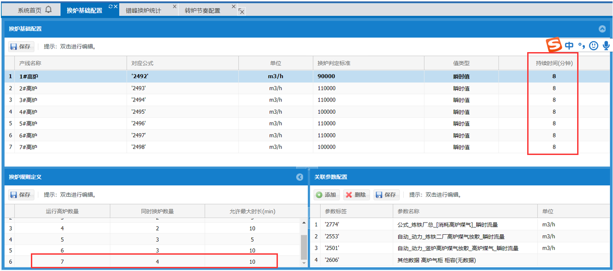

# 🖋每周总结

## 第一周

### 算法题：换炉


预定条件：在生产高炉数量固定，正在生产高炉数量为7，也可能是6 或者是5（原始总数是7），每座高炉对应的煤气值小于 标准值（比如1#是90000）且持续8分钟认为是正在换炉.

注：每座高炉每分钟采集数据得到对应的煤气值和是否停机信号，停机的不参与计算。
需要判断违规情况：

例如在运行高炉6炉情况下，有3炉 持续时间大于等于10分钟 则认为违规
有4炉 同时持续时间大于等于1分钟 则也认为违规。
在运行高炉为7炉情况下，另有上述类似的规则。

问题1：需要得到 不定数量高炉（参数不定即可配置）下 得到当前时间的高炉违规情况和信息

问题2：得到 一段时间内 高炉运行的 违规历史记录。

写一写 算法步骤（包括参数设定等情况）

```javascript
// 一共有m个高炉
// 假设当前正在运行的高炉数量为running，有replacing个正在置换，且到目前为止持续了n分钟，判断当前是否违规
// 问题1：需要得到 不定数量高炉（参数不定即可配置）下 得到当前时间的高炉违规情况和信息

function panduan(now) {
  let running = 0;
  let replacing = 0;
  let gaolu = []; //记录每个高炉的持续时间
  let public = infinity; //多炉同时运行的时间
  for (let i = 0; i < m; i++) {
    if (第i个高炉不停机) {
      let n = 0; //这个高炉的持续时间
      running++;
      // 从当前时间向前回溯
      while (回溯时间收集到的煤气小于标准值) {
        n++;
        now--;
      }
      gaolu.push(n);
    }
  }
  let res = true;
  for (let item of gaolu) {
    if (item > 0) {
      replacing++;
      if (public > item) {
        public = item;
      }
    }
  }
  if (replacing > Math.floor(running / 2)) {
      res = public>=1 ? false : true;
    }
  } else if (replacing === Math.floor(running / 2)) {
     res = public>=10 ? false : true;
  }
  return res;
}
// 得到 一段时间内 高炉运行的 违规历史记录。
function all(start, end) {
  let res = [];
  let s = new Date(start).getMinutes();
  let e = new Date(end).getMinutes();
  while (s <= e) {
    if (!panduan(s)) {
      res.push(s);
    }
    s++;
  }
  let result = [{'start':res[0],'end':res[0]}];
  for(let i=1;i<res.length;i++){
    if(res[i]-res[i-1]===1){  //如果相邻，进行合并
    result[result.length-1].end = res[i];
  } else {   //如果不相邻，则重新开启一个时间段
    result.push({'start':res[i],'end':res[i]})
}
}        
  return res;
}
```

## 第二周

### Iconify上手体验

今天学习了Iconify，一方面之后的项目会使用到，另一方面是Anthony Fu大佬在社区一直在推荐并推动着这个项目，我也是通过了他的两篇博客[Journey with Icons]([Journey with Icons (antfu.me)](https://antfu.me/posts/journey-with-icons)) 和[Journey with Icons Continues]([Journey with Icons Continues (antfu.me)](https://antfu.me/posts/journey-with-icons-continues))来进行的学习，并上手体验了一下，以此来记录一下😊。

[Iconify](https://iconify.design/)是一款收录各种图标供开发者使用的开源项目，提供了超过 150，000 个开源矢量图标，而且数目还在持续增长。

#### purge-icons插件

使用iconify服务器提供的在线图标会出现很多的不稳定因素，可能会出现在首次加载时闪烁的现象，解决方法就是将图标预加载和图标渲染进行同步，AnthonyFu创作的这款purgeicons插件为我们完美的解决了问题。

> 它静态分析您的代码并按需生成[图标包](https://docs.iconify.design/sources/bundles/)。


使用方法：

```js
import { createApp } from 'vue'
import App from './App.vue'

import '@purge-icons/generated' // <-- This

createApp(App).mount('#app')
```

由于我的项目都是基于Vben,而我也发现Vben也正是采用的这款方案，所以我直接在Vben项目上进行了实验。

在Vben/build/vite/plugin/index.ts中有对该插件的相关配置：

```js
import purgeIcons from 'vite-plugin-purge-icons';
export function createVitePlugins(viteEnv: ViteEnv, isBuild: boolean) {
    const vitePlugins: (Plugin | Plugin[])[] = [
    // have to
    vue(),
    // have to
    vueJsx(),
    // support name
    vueSetupExtend(),
  ];
    ...
    vitePlugins.push(purgeIcons());
    return vitePlugins;
}
```

下面是Vben封装的Icon.vue组件

```vue
<template>
  <SvgIcon
    :size="size"
    :name="getSvgIcon"
    v-if="isSvgIcon"
    :class="[$attrs.class, 'anticon']"
    :spin="spin"
  />
  <span
    v-else
    ref="elRef"
    :class="[$attrs.class, 'app-iconify anticon', spin && 'app-iconify-spin']"
    :style="getWrapStyle"
  ></span>
</template>
<script lang="ts">
  import type { PropType } from 'vue';
  import {
    defineComponent,
    ref,
    watch,
    onMounted,
    nextTick,
    unref,
    computed,
    CSSProperties,
  } from 'vue';
  import SvgIcon from './SvgIcon.vue';
  import Iconify from '@purge-icons/generated';
  import { isString } from '/@/utils/is';
  import { propTypes } from '/@/utils/propTypes';

  const SVG_END_WITH_FLAG = '|svg';
  export default defineComponent({
    name: 'Icon',
    components: { SvgIcon },
    props: {
      // icon name
      icon: propTypes.string,//组件接受icon的名字
      // icon color
      color: propTypes.string,//icon的颜色
      // icon size
      size: { //icon的大小
        type: [String, Number] as PropType<string | number>,
        default: 16,
      },
      spin: propTypes.bool.def(false),//是否有加载动画 
      prefix: propTypes.string.def(''),//icon的前缀
    },
    setup(props) {
      const elRef = ref<ElRef>(null); 
      const isSvgIcon = computed(() => props.icon?.endsWith(SVG_END_WITH_FLAG));
      const getSvgIcon = computed(() => props.icon.replace(SVG_END_WITH_FLAG, ''));
      const getIconRef = computed(() => `${props.prefix ? props.prefix + ':' : ''}${props.icon}`);

      const update = async () => {
        if (unref(isSvgIcon)) return;

        const el = unref(elRef);
        if (!el) return;

        await nextTick();
        const icon = unref(getIconRef);
        if (!icon) return;

        const svg = Iconify.renderSVG(icon, {});
          //对图标进行渲染
        if (svg) {
          el.textContent = '';
          el.appendChild(svg);
        } else {
          const span = document.createElement('span');
          span.className = 'iconify';
          span.dataset.icon = icon;
          el.textContent = '';
          el.appendChild(span);
        }
      };

      const getWrapStyle = computed((): CSSProperties => {
        const { size, color } = props;
        let fs = size;
        if (isString(size)) {
          fs = parseInt(size, 10);
        }

        return {
          fontSize: `${fs}px`,
          color: color,
          display: 'inline-flex',
        };
      });

      watch(() => props.icon, update, { flush: 'post' });

      onMounted(update);

      return { elRef, getWrapStyle, isSvgIcon, getSvgIcon };
    },
  });
</script>
<style lang="less">
  .app-iconify {
    display: inline-block;
    // vertical-align: middle;

    &-spin {
      svg {
        animation: loadingCircle 1s infinite linear;
      }
    }
  }

  span.iconify {
    display: block;
    min-width: 1em;
    min-height: 1em;
    background-color: @iconify-bg-color;
    border-radius: 100%;
  }
</style>
```

在组件中使用

```vue
  <CollapseContainer title="IconIfy 组件使用" class="my-5">
      <div class="flex justify-around flex-wrap">
        <Icon icon="ion:layers-outline" :size="30" />
        <Icon icon="ion:bar-chart-outline" :size="30" />
        <Icon icon="ion:tv-outline" :size="30" />
        <Icon icon="ion:settings-outline" :size="30" />
        <Icon icon="material-symbols:10k-outline" :size="30" />
        <Icon icon="emojione-v1:anxious-face-with-sweat" :size="30"/>
        <Icon icon="twemoji:face-with-hand-over-mouth"  size="30"/>
      </div>
    </CollapseContainer>
```

显示


#### Icônes

类似于阿里的iconfont平台，可以自己挑选需要的图标库并进行下载，也是由antfu大佬进行开源


最方便的是可以下载对应的组件，直接解压到相关项目的目录中，以组件的形式直接引入到项目中，太方便啦😎

#### Iconify IntelliSense for VS Code

配套使用的还有antfu佬为编辑器开发的图标智能化插件


可以是我们在编辑器中便可以看到图标，使用的时候先打出图标集名称，用`：`断开，插件会提供图标集下所有的图标可供搜索和选择。


#### 新的解决发案(搭配自动导入插件)

> Vite 的核心概念之一是一切都是**按需的**。模块仅在被请求时进行转译。通过这种方式，Vite 服务器立即启动，而无需捆绑整个应用程序。此外，[Vite 的插件 API](https://vitejs.dev/guide/api-plugin.html) 是 [Rollup 插件系统](https://rollupjs.org/guide/en/#plugin-development)之上的扩展，它允许您对模块进行一些[自定义转换](https://rollupjs.org/guide/en/#transform)。
>
> 因此，如果我们以 Vite 的方式思考 - 也许我们可以在编译时而不是客户端解决这个问题！通过使用[虚拟模块](https://vitejs.dev/guide/api-plugin.html#importing-a-virtual-file)，我能够**即时**将图标作为组件提供，并将其作为[`vite-plugin-icon`](https://github.com/antfu/unplugin-icons)（重命名为稍后）。`unplugin-icons`

所以下面主要使用[unplugin-icons](https://github.com/antfu/unplugin-icons)来进行下面的实验

##### 只安装一个图标集

##### install

------

```
npm i -D unplugin-icons
```

安装skill Icons

```
npm i -D @iconify-json/skill-icons
```

在vite.config.js中添加

```
import { defineConfig } from 'vite'
import vue from '@vitejs/plugin-vue'
import Icons from 'unplugin-icons/vite'
import IconsResolver from 'unplugin-icons/resolver'
import Components from 'unplugin-vue-components/vite' //自动导入功能支持
// https://vitejs.dev/config/
export default defineConfig({
  plugins: [
    vue(),
    Icons({  //icons插件
      autoInstall: true,//可以在编译阶段自动引入未安装的图标
      compiler:'vue3'
   }),
   Components({
    resolvers:[
      IconsResolver({   //通过resolver使其可以自动导入功能
        prefix:'icon'   //{prefix}-{collection}-{icon}
      })
    ]
   })
  ]
})

```

在组件中使用

```
<template>
  <icon-SkillIcons-vue />
  <icon-twemoji:1st-place-medal style="font-size: 4em;color:blue"></icon-twemoji:1st-place-medal>
  <icon-ic:baseline-11mp style="font-size: 3em; color: aquamarine;"></icon-ic:baseline-11mp>
  <icon-ic:sharp-pause-circle/>
  <icon-bi:1-circle-fill />
  <icon-carbon:align-box-top-left />
</template>
```


## 第三周

### 前言
毕业这几个月基本没怎么写过代码，而最近突然上手公司的Vue3项目，突然感觉很吃力，,总结一下做的事情和踩了不少坑🤣，以此来激励一下自己不能松懈下来。

### 更换hosts
> hosts文件是一个用于储存计算机网络中各节点信息的计算机文件。这个文件负责将主机名映射到相应的IP地址。hosts文件通常用于补充或取代网络中DNS的功能。和DNS不同的是，计算机的使用者可以直接对hosts文件进行控制。

所以在开发公司的项目时通常会使用公司内部的私服，我们需要将这些ip地址修改到本机的host文件上，网络才可以跑通。

_________________

#### 具体步骤

host文件在windows/system32/drive/etc/hosts，修改host文件需要管理员权限，很是麻烦，我们可以直接将host文件拖到桌面然后进行修改（桌面操作都是由管理员进行），修改完后拖入到文件夹即可。

#### 验证是否成功

打开cmd终端，使用ping命令对目标ip的域名进行测试

```
ping www.baidu.com
```

链接成功则说明成功分配

### Sass依赖问题

我每次拉取公司的项目代码后，在`pnpm install`后，开启服务器`pnpm serve`后，都会报sass依赖没有安装，之后我再次进行安装sass后还是会报错，后来终于找到了原因是因为📂的名字是中文😅

::: warning
所以文件夹名字一定不要用中文！！！😭
:::

### 使用表单组件

在使用输入框组件时注意数字的输入框位数不能超过16位，因为在JS中，数值的依赖于数据类型的。其中最大的整数可以通过Number.MAX_SAFE_INTEGER或者Math.pow(2, 53) - 1来表示，即9007199254740991。如果要表示比这个更大的整数，可以使用BigInt数据类型。BigInt可以表示任意大的整数，只受限于计算机内存的大小。

### 给组件加样式


### 下周的目标

- [ ] vue3 学习
- [ ] pinia 学习
- [ ] vueuse 学习
- [ ] tailwindCss学习


## 第四周

### 取消操作涉及到的死锁问题

业务需求是在对输入框修改后，点击取消则显示之前的值。

问题的出现：当一个用户在对数据修改后，还没有点击取消，另一个用户同时进行修改后并进行保存，这时第一个用户点击取消后获取到的值并不是当前数据库的值，造成了值的丢失。