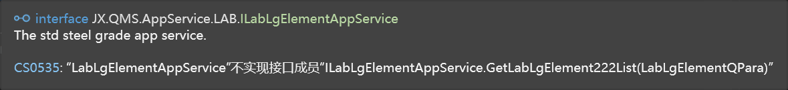
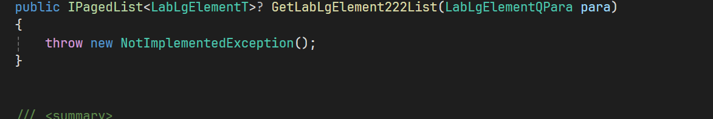
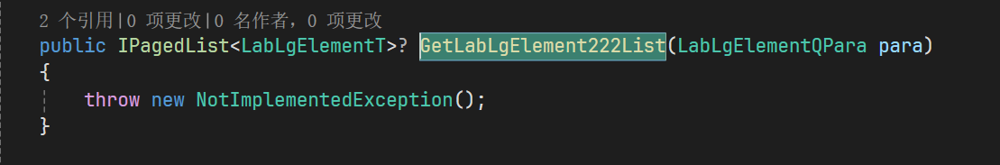

# 工作记录

## 前言

毕业这几个月基本没怎么写过代码，而最近突然上手公司的 Vue3 项目，突然感觉很吃力，,总结一下做的事情和踩了不少坑 🤣，以此来激励一下自己不能松懈下来。

## 更换 hosts

> hosts 文件是一个用于储存计算机网络中各节点信息的计算机文件。这个文件负责将主机名映射到相应的 IP 地址。hosts 文件通常用于补充或取代网络中 DNS 的功能。和 DNS 不同的是，计算机的使用者可以直接对 hosts 文件进行控制。

所以在开发公司的项目时通常会使用公司内部的私服，我们需要将这些 ip 地址修改到本机的 host 文件上，网络才可以跑通。

---

### 具体步骤

host 文件在 windows/system32/drive/etc/hosts，修改 host 文件需要管理员权限，很是麻烦，我们可以直接将 host 文件拖到桌面然后进行修改（桌面操作都是由管理员进行），修改完后拖入到文件夹即可。

### 验证是否成功

打开 cmd 终端，使用 ping 命令对目标 ip 的域名进行测试

```bash
ping www.baidu.com
```

链接成功则说明成功分配

## Sass 依赖问题

我每次拉取公司的项目代码后，在`pnpm install`后，开启服务器`pnpm serve`后，都会报 sass 依赖没有安装，之后我再次进行安装 sass 后还是会报错，后来终于找到了原因是因为 📂 的名字是中文 😅

::: warning
所以文件夹名字一定不要用中文！！！😭
:::

## 使用表单组件

在使用输入框组件时注意数字的输入框位数不能超过 16 位，因为在 JS 中，数值的依赖于数据类型的。其中最大的整数可以通过 Number.MAX_SAFE_INTEGER 或者 Math.pow(2, 53) - 1 来表示，即 9007199254740991。如果要表示比这个更大的整数，可以使用 BigInt 数据类型。BigInt 可以表示任意大的整数，只受限于计算机内存的大小。

## 给组件加样式

## 下周的目标

- [ ] vue3 学习
- [ ] pinia 学习
- [ ] vueuse 学习
- [ ] tailwindCss 学习

## C#上手记录

### 1.实现 controller

```c#
  [HttpGet("GetLabLgElementList")]
  public IHttpCommonResult<IPagedList<LabLgElementT>> GetLabLgElement222List([FromQuery] LabLgElementQPara para)
  {
      var rlt = this.TryCatchResult<IPagedList<LabLgElementT>>((rlt, logger) =>
      {
          rlt.Result = _labLgElementAppService.GetLabLgElement222List(para);
      }, _logger);
      return rlt;
  }
```

### 2.实现 AppService,IxxxAppService.cs 接口

```c#
 + IPagedList<LabLgElementT>? GetLabLgElement222List(LabLgElementQPara para);
```

转到该 service 实现会出现这个错误，使用 Alt+Enter 即可生成该实现，在此基础实现业务逻辑。



### 3.实现 Dservice

在其中调用仓储方法，完成业务逻辑,在调用 Dservice 的方法后，会出现报错提示没有定义该方法，使用 Alt+Enter 即可生成该定义，然后传到实现生成该 Dservice 的实现。

```c#
  public IPagedList<LabLgElementT>? GetLabLgElement222List(LabLgElementQPara para)
 {
     return _labLgElementDService.GetLabLgElement222List(para);
 }
```


