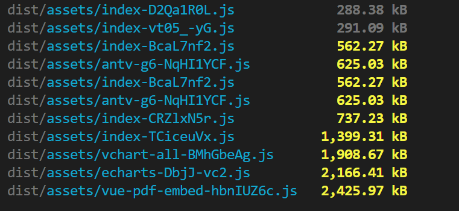

# 性能优化

## 代码体积优化

### 体积分析

使用 rollup-plugin-analyzer 分析体积

```bash
npm install rollup-plugin-analyzer --save-dev
```

### 启用 brotli 压缩

由于浏览器对 brotli 压缩的支持，我们可以在服务端启用 brotli 压缩，来减少文件的体积。

### 分包策略

#### 拆

```js
// 改进建议版本
build: {
  rollupOptions: {
    output: {
      manualChunks: (id) => {
        if (!id.includes("node_modules")) return;

        // 更安全的匹配方式（示例）
        const packageName = id.split("node_modules/").pop().split("/")[0];

        // 推荐的分包策略
        if (packageName.startsWith("echarts")) return "echarts";
        if (packageName.startsWith("@antv")) return "antv";
        if (packageName.startsWith("lodash")) return "lodash";

        // 兜底策略：高频更新的小库合并
        if (["dayjs", "axios"].includes(packageName)) return "utils";

        // 其余合并为 vendor
        return "vendor";
      };
    }
  }
}

// 思路:由于我们的项目都是内网项目，所以可以充分利用缓存，不引入CDN,将大的依赖包单独打包，避免打包到 index.js 中导致体积过大，并且将小的依赖包进行合并,避免文件太多。
```

#### 合并

使用了 experimentalMinChunkSize 这个字段来进行小文件的合并，对于我这个中型项目，在 20kb 以上是合理的

```js

// https://cn.rollupjs.org/configuration-options/#output-experimentalminchunksize

 rollupOptions: {
        output: {
          experimentalMinChunkSize: 20 * 1024,
          manualChunks: id => {
            if (id.includes('vue-pdf-embed')) {
              return 'vue-pdf-embed';
            }
            if (id.includes('echarts')) {
              return 'echarts';
            }
            // if (id.includes('node_modules')) {
            //   return id.toString().split('node_modules/')[1].split('/')[0].toString();
            // }
          }
        }
      }

```

分包后

除了第三方包体积偏大，其他的 index.js 拆分都在 500kb 左右，还算合理

## 1. 减少不必要的渲染
