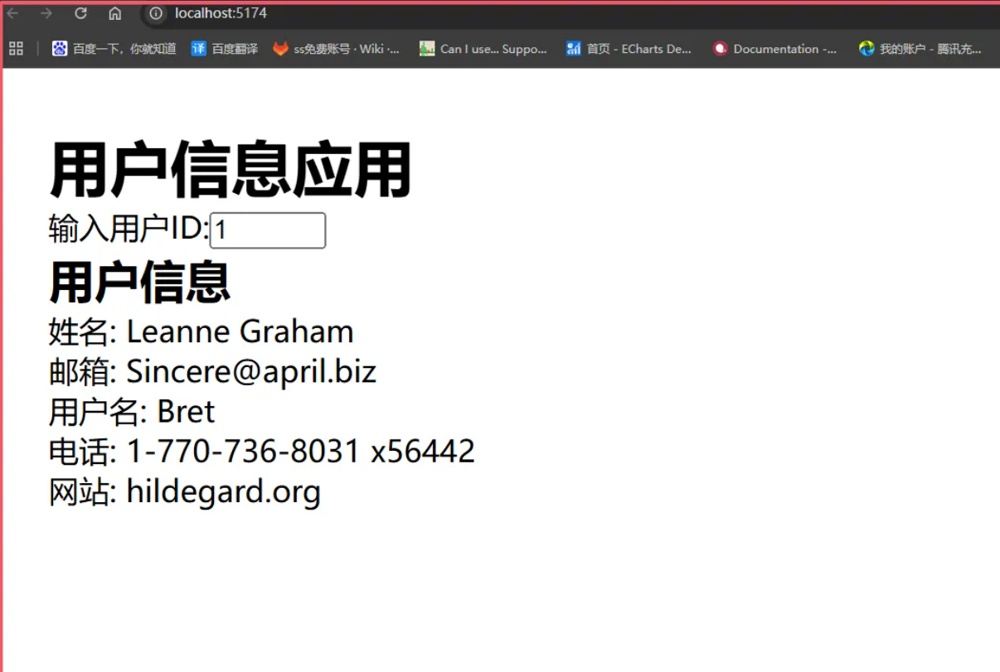
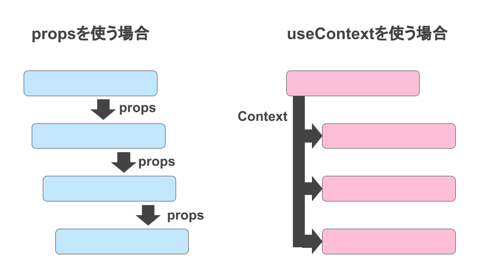
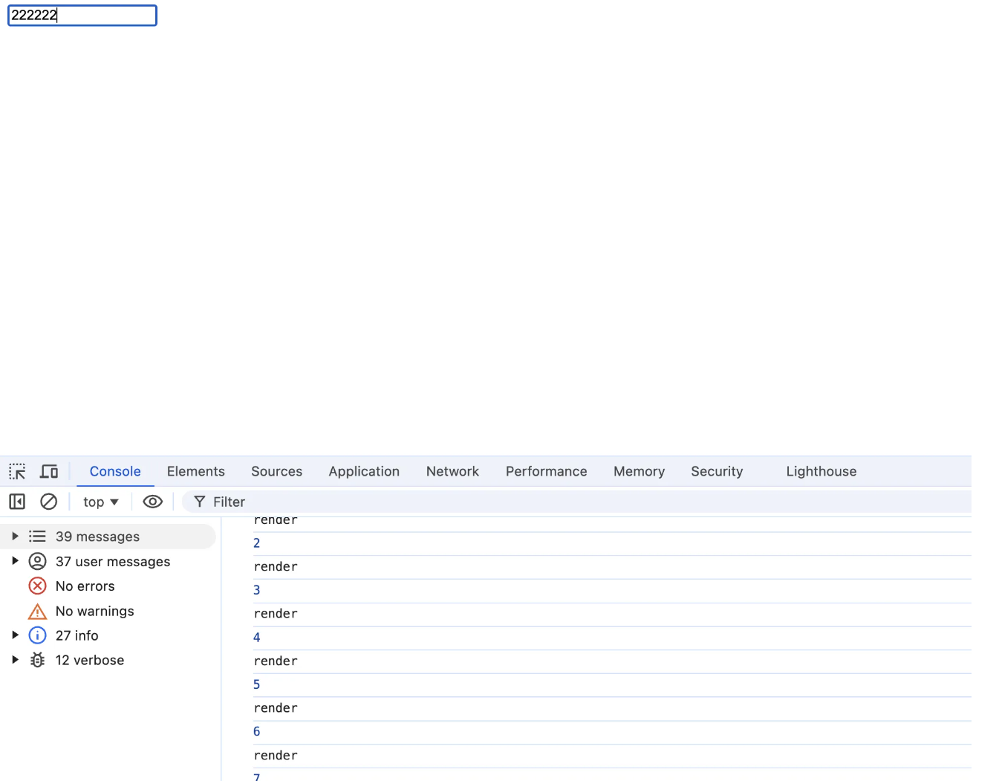
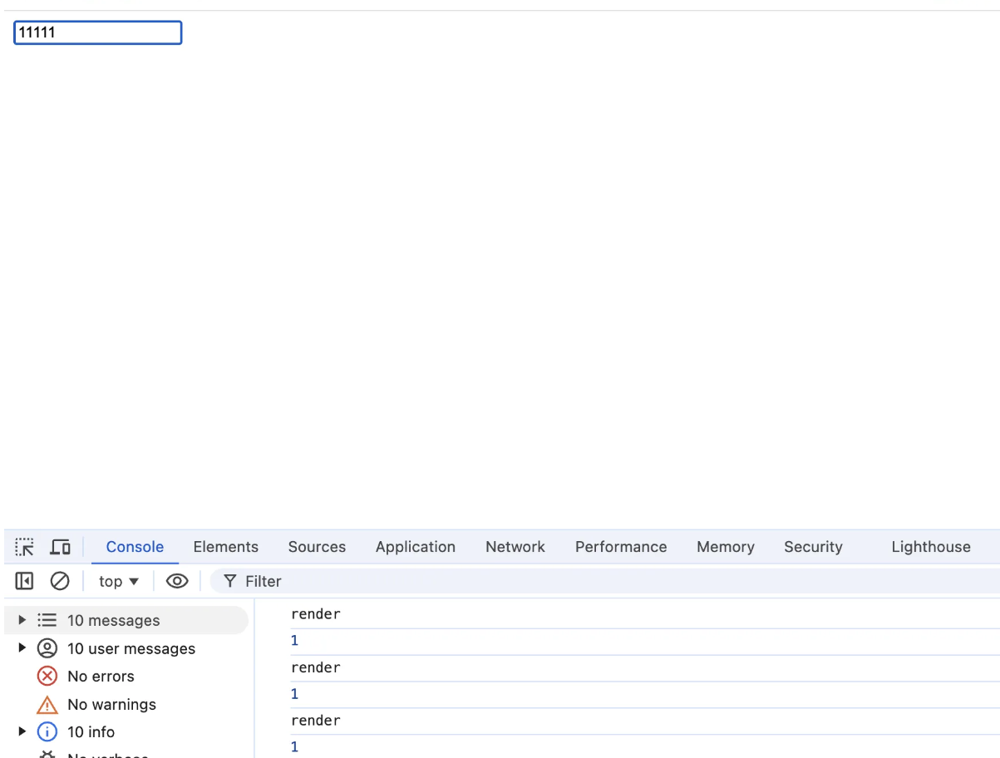
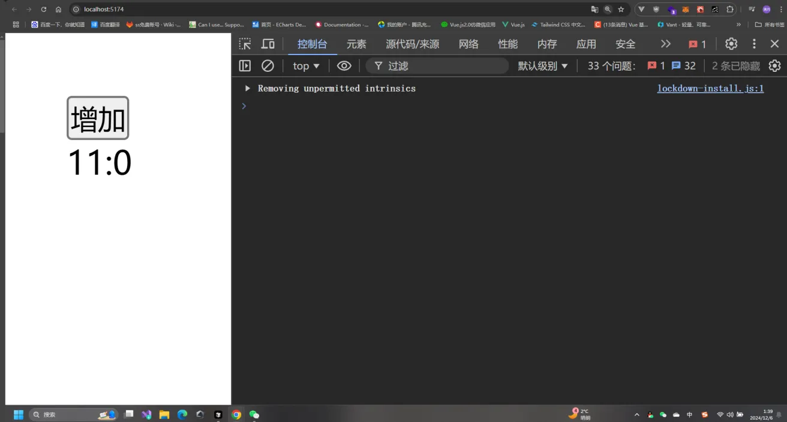
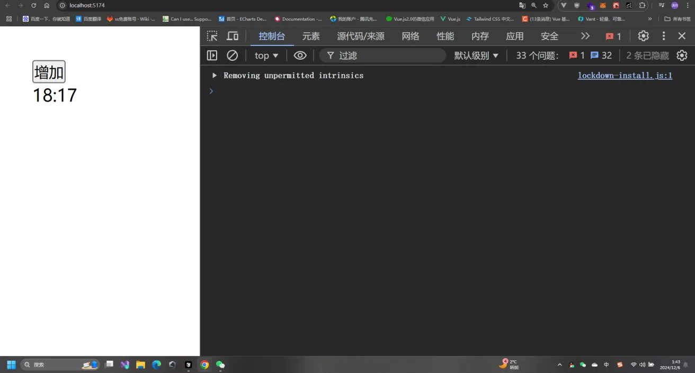

# reactHooks

Hook 就是 JavaScript 函数，这个函数可以帮助你 钩入(hook into)
React State 以及生命周期等特性;

优势:

- 它可以让我们在不编写 class 的情况下使用 state 以及其他的 React 特性;
- 但是我们可以由此延伸出非常多的用法，来让我们前可所提到的问题得到解决;

Hook 的使用场景

- Hook 的出现基本可以代替我们之前所有使用 class 组件的地方(除了一些非常不常用的场景);
- 但是如果是一个旧的项目，你并不需要直接将所有的代码重构为 Hooks，因为它完全向下兼容，你可以渐进式的来使用它
- Hook 只能在函数组件中使用，不能在类组件，或者函数组件之外的地方使用;

## useState

useState 是一个 React Hook，允许函数组件在内部管理状态。
组件通常需要根据交互更改屏幕上显示的内容，例如点击某个按钮更改值，或者输入文本框中的内容，这些值被称为状态值也就是(state)。

### 使用方法

useState 接收一个参数，即状态的初始值，然后返回一个数组，其中包含两个元素：当前的状态值和一个更新该状态的函数

```js
const [state, setState] = useState(initialState);
```

### 注意事项

- useState 是一个 Hook，因此你只能在组件的顶层 或自己的 Hook 中调用它。你不能在循环或条件语句中调用它。
- 在严格模式中，React 将 两次调用初始化函数，以 帮你找到意外的不纯性。这只是开发时的行为，不影响生产

### 实践

#### 添加一个状态

```js
const Card = () => {
  let [index, setIndex] = useState(0);
  let [name, setName] = useState("lrx");
  let [arr, setArr] = useState([1, 2, 3]);
};
```

按照惯例使用 数组解构 来命名状态变量，例如 [index, setIndex]。
useState 返回一个只包含两个项的数组：

1. 当前状态值
2. 更新该状态的函数

要更新屏幕上的内容，请使用新状态调用 set 函数：
调用 set 函数更新 state 将会重新渲染组件。

```js
setIndex(index + 1);
```

#### 案例 1(基本数据类型)

```js
import { useState } from "react";

function Counter() {
  const [count, setCount] = useState(0);

  return (
    <div>
      <p>You clicked {count} times</p>
      <button onClick={() => setCount(count + 1)}>Click me</button>
    </div>
  );
}
```

#### 案例 2(复杂数据类型)

##### 数组

在 React 中你需要将数组视为只读的，不可以直接修改原数组，例如：不可以调用 arr.push() arr.pop() 等方法。
下面是常见数组操作的参考表。当你操作 React state 中的数组时，你需要避免使用左列的方法，而首选右列的方法：

| 避免使用 (会改变原始数组)          | 推荐使用 (会返回一个新数组)       |
| ---------------------------------- | --------------------------------- |
| 添加元素 push，unshift             | concat，[...arr] 展开语法（例子） |
| 删除元素 pop，shift，splice        | filter，slice（例子）             |
| 替换元素 splice，arr[i] = ... 赋值 | map（例子）                       |
| 排序 reverse，sort                 | 先将数组复制一份（例子）          |

###### 数组新增数据

创建一个新数组，包含了原始数组的所有元素，然后在末尾添加新元素，如果想在头部添加新元素，返过来即可。

###### 数组删除数据

创建一个新数组，包含了原始数组的所有元素，然后删除指定元素，如果想在头部删除元素，返过来即可。

###### 数组替换数据

使用 map 筛选出需要替换的元素，然后替换为新的元素，其他元素保持不变。

```jsx
import { useState } from "react";
function App() {
  let [arr, setArr] = useState([1, 2, 3]);
  const heandleClick = () => {
    setArr(
      arr.map((item) => {
        return item == 2 ? 666 : item;
      })
    );
  };
  return (
    <>
      <button onClick={heandleClick}>更改值</button>
      <div id="aaa">{arr}</div>
    </>
  );
}
export default App;
```

###### 指定位置插入元素

案例在 2 后面插入 2.5，通过 slice，截取前面的元素，因为 slice 返回一个新的数组，然后在中间插入我们需要插入的元素，然后把末尾的元素也通过 slice 截取出来，拼接到后面。

```tsx
import { useState } from "react";
function App() {
  let [arr, setArr] = useState([1, 2, 3]);
  const heandleClick = () => {
    let startIndex = 0;
    let endIndex = 2;
    setArr([...arr.slice(startIndex, endIndex), 2.5, ...arr.slice(endIndex)]);
  };
  return (
    <>
      <button onClick={heandleClick}>更改值</button>
      <div id="aaa">{arr}</div>
    </>
  );
}
export default App;
```

##### 对象

useState 可以接受一个函数，可以在函数里面编写逻辑，初始化值，注意这个只会执行一次，更新的时候就不会执行了。
在使用 setObject 的时候，可以使用 Object.assign 合并对象 或者 ... 合并对象，不能单独赋值，不然会覆盖原始对象。

```tsx
import { useState } from "react";
function App() {
  let [obj, setObj] = useState({ name: "lrx", age: 18 });
  const heandleClick = () => {
    // setObj(Object.assign({}, obj, { age: 20 }));//1
    setObj({ ...obj, age: 20 }); //2
  };
  return <button onClick={heandleClick}>更改值</button>;
}
export default App;
```

### useState 的异步更新机制

#### 异步机制

```tsx
import { useState } from "react";
function App() {
  const [count, setCount] = useState(0);
  const handleClick = () => {
    setCount(count + 1);
    console.log(count); // 0
  };
  return <button onClick={handleClick}>Click me</button>;
}
export default App;
```

此时 index 应该打印 1，但是还是 0，因为我们正常编写的代码是同步的，所以会先执行，而 set 函数是异步的所以后执行，这么做是为了性能优化，因为我们要的是结果而不是过程。

#### 内部机制

当我们多次以相同的操作更新状态时，React 会进行比较，如果值相同，则会屏蔽后续的更新行为。自带防抖的功能，防止频繁的更新。

案例：

```tsx
import { useState } from "react";
function App() {
  const [count, setCount] = useState(0);
  const handleClick = () => {
    setCount(count + 1); // 1
    setCount(count + 1); // 1
  };
  return <button onClick={handleClick}>Click me</button>;
}
export default App;
```

结果是 1 并不是 2，因为 setIndex(index + 1)的值是一样的，后续操作被屏蔽掉了，阻止了更新。
为了解决这个问题，你可以向 setIndex 传递一个更新函数，而不是一个状态。

```tsx
import { useState } from "react";
function App() {
  const [count, setCount] = useState(0);
  const handleClick = () => {
    setCount((prevCount) => prevCount + 1); // 1
    setCount((prevCount) => prevCount + 1); // 2
  };
  return <button onClick={handleClick}>Click me</button>;
}
export default App;
```

现在没有其他排队的更新，因此 React 最终将存储 2 作为当前状态。
按照惯例，通常将待定状态参数命名为状态变量名称的第一个字母，例如 prevIndex 或者其他你觉得更清楚的名称。

## useEffect

依赖发生改变就会重新执行 🧐，类似于 Vue 的 watchEffect,后面还可以加一个参数用来进行优化防止内部代码再次执行，比如一些请求代码。useEffect 是 React 中用于处理副作用的钩子。并且 useEffect 还在这里充当生命周期函数，在之前你可能会在类组件中使用 componentDidMount、componentDidUpdate 和 componentWillUnmount 来处理这些生命周期事件。

### 什么是副作用函数，什么是纯函数？

纯函数:

1. 输入决定输出：相同的输入永远会得到相同的输出。这意味着函数的行为是可预测的。
2. 无副作用：纯函数不会修改外部状态，也不会依赖外部可变状态。因此，纯函数内部的操作不会影响外部的变量、文件、数据库等。

副作用函数:

1. 副作用函数 指的是那些在执行时会改变外部状态或依赖外部可变状态的函数。
2. 可预测性降低但是副作用不一定是坏事有时候副作用带来的效果才是我们所期待的
3. 高耦合度函数非常依赖外部的变量状态紧密

- 操作引用类型
- 操作本地存储例如 localStorage
- 调用外部 API，例如 fetch ajax
- 操作 DOM
- 计时器

```tsx
let a = 0;

function calculateDouble(number) {
  a += 1; //修改函数外部环境变量

  localStorage.setItem("a", a); //修改 localStorage

  fetch(/*…*/).then((res) => {
    //网络请求
    //…
  });

  document.querySelector(".root").style.color = "red"; //修改 DOM element

  return number * 2;
}
```

### 使用

```tsx
useEffect(setup, dependencies?)
```

**参数**

- setup：Effect 处理函数,可以返回一个清理函数。组件挂载时执行 setup,依赖项更新时先执行 cleanup 再执行 setup,组件卸载时执行 cleanup。
- dependencies(可选)：setup 中使用到的响应式值列表(props、state 等)。必须以数组形式编写如[dep1, dep2]。不传则每次重渲染都执行 Effect。

**返回值**

useEffect 返回 undefined

```tsx
let a = useEffect(() => {});
console.log("a", a); //undefined
```

### 基本使用

副作用函数能做的事情 useEffect 都能做，例如操作 DOM、网络请求、计时器等等。

#### 操作 DOM

```tsx
import { useEffect } from "react";

function App() {
  const dom = document.getElementById("data");
  console.log(dom); //null
  useEffect(() => {
    const data = document.getElementById("data");
    console.log(data); //<div id='data'>12</div>
  }, []);
  return <div id="data">12</div>;
}
```

#### 网络请求

```tsx
useEffect(() => {
  fetch("http://localhost:5174/?name=12");
}, []);
```

### 执行时机

**组件挂载时执行**
根据我们下面的例子可以观察到，组件在挂载的时候就执行了 useEffect 的副作用函数。
类似于 componentDidMount

```tsx
useEffect(() => {
  console.log("组件挂载");
}, []);
```

**组件更新时执行**

- 无依赖项更新
  根据我们下面的例子可以观察到，当有响应式值发生改变时，useEffect 的副作用函数就会执行。
  类似于 componentDidUpdate + componentDidMount

```tsx
import { useEffect, useState } from "react";

const App = () => {
  const [count, setCount] = useState(0);
  const [name, setName] = useState("");
  useEffect(() => {
    console.log("执行了", count, name);
  });
  return (
    <div id="data">
      <div>
        <h3>count:{count}</h3>
        <button onClick={() => setCount(count + 1)}>+</button>
      </div>
      <div>
        <h3>name:{name}</h3>
        <input value={name} onChange={(e) => setName(e.target.value)} />
      </div>
    </div>
  );
};
export default App;
```

- 有依赖项更新
  根据我们下面的例子可以观察到，当依赖项数组中的 count 值发生改变时，useEffect 的副作用函数就会执行。而当 name 值改变时,由于它不在依赖项数组中,所以不会触发副作用函数的执行

```tsx
import { useEffect, useState } from "react";

const App = () => {
  const [count, setCount] = useState(0);
  const [name, setName] = useState("");
  useEffect(() => {
    console.log("执行了", count, name);
  }, [count]);
  return (
    <div id="data">
      <div>
        <h3>count:{count}</h3>
        <button onClick={() => setCount(count + 1)}>+</button>
      </div>
      <div>
        <h3>name:{name}</h3>
        <button onClick={() => setName(name + 1)}>+</button>
      </div>
    </div>
  );
};
export default App;
```

- 依赖项空值
  根据我们下面的例子可以观察到，当依赖项为空数组时，useEffect 的副作用函数只会执行一次，也就是组件挂载时执行。
  适合做一些初始化的操作例如获取详情什么的

```tsx
import { useEffect, useState } from "react";

const App = () => {
  const [count, setCount] = useState(0);
  const [name, setName] = useState("");
  useEffect(() => {
    console.log("执行了", count, name);
  }, []); //只会执行一次
  return (
    <div id="data">
      <div>
        <h3>count:{count}</h3>
        <button onClick={() => setCount(count + 1)}>+</button>
      </div>
      <div>
        <h3>name:{name}</h3>
        <input value={name} onChange={(e) => setName(e.target.value)} />
      </div>
    </div>
  );
};
export default App;
```

**组件卸载时执行**

useEffect 的副作用函数可以返回一个清理函数，当组件卸载时，useEffect 的副作用函数就会执行清理函数。
确切说清理函数就是副作用函数运行之前，会清楚上一次的副作用函数。
根据我们下面的例子可以观察到，当组件卸载时，useEffect 的副作用函数就会执行。
类似于 componentWillUnmount

```tsx
import { useEffect, useState } from "react";
// 子组件
const Child = (props: { name: string }) => {
  useEffect(() => {
    console.log("render", props.name);
    // 返回一个清理函数
    return () => {
      console.log("unmount", props.name);
    };
  }, [props.name]);
  return <div>Child:{props.name}</div>;
};
const App = () => {
  const [show, setShow] = useState(true);
  const [name, setName] = useState("");
  return (
    <div id="data">
      <div>
        <h3>父组件</h3>
        <input value={name} onChange={(e) => setName(e.target.value)} />
        <button onClick={() => setShow(!show)}>显示/隐藏</button>
      </div>
      <hr />
      <h3>子组件</h3>
      {show && <Child name={name} />}
    </div>
  );
};

export default App;
```

**清理函数场景**
例如我们下面这个例子，当 name 值发生改变时，useEffect 的副作用函数就会执行，并且会开启一个定时器，当 name 值再次发生改变时，useEffect 的副作用函数就会执行清理函数，清除上一次的定时器。这样就避免了接口请求的重复执行。

```tsx
import { useEffect, useState } from "react";
// 子组件
const Child = (props: { name: string }) => {
  useEffect(() => {
    let timer = setTimeout(() => {
      fetch(`http://localhost:5174/?name=${props.name}`);
    }, 1000);
    return () => {
      clearTimeout(timer);
    };
  }, [props.name]);
  return <div>Child</div>;
};
const App = () => {
  const [show, setShow] = useState(true);
  const [name, setName] = useState("");
  return (
    <div id="data">
      <div>
        <h3>父组件</h3>
        <input value={name} onChange={(e) => setName(e.target.value)} />
        <button onClick={() => setShow(!show)}>显示/隐藏</button>
      </div>
      <hr />
      <h3>子组件</h3>
      {show && <Child name={name} />}
    </div>
  );
};
```

### 真实案例

下面是一个真实的用户信息获取案例，通过 id 获取用户信息，并且当 id 发生改变时，会获取新的用户信息。

```tsx
import React, { useState, useEffect } from "react";

interface IUserData {
  username: string;
  email: string;
  phone: string;
  name: string;
  website: string;
}

function App() {
  const [userId, setUserId] = useState("1");
  const [userData, setUserData] = useState<IUserData | null>(null);
  const [loading, setLoading] = useState<boolean>(false);
  const [error, setErrorStatus] = useState(null);

  const FetchUserData = () => {
    setLoading(true);
    return fetch(`https://jsonplaceholder.typicode.com/users/${userId}`)
      .then((data) => setUserData(data))
      .catch((error) => setErrorStatus(error))
      .finally(() => setLoading(false));
  };

  useEffect(() => {
    FetchUserData();
  }, [userId]);

  return (
    <div>
      <h1>用户信息</h1>
      <input value={userId} onChange={(e) => setUserId(e.target.value)} />
      {loading && <p>加载中...</p>}
      {error && <p>错误: {error}</p>}
      {userData && (
        <div>
          <p>用户名: {userData.username}</p>
          <p>邮箱: {userData.email}</p>
          <p>电话: {userData.phone}</p>
          <p>姓名: {userData.name}</p>
          <p>网站: {userData.website}</p>
        </div>
      )}
    </div>
  );
}
```



## useLayoutEffect

useLayoutEffect 是 React 中的一个 Hook，用于在浏览器重新绘制屏幕之前触发。与 useEffect 类似。

### 用法

```tsx
useLayoutEffect(() => {
  // 副作用代码
  return () => {
    // 清理代码
  };
}, [dependencies]);
```

### 参数

- setup：Effect 处理函数,可以返回一个清理函数。组件挂载时执行 setup,依赖项更新时先执行 cleanup 再执行 setup,组件卸载时执行 cleanup。
- dependencies(可选)：setup 中使用到的响应式值列表(props、state 等)。必须以数组形式编写如[dep1, dep2]。不传则每次重渲染都执行 Effect。

### 返回值

useLayoutEffect 返回 undefined

### 和 useEffect 的区别

| 区别       | useLayoutEffect          | useEffect                |
| ---------- | ------------------------ | ------------------------ |
| 执行时机   | 浏览器完成布局和绘制之前 | 浏览器完成布局和绘制之后 |
| 执行副作用 | 浏览器完成布局和绘制之后 | 浏览器完成布局和绘制之后 |
| 执行方式   | 同步执行                 | 异步执行                 |
| DOM 渲染   | 阻塞 DOM 渲染            | 不阻塞 DOM 渲染          |

#### 测试 DOM 阻塞

下面这个例子展示了 useLayoutEffect 和 useEffect 在 DOM 渲染时的区别。useLayoutEffect 会阻塞 DOM 渲染,而 useEffect 不会。

```tsx
import React, { useLayoutEffect, useEffect, useState } from "react";

function App() {
  const [count, setCount] = useState(0);
  //不阻塞DOM
  // useEffect(() => {
  //    for (let i = 0; i < 30000; i++) {
  //       //console.log(i);
  //       setCount(count => count + 1)
  //    }
  // }, []);
  阻塞DOM;
  useLayoutEffect(() => {
    for (let i = 0; i < 20000; i++) {
      //console.log(i);
      setCount((count) => count + 1);
    }
  }, []);
  return (
    <div>
      <div>app </div>
      {Array.from({ length: count }).map((_, index) => (
        <div key={index}>{index}</div>
      ))}
    </div>
  );
}

export default App;
```

#### 测试同步异步渲染

在下面的动画示例代码中:

1. useEffect 实现的动画效果:
   - 初始渲染时 opacity: 0
   - 浏览器完成绘制
   - useEffect 异步执行,设置 opacity: 1
   - 用户可以看到完整的淡入动画过渡效果
2. useLayoutEffect 实现的动画效果:
   - 初始渲染时 opacity: 0
   - DOM 更新后立即同步执行 useLayoutEffect
   - 设置 opacity: 1
   - 浏览器绘制时已经是最终状态
   - 用户看不到过渡动画效果

```css
#root1 {
  width: 200px;
  height: 200px;
  background: rgb(13, 238, 125);
}

#root1 {
  width: 200px;
  height: 200px;
  background: rgb(39, 39, 247);
  margin-top: 20px;
  position: absolute;
  top: 230px;
}
```

```tsx
import React, { useLayoutEffect, useEffect, useRef } from "react";

function App() {
  // 使用 useEffect 实现动画效果
  useEffect(() => {
    const app1 = document.getElementById("app1") as HTMLDivElement;
    app1.style.transition = "opacity 3s";
    app1.style.opacity = "1";
  }, []);

  // 使用 useLayoutEffect 实现动画效果
  useLayoutEffect(() => {
    const app2 = document.getElementById("app2") as HTMLDivElement;
    app2.style.transition = "opacity 3s";
    app2.style.opacity = "1";
  }, []);

  return (
    <div>
      <div id="root1" style={{ opacity: 0 }}>
        root1
      </div>
      <div id="root2" style={{ opacity: 0 }}>
        root2
      </div>
    </div>
  );
}

export default App;
```

### 应用场景

- 需要同步读取或更改 DOM：例如，你需要读取元素的大小或位置并在渲染前进行调整。
- 防止闪烁：在某些情况下，异步的 useEffect 可能会导致可见的布局跳动或闪烁。例如，动画的启动或某些可见的快速 DOM 更改。
- 模拟生命周期方法：如果你正在将旧的类组件迁移到功能组件，并需要模拟 componentDidMount、componentDidUpdate 和 componentWillUnmount 的同步行为。

### 案例

可以记录滚动条位置，等用户返回这个页面时，滚动到之前记录的位置。增强用户体验。

```tsx
import { useLayoutEffect, useState } from "react";

function App() {
  useLayoutEffect(() => {
    const list = document.getElementById("list") as HTMLUListElement;
    list.scrollTop = 100;
  }, []);
  return (
    <ul id="list" style={{ height: "500px", overflowY: "scroll" }}>
      {Array.from({ length: 500 }, (_, i) => (
        <li key={i}>Item {i + 1}</li>
      ))}
    </ul>
  );
}

export default App;
```

## useContext

useContext 提供了一个无需为每层组件手动添加 props，就能在组件树间进行数据传递的方法。设计的目的就是解决组件树间数据传递的问题。


### 用法

```tsx
const MyThemeContext = React.createContext({ theme: "light" }); // 创建一个上下文
function App() {
  return (
    <MyThemeContext.Provider value={{ theme: "light" }}>
      <MyComponent />
    </MyThemeContext.Provider>
  );
}
function MyComponent() {
  const themeContext = useContext(MyThemeContext); // 使用上下文
  return <div>{themeContext.theme}</div>;
}
```

### 参数

入参

- context：是 createContext 创建出来的对象，他不保持信息，他是信息的载体。声明了可以从组件获取或者给组件提供信息。

返回值

- 返回传递的 Context 的值，并且是只读的。如果 context 发生变化，React 会自动重新渲染读取 context 的组件

### 基本用法

::: info
我们编写一个传递主题的例子， 这个 hook 在 18 版本和 19 版本是有区别的。
:::
**18 版本**:
首先我们先通过 createContext 创建一个上下文，然后通过 createContext 创建的组件包裹组件，传递值。

被包裹的组件，在任何一个层级都是可以获取上下文的值，那么如何使用呢？

使用的方式就是通过 useContext 这个 hook，然后传入上下文，就可以获取到上下文的值。

```tsx
import React, { useContext, useState } from "react";
// 创建上下文
const ThemeContext = React.createContext<ThemeContextType>(
  {} as ThemeContextType
);
// 定义上下文类型
interface ThemeContextType {
  theme: string;
  setTheme: (theme: string) => void;
}
const Child = () => {
  // 获取上下文
  const themeContext = useContext(ThemeContext);
  const styles = {
    backgroundColor: themeContext.theme === "light" ? "white" : "black",
    border: "1px solid red",
    width: 100 + "px",
    height: 100 + "px",
    color: themeContext.theme === "light" ? "black" : "white",
  };
  return (
    <div>
      <div style={styles}>child</div>
    </div>
  );
};

const Parent = () => {
  // 获取上下文
  const themeContext = useContext(ThemeContext);
  const styles = {
    backgroundColor: themeContext.theme === "light" ? "white" : "black",
    border: "1px solid red",
    width: 100 + "px",
    height: 100 + "px",
    color: themeContext.theme === "light" ? "black" : "white",
  };
  return (
    <div>
      <div style={styles}>Parent</div>
      <Child />
    </div>
  );
};

function App() {
  const [theme, setTheme] = useState("light");
  return (
    <div>
      <button onClick={() => setTheme(theme === "light" ? "dark" : "light")}>
        切换主题
      </button>
      <ThemeContext.Provider value={{ theme, setTheme }}>
        <Parent />
      </ThemeContext.Provider>
    </div>
  );
}

export default App;
```

**19 版本**:
::: tip
其实 19 版本和 18 版本是差不多的，只是 19 版本更加简单了，不需要再使用 Provider 包裹，直接使用即可。
:::

```tsx
import React, { useContext, useState } from 'react';
const ThemeContext = React.createContext<ThemeContextType>({} as ThemeContextType);
interface ThemeContextType {
   theme: string;
   setTheme: (theme: string) => void;
}

const Child = () => {
   const themeContext = useContext(ThemeContext);
   const styles = {
      backgroundColor: themeContext.theme === 'light' ? 'white' : 'black',
      border: '1px solid red',
      width: 100 + 'px',
      height: 100 + 'px',
      color: themeContext.theme === 'light' ? 'black' : 'white'
   }
   return <div>
      <div style={styles}>
         child
      </div>
   </div>
}

const Parent = () => {
   const themeContext = useContext(ThemeContext);
   const styles = {
      backgroundColor: themeContext.theme === 'light' ? 'white' : 'black',
      border: '1px solid red',
      width: 100 + 'px',
      height: 100 + 'px',
      color: themeContext.theme === 'light' ? 'black' : 'white'
   }
   return <div>
      <div style={styles}>
         Parent
      </div>
      <Child />
   </div>
}
function App() {
   const [theme, setTheme] = useState('light');
   return (
      <div>
         <button onClick={() => setTheme(theme === 'light' ? 'dark' : 'light')}>切换主题</button>
         <ThemeContext.Provider value={{ theme, setTheme }}> // [!code --]
         <ThemeContext value={{ theme, setTheme }}> // [!code ++]
            <Parent />
        </ThemeContext.Provider> // [!code --]
         <ThemeContext>  // [!code ++]
      </div >
   );
}

export default App;
```

### 注意事项

- 使用 ThemeContext 时，传递的 key 必须为 value

```tsx
  // 🚩 不起作用：prop 应该是“value”
  <ThemeContext theme={theme}>
   <Button />
  </ThemeContext>
  // ✅ 传递 value 作为 prop
  <ThemeContext value={theme}>
   <Button />
  </ThemeContext>
```

::: warning
如果使用多个 Context，那么需要注意，如果使用的值是相同的，那么会覆盖。
:::

```tsx
// 🚩 不起作用：prop 应该是“value”
const ThemeContext = React.createContext({ theme: "light" });

function App() {
  return (
    <ThemeContext value={{ theme: "light" }}>
      <ThemeContext value={{ theme: "dark" }}>
        {" "}
        {/* 覆盖了上面的值 */}
        <Parent />
      </ThemeContext>
    </ThemeContext>
  );
}
```

## useReducer

useReducer 是 React 提供的一个高级 Hook,没有它我们也可以正常开发，但是 useReducer 可以使我们的代码具有更好的可读性，可维护性。
useReducer 跟 useState 一样的都是帮我们管理组件的状态的，但是呢与 useState 不同的是 useReducer 是集中式的管理状态的。

### 用法

```tsx
const [state, dispatch] = useReducer(reducer, initialArg, initfn?)
```

### 参数

1. reducer 是一个处理函数，用于更新状态, reducer 里面包含了两个参数，第一个参数是 state，第二个参数是 action。reducer 会返回一个新的 state。
2. initialArg 是初始状态值。
3. init 是一个可选的函数，用于初始化 state，如果编写了 init 函数，则默认值使用 init 函数的返回值，否则使用 initialArg。

### 返回值

useReducer 返回一个由两个值组成的数组：
当前的 state。初次渲染时，它是 init(initialArg) 或 initialArg （如果没有 init 函数）。 dispatch 函数。用于更新 state 并触发组件的重新渲染。

```tsx
import { useReducer } from "react";
//根据旧状态进行处理 oldState，处理完成之后返回新状态 newState
//reducer 只有被dispatch的时候才会被调用 刚进入页面的时候是不会执行的
//oldState 任然是只读的
function reducer(oldState, action) {
  // ...
  return newState;
}

function MyComponent() {
  const [state, dispatch] = useReducer(reducer, { age: 22, name: "123" });
  // ...
}
```

### 计数器案例

初始状态

```tsx
const initialState = { count: 0 };
```

这里定义了一个初始状态对象，里面包含了一个 count 属性，初始值为 0。
reducer 函数

```tsx
function reducer(state, action) {
  switch (action.type) {
    case "increment":
      return { count: state.count + 1 };
    case "decrement":
      return { count: state.count - 1 };
    default:
      throw new Error();
  }
}
```

- reducer 是一个用来根据不同的 action 来更新状态的纯函数。
- 它接收当前状态 (state) 和一个动作对象 (action)，根据 action.type 来决定如何更新 state。
- 如果 action.type 是 'increment'，则 count 增加 1；如果是 'decrement'，则 count 减少 1。
- 如果 action.type 不匹配任何已定义的情况，则抛出一个错误。 App 组件:

```tsx
const App = () => {
  const [state, dispatch] = useReducer(reducer, initialState);

  return (
    <>
      Count: {state.count}
      <button onClick={() => dispatch({ type: "decrement" })}>-</button>
      <button onClick={() => dispatch({ type: "increment" })}>+</button>
    </>
  );
};
export default App;
```

- 当点击 "-" 按钮时，调用 dispatch({ type: 'decrement' })，使 count 减少。
- 当点击 "+" 按钮时，调用 dispatch({ type: 'increment' })，使 count 增加。

### 购物车案例

1. 初始化状态

```tsx
const initData = [
  { name: "大会", price: 9.9, count: 1, id: 1, isEdit: false },
  { name: "达瓦", price: 19.9, count: 1, id: 2, isEdit: false },
  { name: "咯女", price: 29.9, count: 1, id: 3, isEdit: false },
];
```

- initData 是一个数组，表示初始的商品列表。每个商品有以下属性：
  - name: 商品的名称（例如 "咯女"）。
  - price: 单价（例如 9.9）。
  - count: 数量，默认为 1。
  - id: 商品的唯一标识符。
  - isEdit: 表示该商品名称是否处于编辑状态，默认为 false。

2. 定义类型

```tsx
type State = typeof initData;
interface Action {
  type: "ADD" | "SUB" | "DELETE" | "EDIT" | "UPDATE_NAME";
  id: number;
  newName?: string;
}
```

- List 是商品数组的类型，直接从 initData 推断。
- Action 是用于更新商品列表的 action 类型。
  - ADD: 增加某个商品的数量。
  - SUB: 减少某个商品的数量。
  - DELETE: 删除某个商品。
  - EDIT: 切换某个商品的编辑状态。
  - UPDATE_NAME: 更新某个商品的名称。
  - id: 需要操作的商品的 id。
  - newName: 用于 UPDATE_NAME 操作时，新的商品名称。

3. 定义 reducer 函数

```tsx
function reducer(state, action) {
  const item = state.find((item) => item.id === action.id);
  if (item) {
    switch (action.type) {
      case "ADD":
        item.count += 1;
        return [...state];
      case "SUB":
        item.count -= 1;
        return [...state];
      case "DELETE":
        return state.filter((item) => item.id !== action.id);
      case "EDIT":
        item.isEdit = !item.isEdit;
        return [...state];
      case "UPDATE_NAME":
        item.name = action.newName;
        return [...state];
      default:
        return state;
    }
  }
  return [...state];
}
```

reducer 函数根据传入的 action 更新商品列表的状态。 查找到要操作的商品 item。
对不同的 action.type 执行相应操作：

- 增加商品数量
- 减少商品数量
- 删除商品
- 切换商品编辑状态
- 更新商品名称

4. 创建组件

```tsx
function App() {
  let [data, dispatch] = useReducer(reducer, initData);
  return (
    <>
      <table cellPadding={0} cellSpacing={0} width={600} border={1}>
        <thead>
          <tr>
            <th>物品</th>
            <th>价格</th>
            <th>数量</th>
            <th>操作</th>
          </tr>
        </thead>
        <tbody>
          {data.map((item) => {
            return (
              <tr key={item.id}>
                <td align="center">
                  {item.isEdit ? (
                    <input
                      onBlur={(e) => dispatch({ type: "EDIT", id: item.id })}
                      onChange={(e) =>
                        dispatch({
                          type: "UPDATE_NAME",
                          id: item.id,
                          newName: e.target.value,
                        })
                      }
                      value={item.name}
                    />
                  ) : (
                    <span>{item.name}</span>
                  )}
                </td>
                <td align="center">{item.price * item.count}</td>
                <td align="center">
                  <button
                    onClick={() => dispatch({ type: "SUB", id: item.id })}
                  >
                    -
                  </button>
                  <span>{item.count}</span>
                  <button
                    onClick={() => dispatch({ type: "ADD", id: item.id })}
                  >
                    +
                  </button>
                </td>
                <td align="center">
                  <button
                    onClick={() => dispatch({ type: "EDIT", id: item.id })}
                  >
                    编辑
                  </button>
                  <button
                    onClick={() => dispatch({ type: "DELETE", id: item.id })}
                  >
                    删除
                  </button>
                </td>
              </tr>
            );
          })}
        </tbody>
        <tfoot>
          <tr>
            <td colSpan={3}></td>
            <td align="center">
              总价:
              {data.reduce((prev, next) => prev + next.price * next.count, 0)}
            </td>
          </tr>
        </tfoot>
      </table>
    </>
  );
}
```

- App 组件使用 useReducer 来管理 data 状态，它从 initData 初始化，并通过 dispatch 分发动作来改变商品列表。
- 商品列表通过 table 渲染，每个商品显示以下信息：
- 物品：如果该商品的 isEdit 为 true，显示一个输入框用于修改名称；否则显示商品名称。
- 价格：显示商品的总价（price \* count）。
- 数量：显示商品的数量，提供 - 和 + 按钮来减少或增加数量。
- 操作：提供 编辑 按钮切换名称编辑状态，删除 按钮可以删除该商品。
- tfoot 部分显示购物车的总价，通过 reduce 方法计算所有商品的总价。

## useSyncExternalStore

useSyncExternalStore 是 React 18 引入的一个 Hook，用于从外部存储（例如状态管理库、浏览器 API 等）获取状态并在组件中同步显示。这对于需要跟踪外部状态的应用非常有用。

### 场景

1. 订阅外部 store 例如(redux,mobx,Zustand,jotai) vue 的 vuex pinia
2. 订阅浏览器 API 例如(online,storage,location, history hash)等
3. 抽离逻辑，编写自定义 hooks
4. 服务端渲染支持

### 使用

```tsx
const res = useSyncExternalStore(subscribe, getSnapshot, getServerSnapshot?)
```

- subscribe：用来订阅数据源的变化，接收一个回调函数，在数据源更新时调用该回调函数。
- getSnapshot：获取当前数据源的快照（当前状态）。
- getServerSnapshot?：在服务器端渲染时用来获取数据源的快照。
  返回值：该 res 的当前快照，可以在你的渲染逻辑中使用

```tsx
const subscribe = (callback: () => void) => {
  // 订阅
  callback();
  return () => {
    // 取消订阅
  };
};

const getSnapshot = () => {
  return data;
};

const res = useSyncExternalStore(subscribe, getSnapshot);
```

### 案例

#### 1. 订阅浏览器 Api 实现自定义 hook(useStorage)

我们实现一个 useStorage Hook，用于订阅 localStorage 数据。这样做的好处是，我们可以确保组件在 localStorage 数据发生变化时，自动更新同步。
实现代码
我们将创建一个 useStorage Hook，能够存储数据到 localStorage，并在不同浏览器标签页之间同步这些状态。此 Hook 接收一个键值参数用于存储数据的键名，还可以接收一个默认值用于在无数据时的初始化。
在 hooks/useStorage.ts 中定义 useStorage Hook：

```tsx
import { useSyncExternalStore } from "react";

/**
 *
 * @param key 存储到localStorage 的key
 * @param defaultValue 默认值
 */
export const useStorage = (key: any, defaultValue?: any) => {
  const subscribe = (callback: () => void) => {
    window.addEventListener("storage", (e) => {
      console.log("触发了", e);
      callback();
    });
    return () => window.removeEventListener("storage", callback);
  };
  //从localStorage中获取数据 如果读不到返回默认值
  const getSnapshot = () => {
    return (
      (localStorage.getItem(key)
        ? JSON.parse(localStorage.getItem(key)!)
        : null) || defaultValue
    );
  };
  //修改数据
  const setStorage = (value: any) => {
    localStorage.setItem(key, JSON.stringify(value));
    window.dispatchEvent(new StorageEvent("storage")); //手动触发storage事件
  };
  //返回数据
  const res = useSyncExternalStore(subscribe, getSnapshot);

  return [res, setStorage];
};
```

在 App.tsx 中，我们可以直接使用 useStorage，来实现一个简单的计数器。值会存储在 localStorage 中，并且在刷新或其他标签页修改数据时自动更新。

```tsx
import { useStorage } from "./hooks/useStorage";
const App = () => {
  const [val, setVal] = useStorage("data", 1);
  return (
    <>
      <h3>{val}</h3>
      <button onClick={() => setVal(val + 1)}>设置val</button>
    </>
  );
};

export default App;
```

效果演示

1. 值的持久化：点击按钮增加 val，页面刷新后依然会保留最新值。
2. 跨标签页同步：在其他标签页中修改 val，当前标签页也会自动更新。

#### 2.订阅 history 实现路由跳转

实现一个简易的 useHistory Hook，获取浏览器 url 信息 + 参数

```tsx
import { useSyncExternalStore } from "react";

export const useHistory = () => {
  const subscribe = (callback: () => void) => {
    window.addEventListener("popstate", callback);
    return () => window.removeEventListener("popstate", callback);
  };

  const getSnapshot = () => {
    return window.location.href;
  };

  const push = (url: string) => {
    window.history.pushState({}, "", url);
    window.dispatchEvent(new PopStateEvent("popstate"));
  };

  const replace = (url: string) => {
    window.history.replaceState({}, "", url);
    window.dispatchEvent(new PopStateEvent("popstate"));
  };

  const res = useSyncExternalStore(subscribe, getSnapshot);

  return [res, push, replace];
};
```

使用 useHistory Hook
让我们在组件中使用这个 useHistory Hook，实现基本的前进、后退操作以及程序化导航。

```tsx
import { useHistory } from "./hooks/useHistory";

const App = () => {
  const [history, push, replace] = useHistory();
  return (
    <>
      <div>当前 url:{history}</div>
      <button
        onClick={() => {
          push("/x");
        }}
      >
        跳转
      </button>
      <button
        onClick={() => {
          replace("/y");
        }}
      >
        替换
      </button>
    </>
  );
};

export default App;
```

效果演示

- history：这是 useHistory 返回的当前路径值。每次 URL 变化时，useSyncExternalStore 会自动触发更新，使 history 始终保持最新路径。
- push 和 replace：点击“跳转”按钮调用 push("/x")，会将 /aaa 推入历史记录；点击“替换”按钮调用 replace("/y")，则会将当前路径替换为 /y。

### 注意事项

如果 getSnapshot 返回值和上一次不同时，React 会重新渲染组件。这就是为什么，如果总是返回一个不同的值，会进入到一个无限循环，并产生这个报错。

```tsx
Uncaught (in promise) Error: Maximum update depth exceeded.
This can happen when a component repeatedly calls setState inside componentWillUpdate or componentDidUpdate.
React limits the number of nested updates to prevent infinite loops.

```

```tsx
function getSnapshot() {
  return obj.todos; //object
}
```

这种写法每次返回了对象的引用，即使这个对象没有改变，React 也会重新渲染组件。
如果你的 store 数据是可变的，getSnapshot 函数应当返回一个它的不可变快照。这意味着 确实 需要创建新对象，但不是每次调用都如此。而是应当保存最后一次计算得到的快照，并且在 store 中的数据不变的情况下，返回与上一次相同的快照。如何决定可变数据发生了改变则取决于你的可变 store。

```tsx
function getSnapshot() {
  if (obj.todos !== lastTodos) {
    // 只有在 todos 真的发生变化时，才更新快照
    lastSnapshot = { todos: obj.todos.slice() };
    lastTodos = obj.todos;
  }
  return lastSnapshot;
}
```

## useTransition

useTransition 是 React 18 中引入的一个 Hook，用于管理 UI 中的过渡状态，特别是在处理长时间运行的状态更新时。它允许你将某些更新标记为“过渡”状态，这样 React 可以优先处理更重要的更新，比如用户输入，同时延迟处理过渡更新。

### 使用 ⚙️

```tsx
const [isPending, startTransition] = useTransition();
```

### 参数

不需要参数

### 返回值

1. isPending(boolean)，告诉你是否存在待处理的 transition。
2. startTransition(function) 函数，你可以使用此方法将状态更新标记为 transition。

### 优先级

(一般) 不是很重要，因为在实际工作中应用较少

### 案例

```tsx
import React, {
  useLayoutEffect,
  useState,
  useReducer,
  useTransition,
} from "react";
import { Input, List } from "antd";
interface Iitem {
  id: string;
  name: string;
  address: string;
  age: number;
}
function App() {
  const [inputValue, setInputValue] = useState("");
  const [list, setList] = useState<Iitem[]>([]);
  const [isPending, startTransition] = useTransition();
  const handleChange = (e: React.ChangeEvent<HTMLInputElement>) => {
    const val = e.target.value;
    setInputValue(val);
    fetch("/api/mock/list?key=" + val)
      .then((res) => res.json())
      .then((res) => {
        startTransition(() => {
          setList(res.list);
        });
      });
  };
  return (
    <>
      <Input value={inputValue} onChange={handleChange} />
      {isPending && <div>loading...</div>}
      <List
        dataSource={list}
        renderItem={(item) => <List.Item>{item.address}</List.Item>}
      />
    </>
  );
}

export default App;
```

1. 输入框和状态管理 使用 useState Hook 管理输入框的值和结果列表。 每次输入框的内容变化时，handleInputChange 函数会被触发，它会获取用户输入的值，并进行 API 请求。
2. API 请求 在 handleInputChange 中，输入的值会作为查询参数发送到 /api/list API。API 返回的数据用于更新结果列表。 为了优化用户体验，我们将结果更新放在 startTransition 函数中，这样 React 可以在处理更新时保持输入框的响应性。
3. 使用 useTransition useTransition 返回一个布尔值 isPending，指示过渡任务是否仍在进行中。 当用户输入时，如果正在加载数据，我们会显示一个简单的“loading...”提示，以告知用户当前操作仍在进行。
4. 列表渲染 使用 List 组件展示返回的结果，列表项显示每个结果的 name 和 address。

### 注意事项

startTransition 必须是同步的
错误做法

```tsx
startTransition(() => {
  // ❌ 在调用 startTransition 后更新状态
  setTimeout(() => {
    setPage("/about");
  }, 1000);
});
```

正常做法

```tsx
setTimeout(() => {
  startTransition(() => {
    // ✅ 在调用 startTransition 中更新状态
    setPage("/about");
  });
}, 1000);
```

async await 错误做法

```tsx
startTransition(async () => {
  await someAsyncFunction();
  // ❌ 在调用 startTransition 后更新状态
  setPage("/about");
});
```

正确做法

```tsx
await someAsyncFunction();
startTransition(() => {
  // ✅ 在调用 startTransition 中更新状态
  setPage("/about");
});
```

### 原理剖析

useTransition 的核心原理是将一部分状态更新处理为低优先级任务，这样可以将关键的高优先级任务先执行，而低优先级的过渡更新则会稍微延迟处理。这在渲染大量数据、进行复杂运算或处理长时间任务时特别有效。React 通过调度机制来管理优先级：

1. 高优先级更新：直接影响用户体验的任务，比如表单输入、按钮点击等。
2. 低优先级更新：相对不影响交互的过渡性任务，比如大量数据渲染、动画等，这些任务可以延迟执行。

```tsx
+-----------------------+
  |         App           |
  |                       |
  |  +--------------+     |
  |  |    Input     |     |
  |  +--------------+     |
  |                       |
  |  +--------------+     |
  |  |   Display    |     |
  |  +--------------+     |
  +-----------------------+

  用户输入
  |
  v
  [高优先级更新] ---> [调度器] ---> [React 更新组件]
  |
  +---> [低优先级过渡更新] --> [调度器] --> [等待处理]
```

## useCallBack

~~类似于 Vue 的计算属性~~
想象这个场景：你有一个 React.memo 化的子组件，该子组件接受一个父组件传递的函数作为 prop。如果父组件重新渲染，而且这个函数是在父组件的函数体内定义的，那么每次父组件渲染时，都会为子组件传递一个新的函数实例。这可能会导致子组件不必要地重新渲染，即使该函数的实际内容没有任何变化。

useCallback 的主要目的是解决这样的问题。它确保，除非依赖项发生变化，否则函数实例保持不变。这可以防止因为父组件的非相关渲染而导致的子组件的不必要重新渲染。

当然，useCallback 真正的应用场景不仅于此，它还可以用于其他需要稳定引用的场景，例如事件处理器、setTimeout/setInterval 的回调、函数用于 useEffect、useMemo 或 useCallback 等的依赖项、或其他可能因为函数引用改变而导致意外行为的场合。

### 使用 ⚙️


只有当 dependency1、dependency2 等依赖发生改变时，函数才会重新创建。这对于 React.memo 化的组件、useEffect、useMemo 等钩子的输入特别有用，因为它们都依赖于输入的引用恒定性。

### 用法

```tsx
const memoizedCallback = useCallback(() => {
  doSomething(a, b);
}, [a, b]);
```

### 参数

1. callback: 需要被记忆的函数。
2. dependencies: 一个依赖项数组。当数组中的任意一个值发生变化时，callback 会被重新创建。
3. 返回值: 返回一个记忆化的函数。

### 案例 1

来看这个实例：

- 我们创建了一个 WeakMap(用 Map 也行)，用于存储回调函数，并记录回调函数的创建次数。
- 在组件重新渲染时，changeSearch 函数会被重新创建，我们这边会进行验证，如果函数被重新创建了数量会+1，如果没有重新创建，数量默认是 1。
  ::: code-group

```tsx
import { useCallback, useState } from "react";
const functionMap = new WeakMap();
let counter = 1;
const App: React.FC = () => {
  console.log("Render App");
  const [search, setSearch] = useState("");
  const changeSearch = (e: React.ChangeEvent<HTMLInputElement>) => {
    setSearch(e.target.value);
  };
  if (!functionMap.has(changeSearch)) {
    functionMap.set(changeSearch, counter++);
  }
  console.log("函数Id", functionMap.get(changeSearch));
  return (
    <>
      <input type="text" value={search} onChange={changeSearch} />
    </>
  );
};
export default App;
```

:::
我们更改输入框的值，可以看到函数 Id 在增加，说明函数被重新创建了。

为什么是 4 呢，因为默认是 1，然后输入框更改了 3 次，所以是 4，那么这样好吗？我们使用 useCallback 来优化一下。
::: tip
只需要在 changeSearch 函数上使用 useCallback，就可以优化性能。
:::

::: code-group

```tsx
const changeSearch = useCallback((e: React.ChangeEvent<HTMLInputElement>) => {
  setSearch(e.target.value);
}, []);
```

:::
我们可以看到函数 Id 没有增加，说明函数没有被重新创建。


### 案例 2

应用于子组件：

- 我们创建了一个 Child 子组件，并使用 React.memo 进行优化，memo 在上一章讲过了，他会检测 props 是否发生变化，如果发生变化，就会重新渲染子组件。
- 我们创建了一个 childCallback 函数，传递给子组件，然后我们输入框更改值，发现子组件居然重新渲染了，但是我们并没有更改 props，这是为什么呢？
- 这是因为输入框的值发生变化，App 就会重新渲染，然后 childCallback 函数就会被重新创建，然后传递给子组件，子组件会判断这个函数是否发生变化，但是每次创建的函数内存地址都不一样，所以子组件会重新渲染。
  ::: code-group

```tsx
import React, { useCallback, useState } from "react";
const Child = React.memo(
  ({
    user,
    callback,
  }: {
    user: { name: string; age: number };
    callback: () => void;
  }) => {
    console.log("Render Child");
    const styles = {
      color: "red",
      fontSize: "20px",
    };
    return (
      <div style={styles}>
        <div>{user.name}</div>
        <div>{user.age}</div>
        <button onClick={callback}>callback</button>
      </div>
    );
  }
);

const App: React.FC = () => {
  const [search, setSearch] = useState("");
  const [user, setUser] = useState({
    name: "John",
    age: 20,
  });
  const childCallback = () => {
    console.log("callback 执行了");
  };
  return (
    <>
      <input
        type="text"
        value={search}
        onChange={(e) => setSearch(e.target.value)}
      />
      <Child callback={childCallback} user={user} />
    </>
  );
};

export default App;
```

:::
因为 App 重新渲染了，所以 childCallback 函数会被重新创建，然后传递给子组件，子组件会判断这个函数是否发生变化，但是每次创建的函数内存地址都不一样，所以子组件会重新渲染。

::: tip
解决方法:只需要在 childCallback 函数上使用 useCallback，就可以优化性能。
:::

```tsx
const childCallback = useCallback(() => {
  console.log("callback 执行了");
}, []);
```

### 总结

useCallback 的使用需要有所节制，不要盲目地对每个方法应用 useCallback，这样做可能会导致不必要的性能损失。useCallback 本身也需要一定的性能开销。
useCallback 并不是为了阻止函数的重新创建，而是通过依赖项来决定是否返回新的函数或旧的函数，从而在依赖项不变的情况下确保函数的地址不变。

### useMemo 和 useCallback

<LinkCard link="https://zhuanlan.zhihu.com/p/678677928" desc="精读React hooks（八）：我们为什么需要useCallback"></LinkCard>

这个作者写的很好，解释了 useCallback，useCallback 其实就是 useMemo 的语法糖，他的底层也是这么实现的。


我们可以将一个 useCallback 转化为 useMemo 的写法

## useMemo

useMemo 是 React 提供的一个性能优化 Hook。它的主要功能是避免在每次渲染时执行复杂的计算和对象重建。通过记忆上一次的计算结果，仅当依赖项变化时才会重新计算，提高了性能，有点类似于 Vue 的 computed。

### 用法

使用 React.memo 包裹组件[一般用于子组件]，可以避免组件重新渲染。

```tsx
import React, { memo } from "react";
const MyComponent = React.memo(({ prop1, prop2 }) => {
  // 组件逻辑
});
const App = () => {
  return <MyComponent prop1="value1" prop2="value2" />;
};
```

### React.memo 案例

首先明确 React 组件的渲染条件：

1. 组件的 props 发生变化
2. 组件的 state 发生变化
3. useContext 发生变化

我们来看下面这个例子，这个例子没有使用 memo 进行缓存，所以每次父组件的 state 发生变化，子组件都会重新渲染。
而我们的子组件只用到了 user 的信息，但是父组件每次 search 发生变化，子组件也会重新渲染, 这样就就造成了没必要的渲染所以我们使用 memo 缓存

```tsx
import React, { useMemo, useState } from 'react';
interface User {
  name: string;
  age: number;
  email: string;
}
interface CardProps {
  user: User;
}
const Card = function ({ user }: CardProps) {
  const Card = React.memo(function ({ user }: CardProps) {
    console.log('Card render'); // 每次父组件的 state 发生变化，子组件都会重新渲染
    const styles = {
      backgroundColor: 'blue',
      padding: '15px',
      borderRadius: '5px',
      margin: '8px'
    }
    return <div style={styles}>
      <h1>{user.name}</h1>
      <p>{user.age}</p>
      <p>{user.email}</p>
    </div>
  }
                          })
  function App() {
    const [users, setUsers] = useState<User>({
      name: '大伟',
      age: 28,
      job: 'fe'
    });
    const [search, setSearch] = useState('');
    return (
      <div>
        <h1>父组件</h1>
        <input value={search} onChange={(e) => setSearch(e.target.value)} />
        <Card user={users} />
      </div>
    );
  }

  export default App;
```

当我们使用 memo 缓存后，只有 user 发生变化时，子组件才会重新渲染, 而 search 发生变化时，子组件不会重新渲染。

```tsx
import React, { useMemo, useState } from "react";
interface User {
  name: string;
  age: number;
  email: string;
}
interface CardProps {
  user: User;
}
const Card = React.memo(function ({ user }: CardProps) {
  console.log("Card render");
  const styles = {
    backgroundColor: "lightblue",
    padding: "20px",
    borderRadius: "10px",
    margin: "10px",
  };
  return (
    <div style={styles}>
      <h1>{user.name}</h1>
      <p>{user.age}</p>
      <p>{user.email}</p>
    </div>
  );
});
function App() {
  const [users, setUsers] = useState<User>({
    name: "张三",
    age: 18,
    email: "zhangsan@example.com",
  });
  const [search, setSearch] = useState("");
  return (
    <div>
      <h1>父组件</h1>
      <input value={search} onChange={(e) => setSearch(e.target.value)} />
      <div>
        <button
          onClick={() =>
            setUsers({
              name: "李四",
              age: Math.random() * 100,
              email: "lisi@example.com",
            })
          }
        >
          更新user
        </button>
      </div>
      <Card user={users} />
    </div>
  );
}

export default App;
```

### React.memo 总结

1. 使用场景：
   - 当子组件接收的 props 不经常变化时
   - 当组件重新渲染的开销较大时
   - 当需要避免不必要的渲染时
2. 优点
   - 提高性能，减少不必要的渲染。
   - 减少资源消耗
   - 提高应用性能
3. 注意事项
   - 不要过度使用，只在确实需要优化的组件上使用
   - 对于简单的组件，使用 memo 的开销可能比重新渲染还大
   - 如果 props 经常变化， memo 的效果会大打折扣

### useMemo 使用

```tsx
import React, { useMemo, useState } from "react";
const App = () => {
  const [count, setCount] = useState(0);
  const memoizedValue = useMemo(() => count, [count]);
  return <div>{memoizedValue}</div>;
};
```

## useRef

::: warning

1. 组件在重新渲染的时候，useRef 的值不会被重新初始化。
2. 改变 ref.current 属性时，React 不会重新渲染组件。React 不知道它何时会发生改变，因为 ref 是一个普通的 JavaScript 对象。
3. useRef 的值不能作为 useEffect 等其他 hooks 的依赖项，因为它并不是一个响应式状态。
4. useRef 不能直接获取子组件的实例，需要使用 forwardRef。

:::
当你在 React 中需要处理 DOM 元素或需要在组件渲染之间保持持久性数据时，便可以使用 useRef。

```tsx
import { useRef } from "react";
const refValue = useRef(initialValue);
refValue.current;
```

::: tip
和 vue ref 的区别
访问 ref 的值 类似于 vue 的 ref,Vue 的 ref 是.value， 改变值 视图会从重新渲染组件
其次就是 vue 的 ref 是响应式的，而 react 的 ref 不是响应式的 （是普通的 JavaScript 对象）
:::

### 通过 Ref 操作 DOM 元素

参数: initialValue：ref 对象的 current 属性的初始值。可以是任意类型的值。这个参数在首次渲染后被忽略。
返回值: useRef 返回一个对象，对象的 current 属性指向传入的初始值。 {current:xxxx}

注意

- 改变 ref.current 属性时，React 不会重新渲染组件。React 不知道它何时会发生改变，因为 ref 是一个普通的 JavaScript 对象。
- 除了初始化外不要在渲染期间写入或者读取 ref.current，否则会使组件行为变得不可预测。

```tsx
import { useRef } from "react";
function App() {
  //首先，声明一个 初始值 为 null 的 ref 对象
  let div = useRef(null);
  const heandleClick = () => {
    //当 React 创建 DOM 节点并将其渲染到屏幕时，React 将会把 DOM 节点设置为 ref 对象的 current 属性
    console.log(div.current);
  };
  return (
    <>
      {/*然后将 ref 对象作为 ref 属性传递给想要操作的 DOM 节点的 JSX*/}
      <div ref={div}>dom元素</div>
      <button onClick={heandleClick}>获取dom元素</button>
    </>
  );
}
export default App;
```

### 数据存储

我们实现一个保存 count 的新值和旧值的例子，但是在过程中我们发现一个问题，就是 num 的值一直为 0，这是为什么呢？
因为等 useState 的 SetCount 执行之后，组件会重新 rerender,num 的值又被初始化为了 0，所以 num 的值一直为 0。

```tsx
import React, { useLayoutEffect, useRef, useState } from "react";

function App() {
  let num = 0;
  let [count, setCount] = useState(0);
  const handleClick = () => {
    setCount(count + 1);
    num = count;
  };
  return (
    <div>
      <button onClick={handleClick}>增加</button>
      <div>
        {count}:{num}
      </div>
    </div>
  );
}

export default App;
```



#### 如何修改

我们可以使用 useRef 来解决这个问题，因为 useRef 只会在初始化的时候执行一次，当组件 reRender 的时候，useRef 的值不会被重新初始化。

```tsx
import React, { useLayoutEffect, useRef, useState } from "react";

function App() {
  let num = useRef(0);
  let [count, setCount] = useState(0);
  const handleClick = () => {
    setCount(count + 1);
    num.current = count;
  };
  return (
    <div>
      <button onClick={handleClick}>增加</button>
      <div>
        {count}:{num.current}
      </div>
    </div>
  );
}

export default App;
```



#### 实际应用

我们实现一个计时器的例子，在点击开始计数的时候，计时器会每 300ms 执行一次，在点击结束计数的时候，计时器会被清除。

##### 问题

我们发现，点击 end 的时候，计时器并没有被清除，这是为什么呢？

##### 原因

这是因为组件一直在重新 ReRender,所以 timer 的值一直在被重新赋值为 null，导致无法清除计时器。

```tsx
import React, { useLayoutEffect, useRef, useState } from "react";

function App() {
  console.log("render");
  let timer: NodeJS.Timeout | null = null;
  let [count, setCount] = useState(0);
  const handleClick = () => {
    timer = setInterval(() => {
      //   setCount((count) => count + 1);
      setCount(count + 1);
    }, 300);
  };
  const handleEnd = () => {
    console.log(timer);
    if (timer) {
      clearInterval(timer);
      timer = null;
    }
  };
  return (
    <div>
      <button onClick={handleClick}>开始计数</button>
      <button onClick={handleEnd}>结束计数</button>
      <div>{count}</div>
    </div>
  );
}

export default App;
```

##### 如何修改

我们可以使用 useRef 来解决这个问题，因为 useRef 的值不会因为组件的重新渲染而改变。

```tsx
import React, { useLayoutEffect, useRef, useState } from "react";

function App() {
  console.log("render");
  let timer = useRef<null | NodeJS.Timeout>(null);
  let [count, setCount] = useState(0);
  const handleClick = () => {
    timer.current = setInterval(() => {
      setCount((count) => count + 1);
    }, 300);
  };
  const handleEnd = () => {
    if (timer.current) {
      clearInterval(timer.current);
      timer.current = null;
    }
  };
  return (
    <div>
      <button onClick={handleClick}>开始计数</button>
      <button onClick={handleEnd}>结束计数</button>
      <div>{count}</div>
    </div>
  );
}

export default App;
```

## useImperativeHandle

可以在子组件内部暴露给父组件句柄，那么说人话就是，父组件可以调用子组件的方法，或者访问子组件的属性。 如果你学过 Vue，就类似于 Vue 的 defineExpose。

### 使用

```tsx
useImperativeHandle(
  ref,
  () => {
    return {
      // 暴露给父组件的方法或属性
    };
  },
  [deps]
);
```

### 参数

- ref: 父组件传递的 ref 对象
- createHandle: 返回值，返回一个对象，对象的属性就是子组件暴露给父组件的方法或属性
- deps?:[可选] 依赖项，当依赖项发生变化时，会重新调用 createHandle 函数，类似于 useEffect 的依赖项

### 入门案例

::: tip  
useRef 在 18 版本 和 19 版本使用方式不一样
:::

#### 18 版本

18 版本需要配合 forwardRef 一起使用

forwardRef 包装之后，会有两个参数，第一个参数是 props，第二个参数是 ref

我们使用的时候只需要将 ref 传递给 useImperativeHandle 即可，然后 useImperativeHandle 就可以暴露子组件的方法或属性给父组件， 然后父组件就可以通过 ref 调用子组件的方法或访问子组件的属性。

```tsx
interface ChildRef {
  name: string;
  count: number;
  addCount: () => void;
  subCount: () => void;
}

//React18.2
const Child = forwardRef<ChildRef>((_, ref) => {
  const [count, setCount] = useState(0);
  //重点
  useImperativeHandle(ref, () => {
    return {
      name: "child",
      count,
      addCount: () => setCount(count + 1),
      subCount: () => setCount(count - 1),
    };
  });
  return (
    <div>
      <h3>我是子组件</h3>
      <div>count:{count}</div>
      <button onClick={() => setCount(count + 1)}>增加</button>
      <button onClick={() => setCount(count - 1)}>减少</button>
    </div>
  );
});

function App() {
  const childRef = useRef<ChildRef>(null);
  const showRefInfo = () => {
    console.log(childRef.current);
  };
  return (
    <div>
      <h2>我是父组件</h2>
      <button onClick={showRefInfo}>获取子组件信息</button>
      <button onClick={() => childRef.current?.addCount()}>操作子组件+1</button>
      <button onClick={() => childRef.current?.subCount()}>操作子组件-1</button>
      <hr />
      <Child ref={childRef}></Child>
    </div>
  );
}

export default App;
```

#### 19 版本

1. 19 版本不需要配合 forwardRef 一起使用，直接使用即可，他会把 Ref 跟 props 放到一起，你会发现变得更加简单了
2. 19 版本 useRef 的参数改为必须传入一个参数例如`useRef<ChildRef>(null)`

```tsx
interface ChildRef {
  name: string;
  count: number;
  addCount: () => void;
  subCount: () => void;
}

//React19

const Child = ({ ref }: { ref: React.Ref<ChildRef> }) => {
  const [count, setCount] = useState(0);
  useImperativeHandle(ref, () => {
    return {
      name: "child",
      count,
      addCount: () => setCount(count + 1),
      subCount: () => setCount(count - 1),
    };
  });
  return (
    <div>
      <h3>我是子组件</h3>
      <div>count:{count}</div>
      <button onClick={() => setCount(count + 1)}>增加</button>
      <button onClick={() => setCount(count - 1)}>减少</button>
    </div>
  );
};

function App() {
  const childRef = useRef<ChildRef>(null);
  const showRefInfo = () => {
    console.log(childRef.current);
  };
  return (
    <div>
      <h2>我是父组件</h2>
      <button onClick={showRefInfo}>获取子组件信息</button>
      <button onClick={() => childRef.current?.addCount()}>操作子组件+1</button>
      <button onClick={() => childRef.current?.subCount()}>操作子组件-1</button>
      <hr />
      <Child ref={childRef}></Child>
    </div>
  );
}

export default App;
```

#### 执行时机[第三个参数]

1. 如果不传入第三个参数，那么 useImperativeHandle 会在组件挂载时执行一次，然后状态更新时，都会执行一次

```tsx
useImperativeHandle(ref, () => {});
```

2. 如果传入第三个参数，并且是一个空数组，那么 useImperativeHandle 会在组件挂载时执行一次，然后状态更新时，不会执行

```tsx
useImperativeHandle(ref, () => {}, []);
```

3. 如果传入第三个参数，并且有值，那么 useImperativeHandle 会在组件挂载时执行一次，然后会根据依赖项的变化，决定是否重新执行

```tsx
const [count, setCount] = useState(0);
useImperativeHandle(ref, () => {}, [count]);
```

### 实际案例

例如，我们封装了一个表单组件，提供了两个方法：校验和重置。使用 useImperativeHandle 可以将这些方法暴露给父组件，父组件便可以通过 ref 调用子组件的方法。

```tsx
interface ChildRef {
  name: string;
  validate: () => string | true;
  reset: () => void;
}

const Child = ({ ref }: { ref: React.Ref<ChildRef> }) => {
  const [form, setForm] = useState({
    username: "",
    password: "",
    email: "",
  });
  const validate = () => {
    if (!form.username) {
      return "用户名不能为空";
    }
    if (!form.password) {
      return "密码不能为空";
    }
    if (!form.email) {
      return "邮箱不能为空";
    }
    return true;
  };
  const reset = () => {
    setForm({
      username: "",
      password: "",
      email: "",
    });
  };
  useImperativeHandle(ref, () => {
    return {
      name: "child",
      validate: validate,
      reset: reset,
    };
  });
  return (
    <div style={{ marginTop: "20px" }}>
      <h3>我是表单组件</h3>
      <input
        value={form.username}
        onChange={(e) => setForm({ ...form, username: e.target.value })}
        placeholder="请输入用户名"
        type="text"
      />
      <input
        value={form.password}
        onChange={(e) => setForm({ ...form, password: e.target.value })}
        placeholder="请输入密码"
        type="text"
      />
      <input
        value={form.email}
        onChange={(e) => setForm({ ...form, email: e.target.value })}
        placeholder="请输入邮箱"
        type="text"
      />
    </div>
  );
};

function App() {
  const childRef = useRef<ChildRef>(null);
  const showRefInfo = () => {
    console.log(childRef.current);
  };
  const submit = () => {
    const res = childRef.current?.validate();
    console.log(res);
  };
  return (
    <div>
      <h2>我是父组件</h2>
      <button onClick={showRefInfo}>获取子组件信息</button>
      <button onClick={() => submit()}>校验子组件</button>
      <button onClick={() => childRef.current?.reset()}>重置</button>
      <hr />
      <Child ref={childRef}></Child>
    </div>
  );
}

export default App;
```

## 自定义 hooks

> 组件内部的代码描述的是想要做什么（使用在线状态！），而不是怎么做（通过订阅浏览器事件完成）。

- [Hook 的名称必须永远以 use 开头](https://react.docschina.org/learn/reusing-logic-with-custom-hooks#hook-names-always-start-with-use)
- [自定义 Hook 共享的是状态逻辑，而不是状态本身](https://react.docschina.org/learn/reusing-logic-with-custom-hooks#custom-hooks-let-you-share-stateful-logic-not-state-itself)
- [在 Hook 之间传递响应值](https://react.docschina.org/learn/reusing-logic-with-custom-hooks#passing-reactive-values-between-hooks)

### 如何检验自己的 Hooks 标准且优雅 🧐

官方文档也进行了探讨并且给出了标准：

> 理想情况下，你的自定义 Hook 名称应该清晰到即使一个不经常写代码的人也能很好地猜中自定义 Hook 的功能，输入和返回：
>
> - ✅ useData(url)
> - ✅ useImpressionLog(eventName, extraData)
> - ✅ useChatRoom(options)
>
>   当你和外部系统同步的时候，你的自定义 Hook 名称可能会更加专业，并使用该系统特定的术语。只要对熟悉这个系统的人来说名称清晰就可以：
>
> - ✅ useMediaQuery(query)
> - ✅ useSocket(url)
> - ✅ useIntersectionObserver(ref, options)
>
> 保持自定义 Hook 专注于具体的高级用例,避免创建和使用作为 useEffect API 本身的替代品和 wrapper 的自定义“生命周期” Hook：


> 好的自定义 Hook 通过限制功能使代码调用更具声明性。例如 useChatRoom(options) 只能连接聊天室，而 useImpressionLog(eventName, extraData) 只能向分析系统发送展示日志。如果你的自定义 Hook API 没有约束用例且非常抽象，那么在长期的运行中，它引入的问题可能比解决的问题更多。


