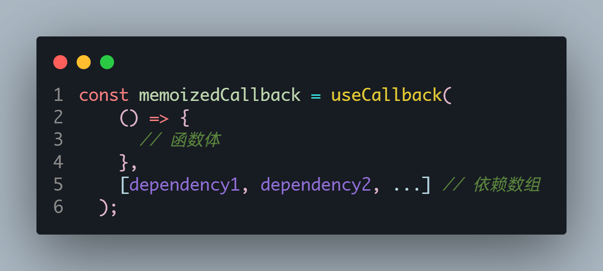
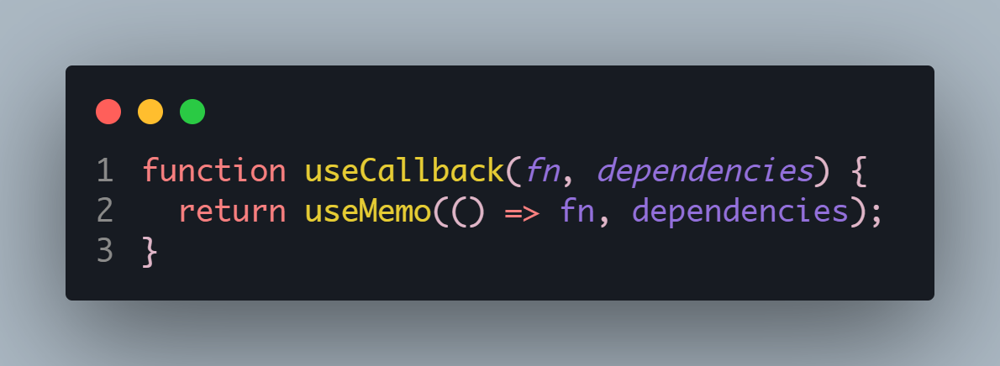
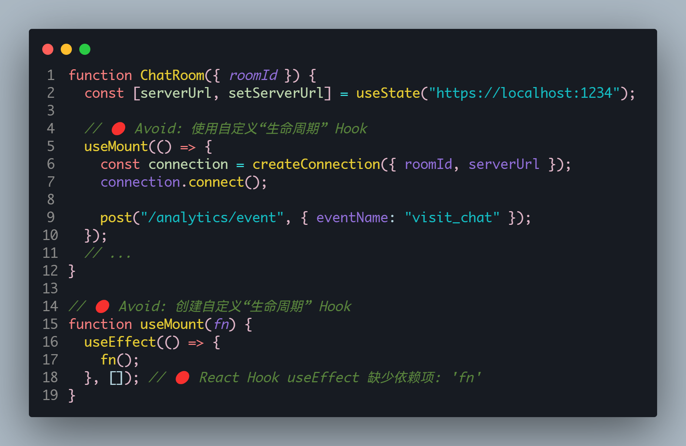
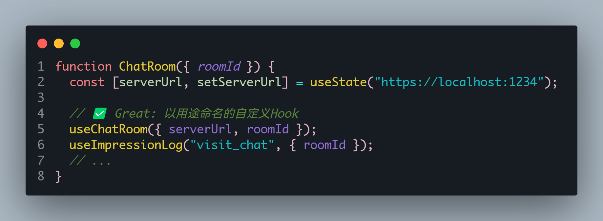

# reactHooks

Hook 就是 JavaScript 函数，这个函数可以帮助你 钩入(hook into)
React State 以及生命周期等特性;

优势:

- 它可以让我们在不编写 class 的情况下使用 state 以及其他的 React 特性;
- 但是我们可以由此延伸出非常多的用法，来让我们前可所提到的问题得到解决;

Hook 的使用场景

- Hook 的出现基本可以代替我们之前所有使用 class 组件的地方(除了一些非常不常用的场景);
- 但是如果是一个旧的项目，你并不需要直接将所有的代码重构为 Hooks，因为它完全向下兼容，你可以渐进式的来使用它
- Hook 只能在函数组件中使用，不能在类组件，或者函数组件之外的地方使用;

## useState

useState 是一个 React Hook，允许函数组件在内部管理状态。
组件通常需要根据交互更改屏幕上显示的内容，例如点击某个按钮更改值，或者输入文本框中的内容，这些值被称为状态值也就是(state)。

### 使用方法

useState 接收一个参数，即状态的初始值，然后返回一个数组，其中包含两个元素：当前的状态值和一个更新该状态的函数

```js
const [state, setState] = useState(initialState);
```

### 注意事项

- useState 是一个 Hook，因此你只能在组件的顶层 或自己的 Hook 中调用它。你不能在循环或条件语句中调用它。
- 在严格模式中，React 将 两次调用初始化函数，以 帮你找到意外的不纯性。这只是开发时的行为，不影响生产

### 实践

#### 添加一个状态

```js
const Card = () => {
  let [index, setIndex] = useState(0);
  let [name, setName] = useState("lrx");
  let [arr, setArr] = useState([1, 2, 3]);
};
```

按照惯例使用 数组解构 来命名状态变量，例如 [index, setIndex]。
useState 返回一个只包含两个项的数组：

1. 当前状态值
2. 更新该状态的函数

要更新屏幕上的内容，请使用新状态调用 set 函数：
调用 set 函数更新 state 将会重新渲染组件。

```js
setIndex(index + 1);
```

#### 案例 1(基本数据类型)

```js
import { useState } from "react";

function Counter() {
  const [count, setCount] = useState(0);

  return (
    <div>
      <p>You clicked {count} times</p>
      <button onClick={() => setCount(count + 1)}>Click me</button>
    </div>
  );
}
```

#### 案例 2(复杂数据类型)

##### 数组

在 React 中你需要将数组视为只读的，不可以直接修改原数组，例如：不可以调用 arr.push() arr.pop() 等方法。
下面是常见数组操作的参考表。当你操作 React state 中的数组时，你需要避免使用左列的方法，而首选右列的方法：

| 避免使用 (会改变原始数组)          | 推荐使用 (会返回一个新数组)       |
| ---------------------------------- | --------------------------------- |
| 添加元素 push，unshift             | concat，[...arr] 展开语法（例子） |
| 删除元素 pop，shift，splice        | filter，slice（例子）             |
| 替换元素 splice，arr[i] = ... 赋值 | map（例子）                       |
| 排序 reverse，sort                 | 先将数组复制一份（例子）          |

###### 数组新增数据

创建一个新数组，包含了原始数组的所有元素，然后在末尾添加新元素，如果想在头部添加新元素，返过来即可。

###### 数组删除数据

创建一个新数组，包含了原始数组的所有元素，然后删除指定元素，如果想在头部删除元素，返过来即可。

###### 数组替换数据

使用 map 筛选出需要替换的元素，然后替换为新的元素，其他元素保持不变。

```jsx
import { useState } from "react";
function App() {
  let [arr, setArr] = useState([1, 2, 3]);
  const heandleClick = () => {
    setArr(
      arr.map((item) => {
        return item == 2 ? 666 : item;
      })
    );
  };
  return (
    <>
      <button onClick={heandleClick}>更改值</button>
      <div id="aaa">{arr}</div>
    </>
  );
}
export default App;
```

###### 指定位置插入元素

案例在 2 后面插入 2.5，通过 slice，截取前面的元素，因为 slice 返回一个新的数组，然后在中间插入我们需要插入的元素，然后把末尾的元素也通过 slice 截取出来，拼接到后面。

```tsx
import { useState } from "react";
function App() {
  let [arr, setArr] = useState([1, 2, 3]);
  const heandleClick = () => {
    let startIndex = 0;
    let endIndex = 2;
    setArr([...arr.slice(startIndex, endIndex), 2.5, ...arr.slice(endIndex)]);
  };
  return (
    <>
      <button onClick={heandleClick}>更改值</button>
      <div id="aaa">{arr}</div>
    </>
  );
}
export default App;
```

##### 对象

useState 可以接受一个函数，可以在函数里面编写逻辑，初始化值，注意这个只会执行一次，更新的时候就不会执行了。
在使用 setObject 的时候，可以使用 Object.assign 合并对象 或者 ... 合并对象，不能单独赋值，不然会覆盖原始对象。

```tsx
import { useState } from "react";
function App() {
  let [obj, setObj] = useState({ name: "lrx", age: 18 });
  const heandleClick = () => {
    // setObj(Object.assign({}, obj, { age: 20 }));//1
    setObj({ ...obj, age: 20 }); //2
  };
  return <button onClick={heandleClick}>更改值</button>;
}
export default App;
```

### useState 的异步更新机制

#### 异步机制

```tsx
import { useState } from "react";
function App() {
  const [count, setCount] = useState(0);
  const handleClick = () => {
    setCount(count + 1);
    console.log(count); // 0
  };
  return <button onClick={handleClick}>Click me</button>;
}
export default App;
```

此时 index 应该打印 1，但是还是 0，因为我们正常编写的代码是同步的，所以会先执行，而 set 函数是异步的所以后执行，这么做是为了性能优化，因为我们要的是结果而不是过程。

#### 内部机制

当我们多次以相同的操作更新状态时，React 会进行比较，如果值相同，则会屏蔽后续的更新行为。自带防抖的功能，防止频繁的更新。

案例：

```tsx
import { useState } from "react";
function App() {
  const [count, setCount] = useState(0);
  const handleClick = () => {
    setCount(count + 1); // 1
    setCount(count + 1); // 1
  };
  return <button onClick={handleClick}>Click me</button>;
}
export default App;
```

结果是 1 并不是 2，因为 setIndex(index + 1)的值是一样的，后续操作被屏蔽掉了，阻止了更新。
为了解决这个问题，你可以向 setIndex 传递一个更新函数，而不是一个状态。

```tsx
import { useState } from "react";
function App() {
  const [count, setCount] = useState(0);
  const handleClick = () => {
    setCount((prevCount) => prevCount + 1); // 1
    setCount((prevCount) => prevCount + 1); // 2
  };
  return <button onClick={handleClick}>Click me</button>;
}
export default App;
```

现在没有其他排队的更新，因此 React 最终将存储 2 作为当前状态。
按照惯例，通常将待定状态参数命名为状态变量名称的第一个字母，例如 prevIndex 或者其他你觉得更清楚的名称。

## useEffectHooks

依赖发生改变就会重新执行 🧐，类似于 Vue 的 watchEffect,后面还可以加一个参数用来进行优化防止内部代码再次执行，比如一些请求代码。

## useContext

## useReducer

useState 的替代方案

## useCallBack

~~类似于 Vue 的计算属性~~
想象这个场景：你有一个 React.memo 化的子组件，该子组件接受一个父组件传递的函数作为 prop。如果父组件重新渲染，而且这个函数是在父组件的函数体内定义的，那么每次父组件渲染时，都会为子组件传递一个新的函数实例。这可能会导致子组件不必要地重新渲染，即使该函数的实际内容没有任何变化。

useCallback 的主要目的是解决这样的问题。它确保，除非依赖项发生变化，否则函数实例保持不变。这可以防止因为父组件的非相关渲染而导致的子组件的不必要重新渲染。

当然，useCallback 真正的应用场景不仅于此，它还可以用于其他需要稳定引用的场景，例如事件处理器、setTimeout/setInterval 的回调、函数用于 useEffect、useMemo 或 useCallback 等的依赖项、或其他可能因为函数引用改变而导致意外行为的场合。

### 使用 ⚙️


只有当 dependency1、dependency2 等依赖发生改变时，函数才会重新创建。这对于 React.memo 化的组件、useEffect、useMemo 等钩子的输入特别有用，因为它们都依赖于输入的引用恒定性。

### useMemo 和 useCallback

<LinkCard link="https://zhuanlan.zhihu.com/p/678677928" desc="精读React hooks（八）：我们为什么需要useCallback"></LinkCard>

这个作者写的很好，解释了 useCallback，useCallback 其实就是 useMemo 的语法糖，他的底层也是这么实现的。



我们可以将一个 useCallback 转化为 useMemo 的写法

## useMemo

类似于 Vue 的计算属性

## useRef

## useImperativeHandle

## 自定义 hooks

> 组件内部的代码描述的是想要做什么（使用在线状态！），而不是怎么做（通过订阅浏览器事件完成）。

- [Hook 的名称必须永远以 use 开头](https://react.docschina.org/learn/reusing-logic-with-custom-hooks#hook-names-always-start-with-use)
- [自定义 Hook 共享的是状态逻辑，而不是状态本身](https://react.docschina.org/learn/reusing-logic-with-custom-hooks#custom-hooks-let-you-share-stateful-logic-not-state-itself)
- [在 Hook 之间传递响应值](https://react.docschina.org/learn/reusing-logic-with-custom-hooks#passing-reactive-values-between-hooks)

### 如何检验自己的 Hooks 标准且优雅 🧐

官方文档也进行了探讨并且给出了标准：

> 理想情况下，你的自定义 Hook 名称应该清晰到即使一个不经常写代码的人也能很好地猜中自定义 Hook 的功能，输入和返回：
>
> - ✅ useData(url)
> - ✅ useImpressionLog(eventName, extraData)
> - ✅ useChatRoom(options)
>
>   当你和外部系统同步的时候，你的自定义 Hook 名称可能会更加专业，并使用该系统特定的术语。只要对熟悉这个系统的人来说名称清晰就可以：
>
> - ✅ useMediaQuery(query)
> - ✅ useSocket(url)
> - ✅ useIntersectionObserver(ref, options)
>
> 保持自定义 Hook 专注于具体的高级用例,避免创建和使用作为 useEffect API 本身的替代品和 wrapper 的自定义“生命周期” Hook：



> 好的自定义 Hook 通过限制功能使代码调用更具声明性。例如 useChatRoom(options) 只能连接聊天室，而 useImpressionLog(eventName, extraData) 只能向分析系统发送展示日志。如果你的自定义 Hook API 没有约束用例且非常抽象，那么在长期的运行中，它引入的问题可能比解决的问题更多。


